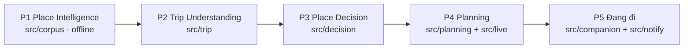

# TripGuardian

> **Dự án học tập, phi thương mại.** Không dùng code, dữ liệu hay nội dung crawl (review Google Maps, video và bình luận TikTok) cho mục đích thương mại. Nội dung crawl thuộc về tác giả gốc và chỉ dùng cho nghiên cứu trong dự án này.

Hệ thống place intelligence + lập lịch trình cá nhân hóa: giúp người dùng **chọn đúng địa điểm trước khi tạo lịch trình**, rồi kiểm tra tổ hợp đã chọn có đi được cùng nhau không. Phạm vi kiểm chứng ban đầu: Đà Lạt.

Năm giai đoạn, mỗi giai đoạn một package và một tài liệu:



## Tài liệu

| Tài liệu | Nội dung |
|---|---|
| `docs/PROJECT_CONTEXT.md` | Vì sao, cho ai, User Profile, nguyên tắc sản phẩm, phạm vi MVP, thước đo |
| `docs/ARCHITECTURE.md` | Bản đồ hệ thống: giai đoạn, phụ thuộc package, constraint, cấu hình, dữ liệu, triển khai |
| `docs/P1_CORPUS.md` | Place Intelligence: nguồn, pipeline từng nguồn, observe, aggregate, Judge, serving, CLI |
| `docs/P2_TRIP_UNDERSTANDING.md` | Trip State, chat → quiz, Clef + Agent, hậu cần, Search Input, học mẫu, bench |
| `docs/P3_PLACE_DECISION.md` | Sàng lọc fail-closed, xếp hạng, đa dạng, khả thi tổ hợp, Decision Output |
| `docs/P4_PLANNING.md` | Live Context, chỗ ở, chia ngày, thứ tự, validate, độ vững, phương án, Plan Output |
| `docs/P5_COMPANION.md` | Đang đi: Hôm nay, check-in, gợi ý tại chỗ, Google Calendar, thông báo |
| `docs/AGENT_HARNESS.md` | Agent / tool / skill, router, hành trình chung, revision / retry, HTTP và SSE |
| `docs/ACCOUNTS.md` | Đăng nhập Google, khách dùng thử, hồ sơ, avatar, xóa tài khoản, Postgres |
| `docs/ANALYTICS.md` | Event server / web, server analytics private, chỉ số Admin, Insights |
| `docs/SPEECH.md` | Giọng nói của trợ lý: nghe (ASR) và đọc (TTS) |
| `docs/LLM_PROVIDER.md` | Model nào đảm nhận vai trò nào: endpoint, key, chứng chỉ, ASR local |
| `docs/WEB.md` | Chức năng Web theo vai trò, từng màn, chuyển màn, màn nào ở file nào |
| `docs/UI_DESIGN.md` | Nguyên tắc hiển thị dữ liệu, hệ thị giác, chuyển cảnh, landing |
| `docs/log/DEV_LOG.md` | Nhật ký **code đang có gì** theo từng tính năng |
| `docs/log/AGENT_FAILURES.md` | Nhật ký lỗi của coding agent, làm bằng chứng trước khi nâng thành rule |
| `docs/plans/OPEN_TASKS.md` | Việc còn mở (file làm việc tạm, không phải tài liệu chính thức) |

Quy tắc làm việc (bắt buộc): `RULE.md`. Hướng dẫn cho agent: `AGENTS.md`.

## Thiết lập

Mục tiêu: clone code, tải gói dữ liệu, chạy được cả hệ thống như máy đang phát triển. Dữ liệu không nằm trong git.

**Cần cài trước:** Python ≥ 3.12 (đang dùng 3.13), Node ≥ 20.19 (đang dùng 24), Git Bash (Windows; `run.sh` là shell script, dùng `netstat`/`taskkill`), Google Chrome bản thường (Playwright mở Chrome qua `channel="chrome"`), Docker (chỉ cho OSRM). Chỉ khi crawl: ffmpeg trên `PATH`, GPU cho ASR.

```sh
git clone https://github.com/hohoangluan/tripguardian && cd tripguardian
python -m venv .venv && source .venv/Scripts/activate   # Linux/macOS: .venv/bin/activate
pip install -e ".[dev]"                                 # thêm .[asr] chỉ khi chạy ASR; chunkformer: pip install --no-deps
python -m playwright install chromium                    # browser headless cho test parser và crawl
cd web && npm install && cd ..
cp .env.example .env                                     # điền key: docs/LLM_PROVIDER.md
```

1. **Dữ liệu.** Tải `tripguardian-data-<ngày>.zip` mới nhất từ [Drive của nhóm](https://drive.google.com/drive/folders/1LeEgIdoioyCAM64WV3VLGeKYA-X5yEGT?usp=sharing), giải nén **tại thư mục gốc repo**: `python -m zipfile -e tripguardian-data-<ngày>.zip .` — gói trả về đúng chỗ `data/`, `web/public/data/snapshot.json` (dữ liệu web hiển thị) và `tests/fixtures/{gmaps,tiktok}` (trang crawl thật cho test parser). Mấy file này trích review và tài khoản người thật nên không nằm trong repo public. Gói không có `video.mp4` của TikTok (chỉ bước ASR khi crawl cần); bản `--no-photos` không có ảnh Maps, khi đó `/admin/labels` không hiện ảnh.
2. **Key.** Trip Understanding, chọn câu hỏi và mọi phase cần model gọi API UIT, chỉ trả lời trong mạng campus; key và endpoint ở `.env`. Lỗi chứng chỉ `llm.uit.edu.vn`: tạo CA bundle một lần mỗi máy — `docs/LLM_PROVIDER.md` §Chứng chỉ TLS.
3. **OSRM** (thời gian di chuyển cho Planning): `bash scripts/osrm_setup.sh` một lần mỗi máy — tải OSM Việt Nam, dựng chỉ mục vào `osrm-data/`, mở `127.0.0.1:5000`. Lần sau chỉ cần chạy lại container (dòng `docker run ... -p 127.0.0.1:5000:5000` cuối script). Không có OSRM thì Planning ước lượng thô và gắn cảnh báo. Endpoint và TTL ở `config/live.yaml`; `LIVE_CONTACT` trong `.env` là liên hệ gửi kèm request.
4. **Postgres** (tài khoản, hành trình, event, thông báo; cần Docker): điền `POSTGRES_PASSWORD`, `DATABASE_URL`, `DATABASE_URL_READONLY` trong `.env`, rồi `./run.sh db` — tạo container `tripguardian-pg` ở `127.0.0.1:5433`, role, database và chạy migration (chạy lại an toàn). `./run.sh db-backup` sao lưu vào `data/backup/pg/`. Đăng nhập Google, Calendar và web push cần thêm `APP_BASE_URL`, `GOOGLE_*`, `TOKEN_ENC_KEY`, `VAPID_*` (`.env.example`, `docs/ACCOUNTS.md`). Hành trình cũ dạng file: `python -m harness import-files data/harness/sessions data/harness/feedback.jsonl`.
5. **Chỉ khi crawl:** đăng nhập tài khoản phụ một lần mỗi máy, `python -m corpus login tiktok`, `python -m corpus login gmaps` (profile lưu ở `.browser/`, đã gitignore). Chạy dịch vụ và Planning lodging không cần đăng nhập.

Người giữ dữ liệu tạo gói mới: `python scripts/pack_data.py [--no-photos] [--out <thư mục>]` (cái gì bị bỏ và vì sao: docstring của script), rồi đưa zip lên Drive. Sửa `data/` xong mà web cần thấy: `python web/scripts/export_snapshot.py` trước khi đóng gói.

## Chạy

```sh
./run.sh start   # harness + analytics (private) + review + web dev server + worker thông báo, in ra URL khi mọi cổng đã trả lời
./run.sh stop    # dừng mọi tiến trình script này khởi động
```

Production (gpu156, public qua Cloudflare tunnel):

```sh
./run.sh prod       # thumbnail → build web (build:prod) → harness :8769 → web/server.mjs :28899 → worker thông báo → tunnel (token ở ~/.cloudflared/tripguardian.token)
./run.sh prod-stop  # dừng tất cả
```

`web/server.mjs` chỉ phục vụ phần public: landing, `/app`, `/assets`, `/img`, `/data`, ảnh `/media` (jpg), thumbnail `/media/thumb` (WebP) và proxy `/api/harness/*`, `/api/auth/*` (keep-alive); `/admin`, analytics, mọi `/api` khác và video trả 404. Cần Postgres đang chạy (`./run.sh db`). Route hostname → cổng nằm trong dashboard Cloudflare của tunnel; `prod` in ra các route nhận được để thấy ngay khi token sai. Đổi cổng / token: `PUBLIC_PORT`, `TUNNEL_TOKEN_FILE`. Tiến trình chạy bằng `nohup`, không tự khởi động lại khi máy reboot.

Tốc độ production: `web/scripts/make_thumbs.py` tạo WebP rộng ≤ 480 px cho mọi ảnh bìa vào `data/thumbs/<nguồn>/` (chỉ ảnh mới); `npm run build:prod` = `vite build` + `web/scripts/prod_assets.mjs`: `dist/data/snapshot.json` chỉ giữ trường User Web đọc (27 → 16 MB, `public/data` vẫn đủ cho dev/admin) và mọi file văn bản có bản `.br` / `.gz` (cache theo hash ở `web/node_modules/.cache/tg-prod`). `server.mjs` gửi bản nén client nhận, gắn `ETag` (lần sau 304); `/data` cache 5 phút + revalidate, `/media` 7 ngày, `/assets` immutable.

| Dịch vụ | Cổng | Lệnh tương đương |
|---|---|---|
| Web (Vite) | 5173 | `http://127.0.0.1:5173/` (landing) · `/app` · `/admin` |
| Agent harness (Trip, Decision, Planning) | 8769 | `python -m harness serve` |
| Trang review / gán nhãn | 8765 | `python -m corpus review` |

Chuyến bay / xe khách cho câu hỏi hậu cần được tra trước mỗi ngày vào cache `data/live/flights/`, `data/live/vexere/` (phạm vi: `config/live.yaml` `transit_prewarm`; ~1.300 lượt tra, chuyến bay mở trình duyệt; một nguồn lỗi 8 lần liền thì dừng nguồn đó). Máy không có Chrome: `run.sh` tự trỏ Playwright vào Chromium trong `.cache/ms-playwright` cho harness và cho lệnh này. Cron trên máy production:

```sh
15 3 * * * cd <repo> && ./run.sh prewarm >> logs/prewarm_transit.log 2>&1
```

CLI/API module chạy độc lập khi cần: `python -m trip serve` (:8766), `python -m decision serve` (:8767), `python -m planning serve` (:8768). User Web dùng harness và journey chung; contract ở `docs/AGENT_HARNESS.md`.

### Test Trip bằng Streamlit

Một client tối thiểu để kiểm thử riêng Trip Understanding qua đúng Harness HTTP/SSE (không thay thế User Web):

```sh
python -m harness serve
streamlit run tools/trip_tester.py
```

Mặc định app kết nối `http://127.0.0.1:8769`; có thể đổi URL ở sidebar. Cài dependencies dev trước bằng `pip install -e ".[dev]"`.

Chạy thử User Web toàn luồng với harness thật (Khám phá → Hiểu chuyến đi → Chọn nơi → Lịch trình → Phản hồi), chụp từng màn vào `web/shots/app/`: `node web/scripts/shots_app.mjs [http://127.0.0.1:5173]`. Script dùng Chromium đầy đủ trong `.cache/ms-playwright/chromium-1169` (bản headless shell treo trên server dùng chung); `playwright-core` của web ghim 1.52.0 để khớp bản Chromium đó.

Log ở `logs/run/<tên>.log`. Web đọc địa điểm từ `web/public/data/snapshot.json` (trong gói Drive); sinh lại bằng `python web/scripts/export_snapshot.py` sau khi aggregate. Gallery mỗi nơi (≤ 12 ảnh Maps / frame clip, ảnh đầu là ảnh bìa) nằm ở `web/public/data/covers.json`, sinh bằng `python web/scripts/pick_covers.py`: YOLO loại ảnh có người chiếm khung, pHash bỏ ảnh gần trùng, Gemma (task `photo_rank`, cache `.cache/photo_rank.json`) chấm độ đẹp và mức thể hiện nơi đó (chạy GPU + host LAN vài giờ; `--resume` chạy tiếp chỗ dừng, `--dry-run --ids a,b` in thứ hạng; tạm dừng `logs/tiktok_lan_uit_lane.sh` khi chạy). Xong thì chạy `make_thumbs.py`.

## Xây dữ liệu và chạy từng bước

Lệnh đầy đủ của từng giai đoạn nằm trong tài liệu của giai đoạn đó. Đường chính:

```sh
# 1. Place Intelligence (docs/P1_CORPUS.md §CLI)
python -m corpus gmaps all --city dalat --headed     # search → filter → counts → list → crawl → qc → observe
python -m corpus gmaps photos && python -m corpus gmaps photo_observe
python -m corpus tiktok all --city dalat --headed
python -m corpus aggregate && python -m corpus serving

# 2. Đo xem corpus đã đủ cho Place Decision chưa (docs/P3_PLACE_DECISION.md §17)
python -m decision evaluate                          # 30 Trip State ẩn → data/decision/eval.json

# 3. Lập lịch trình từ một Decision Output (docs/P4_PLANNING.md §CLI và API)
python -m planning build    <decision_output.json>
python -m planning variants <decision_output.json> [--weather forecast.json]
python -m planning lodging  <decision_output.json>   # chỗ ở cạnh tranh làm neo mỗi ngày
python -m planning evaluate                          # 30 chuyến ẩn qua Decision → Planning
```

Phase cần model cần mạng UIT; gặp captcha thì giải trong cửa sổ trình duyệt (`--headed`). `evaluate` của Planning cần OSRM đang chạy và không chạy trong CI.

## Test

```sh
python -m pytest -q                      # không gọi mạng; thiếu gói Drive thì test parser Maps/TikTok tự skip
python -m pytest -q tests/planning        # một giai đoạn
python scripts/journey_sim.py [--monkey N]           # mô phỏng người dùng đi hết Trip → Decision → Planning trên dữ liệu thật, không gọi model hay mạng; báo cáo ở data/journey_sim/report.json; `--agent` chạy 5 kịch bản gõ chữ qua Gemma trên UIT (từ chối chạy nếu `AGENT_BASE_URL` không phải UIT) và in thời gian từng lượt
```

Test gọi mạng hoặc model thật nằm sau marker `live` và bị `addopts` loại khỏi lần chạy mặc định (`pyproject.toml`). Test marker `pg` cần Postgres: `TEST_DATABASE_URL=<DATABASE_URL> python -m pytest -q` (mỗi test một schema tạm); thiếu biến thì tự skip.

## Làm việc nhóm

- Mỗi task một branch từ `main` (`feat/<giai-đoạn>-<việc>`, `fix/...`), mở PR vào `main`; không push thẳng `main`.
- Trước khi mở PR: `python -m pytest -q` xanh. CI (`.github/workflows/test.yml`) chạy đúng lệnh này trên mỗi PR.
- Bắt buộc theo `RULE.md`: tài liệu tiếng Việt, code tiếng Anh, chỉ gọi module khác qua `__init__.py`, sửa tài liệu của giai đoạn khi đổi hành vi.
- Không commit `.env`, `data/`, `.browser/`, `logs/`, `snapshot.json`, `tests/fixtures/{gmaps,tiktok}` (đã gitignore). Repo public: không đưa nội dung crawl (review, bình luận, tên tài khoản người thật) vào git; dữ liệu chung đi qua gói zip ở §Thiết lập.

## Ranh giới

Mỗi giai đoạn chỉ giao tiếp với giai đoạn khác qua public API của package (`__init__.py`), không deep import; mỗi nguồn dữ liệu ngoài có module và thư mục dữ liệu riêng. Chi tiết và lý do: `RULE.md` §2, `docs/ARCHITECTURE.md` §3.
