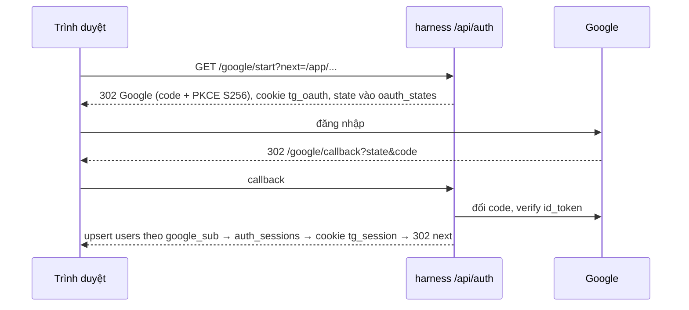

# Tài khoản

Đăng nhập, phiên, hồ sơ, avatar, xóa tài khoản và liên kết Google Calendar. Code: `src/accounts/` (public API ở `__init__.py`), HTTP ở `src/harness/server.py`, Postgres ở `src/db/` + `migrations/`. Web: `web/src/user/account.ts`, `screens/Auth.tsx`, `screens/Account.tsx`.

## 1. Quy tắc

- `/app` cần phiên: tài khoản Google hoặc khách dùng thử (§4b); landing `/` vẫn public. Đăng nhập **chỉ bằng Google**.
- Hồ sơ là **prior**, không phải fact: chuyến hiện tại luôn thắng (`docs/P2_TRIP_UNDERSTANDING.md` §17).
- Chỉ lưu hash SHA-256 của token phiên; refresh token Google mã hóa bằng Fernet (`TOKEN_ENC_KEY`).
- Admin xem được mọi dữ liệu người dùng; không ai gõ fact địa điểm qua tài khoản.

## 2. Đăng nhập

`POST /api/auth/logout` xóa phiên và cookie. `POST /api/auth/guest` tạo khách dùng thử (§4b).

- `state` lưu ở bảng `oauth_states` (10 phút, dùng một lần) và trong cookie `tg_oauth` (`Path=/api/auth`); callback chỉ nhận khi hai cái khớp. Callback duy nhất là `GOOGLE_REDIRECT_URI`, dùng chung cho đăng nhập và Calendar (`purpose: login | calendar`).
- `next` chỉ nhận đường dẫn trên site (bắt đầu bằng `/`, không `//`, không `\`); sai thì về `/app`.
- Cookie `tg_session`: `HttpOnly; SameSite=Lax; Path=/`, `Secure` khi `APP_BASE_URL` là https, 30 ngày; dùng lại sau hơn 1 giờ thì gia hạn 30 ngày và gửi lại cookie.
- Lỗi đăng nhập về `/app/login?error=denied|state|failed`; tài khoản `status ≠ active` không đăng nhập được.
- Lần đầu: màn đồng ý điều khoản và chính sách dữ liệu (bắt buộc tích), ghi `profiles.consents.{terms,privacy} = {version, at}`. Phiên bản hiện tại là `TERMS_VERSION` trong `src/accounts/service.py`; đổi phiên bản thì mọi người được hỏi lại.
- Walk-through không có Google: `TG_TEST_LOGIN=1` bật `GET /api/auth/test/login?email=&name=&next=`; route tự tắt khi `APP_BASE_URL` là https.

Web: `account.ts` đọc `GET /api/harness/me`; mọi lời gọi `/api/harness/*` trả 401 đưa về màn đăng nhập rồi Google trả về đúng trang đang mở.

## 3. Hồ sơ và avatar

| API | Việc |
|---|---|
| `GET /api/harness/me` | `{id, email, name, avatar, role, home_city, usual_mobility, usual_companions, consents, needs_consent, calendar, terms_version}`; mở app cũng kết thúc trạng thái tạm im thông báo |
| `POST /api/harness/me/consent` | `{version}` = phiên bản hiện tại |
| `PATCH /api/harness/me` | `display_name` ≤ 60, `home_city` ≤ 80, `usual_mobility ∈ {motorbike, car}`, `usual_companions ∈ {solo, partner, friends, kids, parents}`; `null` / `""` xóa trường |
| `POST /api/harness/me/avatar` | Body là file ảnh, tối đa 5 MB, JPEG / PNG / WebP mà Pillow mở được; cắt vuông, 256 px, bỏ EXIF, lưu `data/accounts/avatars/<uuid>.webp`; file gốc không giữ |
| `GET /api/harness/avatars/<key>` | Ảnh WebP; chưa có avatar riêng thì `avatar` là ảnh Google |
| `DELETE /api/harness/me` | `{confirm: true}`; web hỏi hai bước |
| `GET /api/harness/me/saved` | `{saved: [place_id, …]}` nơi đã lưu ("Đã lưu"), mới nhất trước; bảng `saved_places` (khóa `user_id, place_id`) |
| `POST /api/harness/me/saved` | `{place_ids: [...]}` 1–500 id; lưu lại nơi đã có thì giữ thời điểm cũ; mỗi tài khoản giữ tối đa 500 nơi mới nhất. Trả cả danh sách |
| `DELETE /api/harness/me/saved/<place_id>` | Bỏ lưu; trả cả danh sách |

Nơi đã lưu: web đổi trái tim ngay rồi ghi lên máy chủ, ghi lỗi thì trả lại như cũ và báo. Lần đầu đăng nhập trên một trình duyệt còn danh sách cũ trong `localStorage` (`tg.saved.v1`, trước khi nơi đã lưu theo tài khoản), web gộp nó vào tài khoản một lần rồi xóa bản trên máy (`web/src/user/store.ts` `loadSaved`).

Prior cho Trip: khi tạo hành trình, `usual_mobility` / `usual_companions` vào Trip State với `source = profile` (hiện ✎ "từ hồ sơ"); lời người dùng trong chuyến ghi đè. `home_city` chưa vào Trip: điểm xuất phát của Trip là một điểm có tọa độ chọn từ ô tìm kiếm.

## 4. Xóa tài khoản

Thu hồi token Google trước, rồi xóa `profiles`, `calendar_links`, `push_subscriptions`, `notification_prefs`, `auth_sessions`, `oauth_states`, `saved_places`, file avatar và mẫu dài hạn của Trip. `users` giữ dòng với `deleted_at`, `status = deleted`, email / tên / `google_sub` bị xóa. `journeys`, `events`, `feedback`, `trips`, `notifications` giữ lại với `user_id = NULL`. Đăng nhập lại bằng cùng Google tạo tài khoản mới.

## 4b. Khách dùng thử

Nút "Dùng thử, không cần đăng nhập" ở màn đăng nhập gọi `POST /api/auth/guest` (cùng origin; đã có phiên thì trả lại `me` của phiên đó, không tạo khách thứ hai). Khách là một dòng `users` có `role = 'guest'` (migration 004), không email, không `google_sub`, không `profiles`. Phiên 1 ngày (`GUEST_DAYS`), không gia hạn.

- **1 chuyến**: `POST /api/harness/sessions` lần thứ hai trả 409 `guest_limit`; chuyến cũ vẫn mở được trong ngày.
- **Không có lịch sử**: `GET /api/harness/trips` luôn trả `[]` cho khách; web không ghi danh sách chuyến cho khách.
- **Không có tính năng của tài khoản**: lưu địa điểm, avatar, đồng ý điều khoản, thông báo, push, Calendar, hồ sơ, xóa tài khoản trả 403 `sign_in_required`. `needs_consent` luôn `false` cho khách (khách không có dữ liệu cá nhân để đồng ý).
- **Không xóa gì**: dòng `users`, `journeys`, `events` của khách giữ nguyên để Admin xem lại (Hành trình hiện "Khách dùng thử"; Dashboard đếm khách riêng, không tính vào "Người dùng mới"). Khách đăng nhập Google sau đó là một tài khoản mới, chuyến thử không chuyển sang.
- **Dữ liệu trong trình duyệt gắn theo chủ**: `tg.owner` ghi tài khoản (hoặc khách) đang dùng; đổi chủ thì chuyến đang mở, lịch sử chat và yêu cầu chưa gửi của chủ trước bị xóa, danh sách chuyến lưu theo `tg.trips.v1.<id>`.

## 5. Liên kết Google Calendar

`GET /api/auth/google/start?purpose=calendar&next=` (cần đang đăng nhập) xin thêm scope `calendar.app.created` với `access_type=offline`, `prompt=consent`, `include_granted_scopes=true`; chỉ gọi khi người dùng bấm "Thêm vào Google Calendar". Callback chỉ nhận khi Google trả refresh token, có đúng scope, và cùng tài khoản Google đã đăng nhập; xong về `next?calendar=connected`, lỗi về `next?calendar=failed`. Ngắt kết nối thu hồi token (`docs/P5_COMPANION.md` §Calendar).

## 6. Postgres

Container `tripguardian-pg` (`postgres:16`, `127.0.0.1:5433`, volume `tripguardian-pgdata`). `./run.sh db` tạo / khởi động container, tạo role và database (`python -m db bootstrap`, cần `POSTGRES_PASSWORD`) rồi `python -m db migrate`. `./run.sh db-backup` → `data/backup/pg/<ngày>.sql.gz`, giữ 14 bản. Cổng 5432 trên máy là Postgres khác, không dùng.

- `tg_app` (`DATABASE_URL`) ghi; `tg_analytics` (`DATABASE_URL_READONLY`) chỉ `SELECT`, không đọc `auth_sessions`, `oauth_states`, `calendar_links`, `push_subscriptions`.
- Migration là file SQL đánh số trong `migrations/`, áp một lần mỗi file trong transaction, ghi vào `schema_migrations`; chạy lại không làm gì.
- Test đánh dấu `pg` chỉ chạy khi có `TEST_DATABASE_URL`; mỗi test dùng một schema tạm.
