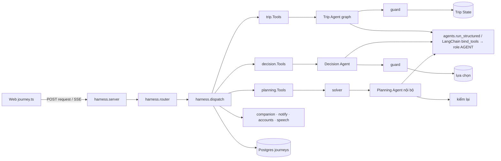
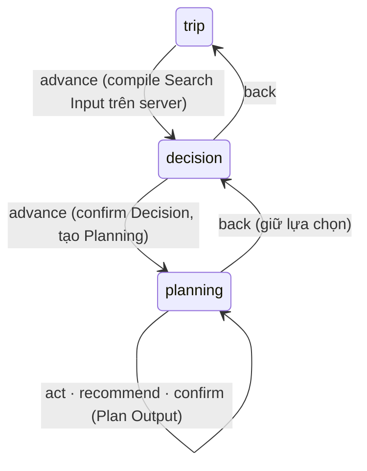
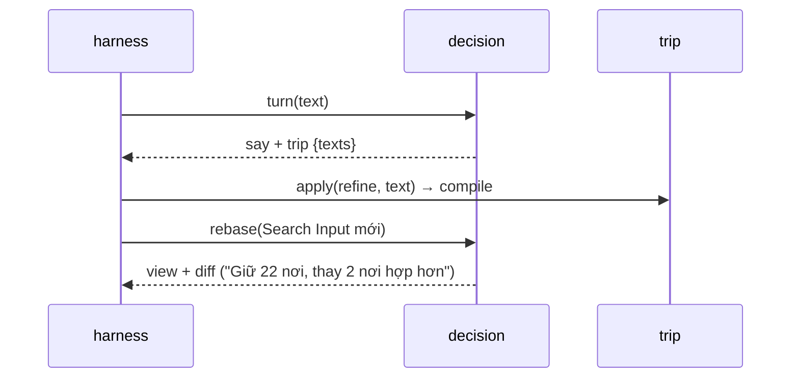
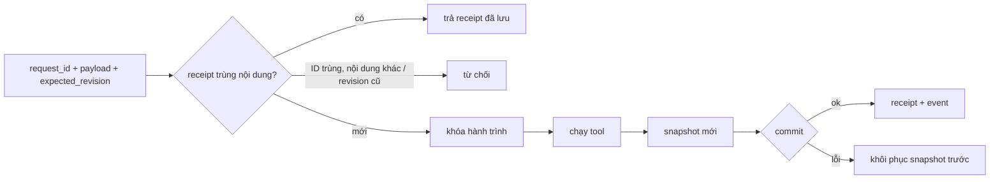

# Agent, harness và router

Một hành trình chung cho Trip → Decision → Planning. Module sở hữu state, tool và guard của mình; harness điều phối qua public API. Model theo vai trò `Agent` (`docs/LLM_PROVIDER.md`).

## 1. Cấu trúc và quyền



| Package / file | Trách nhiệm |
|---|---|
| `src/agents/runtime.py`, `limit.py` | stream, deadline, JSON / schema, retry vòng khoảng trắng một lần; giới hạn call trong tiến trình |
| `src/agents/contracts.py` | `ToolSpec`, `SkillSpec`, đọc YAML an toàn, allowlist tên / quyền |
| `src/{trip,decision,planning}/tools.py` + `skills.yaml` | adapter public: validate, gọi engine, xuất / khôi phục snapshot; tool được phép |
| `src/harness/contracts.py`, `router.py` | request / response có kiểu; định tuyến theo stage + operation |
| `src/harness/dispatch.py`, `session.py`, `pgstore.py` | handoff, revision, receipt, snapshot atomic |
| `src/harness/server.py`, `events.py` | HTTP / SSE localhost; ghi event |
| `web/src/user/journey.ts` | client: tuần tự mutation, retry, khôi phục pending, cache |

Skill là khai báo do repo quản lý; `permit_tool` kiểm capability tại adapter; `guard` là đường duy nhất ghi state. Planning không nhận `turn` qua router; `live` chỉ cung cấp tool.

## 2. Router và handoff



| Stage | Operation |
|---|---|
| `trip` | `turn`, `advance` |
| `decision` | `turn`, `act`, `advance`, `back` |
| `planning` | `act`, `recommend`, `confirm`, `back` |

Request tới stage không active bị từ chối. Router không gọi LLM. `advance`, `back`, `recommend`, `confirm` chỉ nhận payload rỗng (client không gửi output thay handoff đã kiểm).

**Lượt chat ở Chọn nơi có mong muốn về chuyến** (Decision phát `trip {texts}`):



**Lịch ngầm (`preview`)**: đọc Decision Output nháp (`decision` read `draft`) dưới khóa hành trình, gọi `planning.Tools.preview` ngoài khóa. Cache ≤ 16 bản, ≤ 15 phút và không quá TTL tài nguyên live; request trùng gom một lần dựng; `advance` lấy bản sao độc lập của đúng preview. Web debounce, chỉ một request chạy.

Plan Output đã chốt vẫn phục vụ Hôm nay khi sửa lịch hoặc quay về tuyển chọn, tới lần chốt sau.

## 3. Phiên, revision và retry

`Journey` = ID, `user_id`, stage, revision, ID phiên module, outputs, snapshot, receipt. `python -m harness serve` dùng `PgStore` (bảng `journeys`, envelope `jsonb`); ghi `UPDATE … WHERE revision = <đã đọc>`, người thứ hai nhận `Conflict` 409.



Restart phục hồi module từ snapshot đã commit, không gọi lại LLM. Client lưu pending request ở `localStorage` trước khi gửi, retry giữ nguyên ID / payload / revision. Nạp file cũ: `python -m harness import-files data/harness/sessions data/harness/feedback.jsonl`.

## 4. API và SSE

`python -m harness serve [--port 8769]` (bind `127.0.0.1`, cần `DATABASE_URL`). Mọi `/api/harness/*` cần cookie `tg_session` (401 nếu thiếu); mutation phải có `Origin` khớp `APP_BASE_URL` hoặc `Host` (403); hành trình của tài khoản khác → 404. Ngoại lệ: `POST /api/harness/events` không phiên chỉ giữ `page_view`, `landing_cta`.

| API | Việc |
|---|---|
| `POST /api/harness/sessions` | `{experience?, start_with?}` → journey + Trip view; prior từ hồ sơ; khách lần 2 → 409 `guest_limit` |
| `GET /api/harness/sessions/<id>?stage=` | view module |
| `POST /api/harness/sessions/<id>/request` | mutation; `Accept: text/event-stream` để nhận SSE |
| `GET …/read/decision/{compare,why-not,page,fit}` | so sánh, lý do loại, trang tiếp (`P3` §9.4), `Card.fit` ≤ 60 nơi |
| `GET …/read/planning/{variants,lodging}`, `…/planning/lodging/events` | phương án; tiến độ chỗ ở (SSE ≤ ~10 s) |
| `GET …/preview` | chỉ stage `decision`: `{revision, status: ready|failed|blocked|empty, plan}` |
| `GET /api/harness/places?q=`, `/geo?q=`, `/lodging/suggest?q=` | tra nơi; ô xuất phát (`live.geosearch`); ô chỗ ở |
| `GET /api/harness/transit?…`, `/transit/events?…` | chuyến xe / bay (`P4` §Chuyến xe khách, chuyến bay) |
| `GET /api/harness/rentals?mode=bus|plane` | điểm thuê xe máy (`P4` §Thuê xe máy) |
| `GET /api/harness/trips` | ≤ 50 hành trình của tài khoản (khách: `[]`) |
| `POST …/feedback`, `POST /api/harness/reports` | phản hồi sau chuyến; báo sai thông tin nơi |
| `…/today`, `…/companion`, `/calendar/*`, `/push/*`, `/notifications*` | `docs/P5_COMPANION.md` |
| `/me*`, `/avatars/<key>`, `DELETE /profile/<user_id>` | `docs/ACCOUNTS.md`; xóa mẫu dài hạn |
| `POST /api/harness/speech`, `/transcribe` | `docs/SPEECH.md` |
| `POST /api/harness/events` | event web (`docs/ANALYTICS.md`) |

Request mẫu:

```json
{"request_id":"unique-id","stage":"decision","operation":"act","expected_revision":3,"payload":{"type":"select","place_id":"..."}}
```

Response `JourneyView`: `id, stage, revision, sessions, outputs, result`. Body ≤ 64 KiB (avatar 5 MB, ghi âm 4 MB). 400 input sai · 404 không có / không phải của mình · 409 conflict hoặc chưa chốt được · 500 lỗi khác (có log). SSE bọc `request_id, stage, revision, event, data`; `say` / `preview` mang `provisional: true`; event `journey` cuối stream là receipt. Đường `geo`, `lodging/suggest`, `transit`, `rentals` không cần journey (harness gọi thẳng `planning.Tools`).

## 5. Ngân sách model và kiểm chứng

Edit, show, act, router không gọi LLM. Chip quiz của Trip ghi thẳng `drafts`; câu gõ tự do và lựa chọn trên thẻ agent là một lượt agent. Clef chặn lạc đề / phá hoại / câu hỏi số liệu trước Agent (`docs/P2_TRIP_UNDERSTANDING.md` §4). `decision/heuristics.py` nhận lệnh chọn / bỏ / khóa với tên đầy đủ khớp duy nhất. Log: `clef_reject:*`, `clef_data`, `heuristic:exact_command`; adapter phát event nội bộ `trace {path}` (`agent | fallback | heuristic:*`), harness bỏ trước khi gửi web và ghi vào event cho Admin.

`config/agents.yaml`: `max_parallel: 2`, `max_waiting: 16`, hàng chờ nằm trong deadline tổng; đầy / timeout / sai schema → module dùng fallback. Quota chỉ trong một tiến trình.

```sh
python -m pytest -q tests/agents tests/harness tests/trip tests/decision tests/planning
# test web đọc JS biên dịch từ mã hiện tại (đường dẫn qua JOURNEY_JS / PLAN_VIEW_JS)
TSC="node web/node_modules/typescript/bin/tsc --ignoreConfig --target ES2022 --module ES2022 --lib ES2022,DOM --skipLibCheck --types ''"
eval $TSC web/src/user/journey.ts --outDir /tmp/tg-journey && node --test web/scripts/test_journey.mjs
eval $TSC web/src/user/planning/view.ts --outDir /tmp/tg-plan-view && node --test web/scripts/test_plan_view.mjs
node --test web/scripts/test_preview_queue.mjs web/scripts/test_visit_edit.mjs
```

Test không mạng dùng stream giả + engine thật với fixture serving / live; model thật theo marker `live`.
