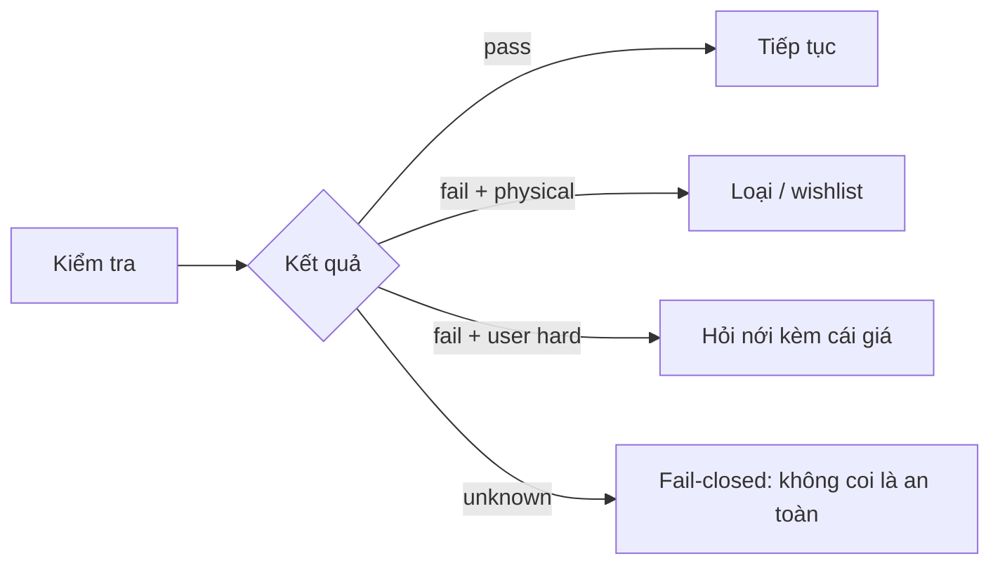
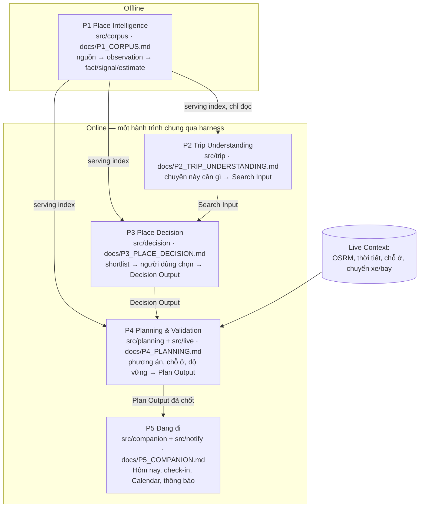
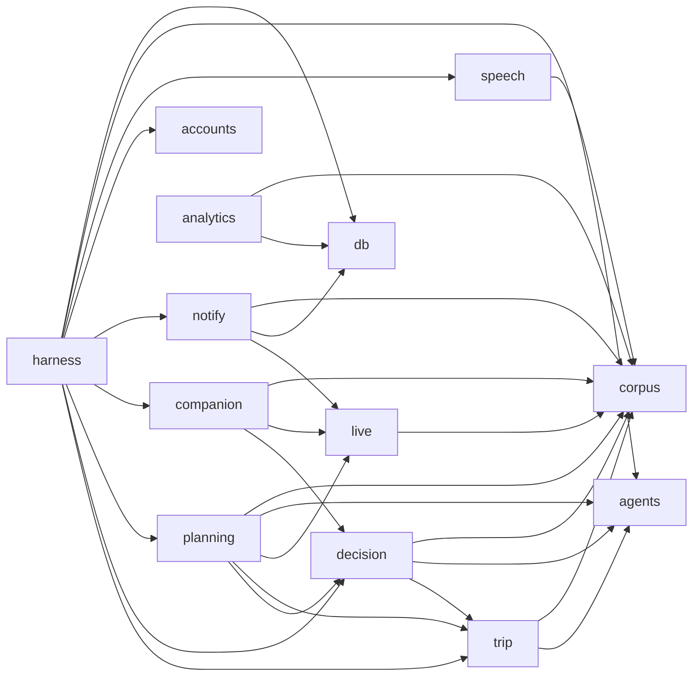
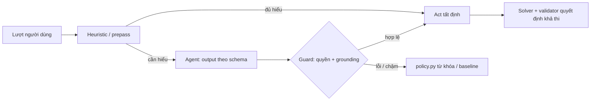
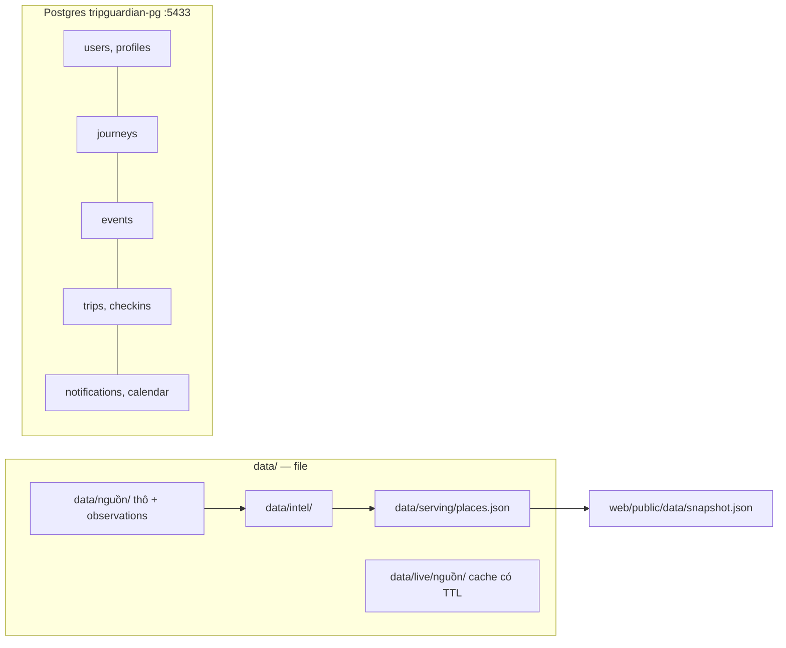
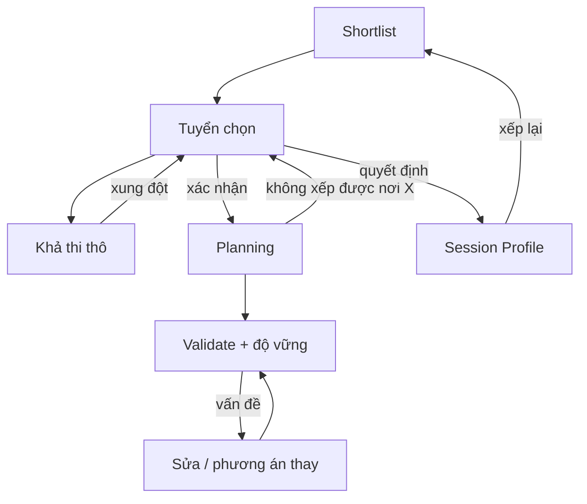
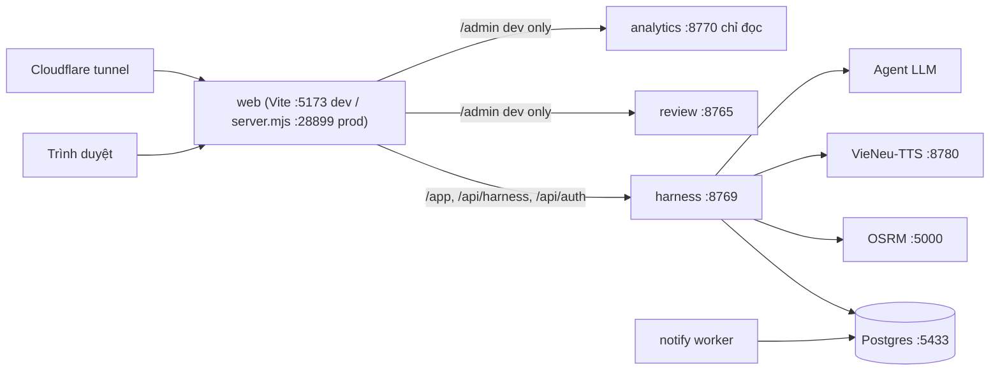

# Kiến trúc — TripGuardian

Bản đồ hệ thống: các phần, cách nối, quy tắc chung. Chi tiết từng phần ở tài liệu của phần đó. Vì sao làm: `docs/PROJECT_CONTEXT.md`.

## 1. Nguyên tắc hệ thống

- Thiếu bằng chứng → `unknown`; không bao giờ bịa fact hay địa điểm.
- Input người dùng mô tả **chuyến đi**, không phải bằng chứng về địa điểm.
- Live context chỉ sống trong request, không thành tri thức địa điểm.
- Physical constraint không có đường code nào nới.
- Offline **ghi** Place Intelligence; online chỉ **đọc** nó và chỉ ghi lịch trình + dữ liệu người dùng.
- Module chỉ gọi nhau qua public API (`__init__.py`); mỗi nguồn ngoài một module + một thư mục dữ liệu.

## 2. Mô hình constraint

| Loại | Ý nghĩa | Nới được? | Khi vi phạm |
|---|---|---|---|
| Physical | Bất khả thi thực tế | **Không** | Loại, hoặc giữ wishlist kèm lý do |
| User hard | Yêu cầu rõ của người dùng | Chỉ khi người dùng xác nhận | Hỏi nới, **kèm cái giá đã tính** |
| Soft | Sở thích | Có | Chỉ đổi thứ tự |

Mỗi kiểm tra trả `pass | fail | unknown`. Hard constraint thiếu bằng chứng → không coi là an toàn (fail-closed, `docs/P3_PLACE_DECISION.md` §6.2).

## 3. Năm giai đoạn

| Giai đoạn | Code | Contract ra |
|---|---|---|
| P1 Place Intelligence | `src/corpus/` | serving record (`P1_CORPUS.md` §Bản ghi địa điểm) |
| P2 Trip Understanding | `src/trip/` | `SearchInput` (`P2_TRIP_UNDERSTANDING.md` §9) |
| P3 Place Decision | `src/decision/` | `DecisionOutput` (`P3_PLACE_DECISION.md` §15) |
| P4 Planning & Validation | `src/planning/`, `src/live/` | Plan Output (`P4_PLANNING.md` §Plan Output) |
| P5 Đang đi | `src/companion/`, `src/notify/` | `trips`, check-in, thông báo (`P5_COMPANION.md`) |

Phần dùng chung, chỉ ghi dữ liệu người dùng: tài khoản (`docs/ACCOUNTS.md`), event + Admin (`docs/ANALYTICS.md`), giọng nói (`docs/SPEECH.md`). Check-in và thông báo không phải bằng chứng về địa điểm.

## 4. Phụ thuộc giữa package

Một hướng, chỉ qua `__init__.py` (đo từ import thật):

`corpus` không biết giai đoạn nào sau nó (tên dùng: `corpus.serving`, `corpus.ontology`, `corpus.llm`, `corpus.crawl`, `corpus.review`). `live` không biết `planning`. Test khẳng định: `tests/planning/test_planning_boundaries.py`, `tests/live/test_boundaries.py`.

## 5. Vai trò model

Code gọi model theo **vai trò**; model cụ thể nằm trong config, key trong `.env` (`docs/LLM_PROVIDER.md`).

| Vai trò | Ở đâu | Việc |
|---|---|---|
| ASR | corpus | Âm thanh TikTok → transcript có timestamp |
| Extractor | corpus | Mọi việc khối lượng lớn: observation có span, lọc, kiểm span |
| Judge | corpus | Thay người duyệt: nhãn nhận định, đóng cửa, gộp nơi |
| Agent | trip, decision, planning | Hiểu câu tự do; đề xuất bố trí nội bộ |
| TTS | speech | Giọng nói của trợ lý |

Model không ghi fact và không tạo địa điểm. Chi tiết runtime: `docs/AGENT_HARNESS.md`.

## 6. Cấu hình và dữ liệu

Mọi ngưỡng nằm trong `config/`, không trong code.

| File | Của | Nội dung |
|---|---|---|
| `cities.yaml`, `queries.yaml` | corpus | thành phố, vùng quét, category, trần crawl |
| `ontology.yaml` | corpus + profile | feature ontology có version, id dùng chung |
| `category_defaults.yaml`, `serving.yaml` | corpus | estimate mặc định theo nhóm; ngưỡng serving |
| `trip.yaml` | trip | câu hỏi, ngưỡng Clef, hậu cần, học mẫu |
| `agents.yaml` | agents | giới hạn call / hàng đợi trong tiến trình |
| `decision.yaml` | decision | trọng số xếp hạng, cỡ shortlist, cửa sổ hiện |
| `planning.yaml` | planning | nhịp độ, cụm, mục tiêu, độ vững, chỗ ở |
| `live.yaml`, `airports.yaml` | live, trip | endpoint, TTL, bảng tỉnh / sân bay |
| `climate.yaml`, `holidays.yaml`, `events.yaml`, `advisories.yaml` | live | dữ liệu nhập tay theo ngày |
| `eval_trips.yaml` | decision + planning | 30 chuyến ẩn để đo |
| `companion.yaml`, `notifications.yaml` | companion, notify | gợi ý tại chỗ; mẫu thông báo |

Role `tg_app` ghi; `tg_analytics` chỉ đọc và không thấy bảng bí mật. Một act sinh `State` mới (có phiên bản, undo/redo); `scope.py` quyết định phần nào tính lại.

## 7. Vòng phản hồi

Decision ước lượng **thô** để chọn nhanh; Planning tính **thật** rồi trả ngược nơi gây lỗi. Vòng cá nhân hóa: `docs/PROJECT_CONTEXT.md` §10.

## 8. Giao diện, cổng, triển khai

Bản public (`./run.sh prod`) chỉ mở landing, `/app`, ảnh và `/api/harness/*`, `/api/auth/*`; `/admin`, analytics và mọi `/api` khác trả 404. Cách chạy: `README.md`. Màn hình: `docs/WEB.md`.

## 9. Quyết định thiết kế chính

| Quyết định | Lý do |
|---|---|
| Place Intelligence tách khỏi chuyến đi | Vòng đời khác nhau |
| Nguồn khám phá ≠ nguồn bằng chứng | Nơi tìm ra địa điểm chưa chắc đáng tin cho mọi nhận định |
| Resolve địa điểm người dùng trước khi đánh giá | Tên có thể là alias, trùng, hoặc chưa biết |
| Physical / user hard / soft tách riêng | Cách xử lý xung đột khác nhau |
| Decision dùng khoảng cách thô, Planning dùng thời gian thật | Không tính kế hoạch chi tiết trước khi có shortlist |
| Người dùng chọn trước khi xếp lịch | Hỗ trợ quyết định, không quyết thay |
| Khả thi theo tổ hợp | Từng nơi hợp lệ vẫn có thể thành chuyến bất khả thi |
| Nhịp độ ≠ mục tiêu tối ưu | "Thong thả" là cường độ; "ít di chuyển" là mục tiêu |
| Kiểm tra tất định, độ vững sau khả thi | Lịch trông hợp lý là chưa đủ |
| Dự phòng dùng lại ứng viên bị loại | Giải thích được, hợp bối cảnh |
| Chỗ ở là biến tối ưu, không là tri thức địa điểm | Giá và phòng đổi theo ngày |
| Profile là prior, xếp sau constraint | Lịch sử không lấn chuyến hiện tại |
| Dữ liệu địa điểm do agent xây, gate + định tuyến rủi ro | Công sức người tăng theo rủi ro, không theo cỡ corpus |
| Cố định vai trò model, không cố định model | Đổi model bằng config khi nhãn cho thấy tốt hơn |
| Phiên = `State` có phiên bản + hàm thuần | Undo / redo thật, chỉ chạy lại phần bị ảnh hưởng |
