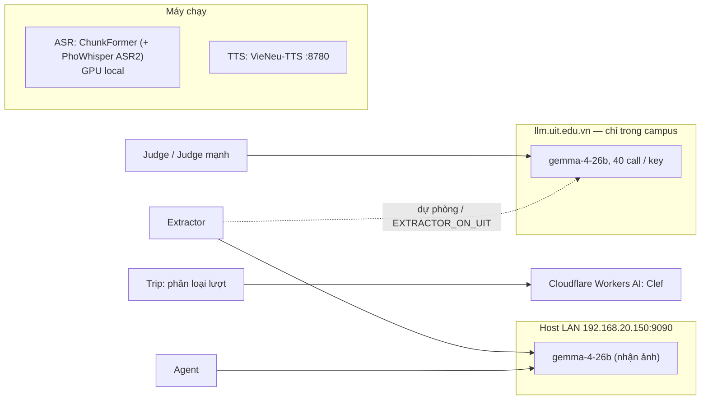

# LLM Provider

Code gọi model theo **vai trò**. `Role` (biến env của key / endpoint / model / số call đồng thời) và `Task` (vai trò, prompt, schema, `max_tokens`, `temperature`, `parallel`) khai báo ở `src/corpus/llm/` (`roles.py`, `tasks.py`); proposal của Planning khai báo ở `src/planning/proposal.py` trên role `AGENT`. Định nghĩa vai trò: `docs/P1_CORPUS.md` §Vai trò model. File này chỉ ghi model nào đảm nhận và cách kết nối.



| Vai trò | Dùng ở | Model hiện tại |
|---|---|---|
| ASR | corpus TikTok; `speech` (nghe) | ChunkFormer (`khanhld/chunkformer-ctc-large-vie`); ASR2 `vinai/PhoWhisper-medium` |
| Extractor | corpus (observe, filter, qc, kiểm span, `asr_check`, `place_verify`, audit Gemma); `photo_rank` | Gemma 4 trên host LAN; UIT dự phòng |
| Judge, Judge mạnh | `judge audit / status / dedup`, kiểm nơi của `qc` | Gemma 4 trên UIT, 38 call |
| Agent | trip (vòng tool `bind_tools`, không stream), decision (lượt chữ), planning (proposal) | `gemma-4-26b` host LAN; `tool_calls` + `json_schema`, 0,3–1,6 s / call |
| TTS | `speech` (đọc) | VieNeu-TTS v3 Turbo, giọng `Trúc Ly` |
| Clef | trip (phân loại lượt, kiểm có / không) | `clef-flash` (Cloudflare) |

Gemma có thể chèn khối `<|channel>thought…<channel|>`: Trip lột bằng regex (`strip_thought`); Decision / Planning dùng JSON có ràng buộc.

## Host LAN (Extractor, Agent)

Server tương thích OpenAI, `http://192.168.20.150:9090/v1`, model `gemma-4-26b`. Mọi task nhiều call của corpus và vai trò Agent chạy ở đây; UIT là dự phòng (đổi ba biến Extractor trong `.env`).

`EXTRACTOR_PARALLEL=38` (ưu tiên chất lượng; mọi task không tự đặt `parallel` dùng số này). Sức chứa thật bị giới hạn ở bộ nhớ KV và tốc độ sinh (~30 token/s mỗi chuỗi): host chạy thật ~35–50 call, phần thừa chỉ xếp hàng (tính vào timeout 240 s). Kiểm trước khi đổ lỗi cho code:

```sh
curl -s http://192.168.20.150:9090/metrics | grep -E "num_requests_(running|waiting)|kv_cache_usage|preemptions"
```

Hai chỗ phía client tốn host, **chưa áp** vì đổi output (cần đo bằng nhãn trước): biến (`Place: {name}`) đứng trước phần tĩnh nên prefix cache gần như không trúng (dời xuống cuối: hit ~75%, +26% token/s); JSON thụt lề tốn gấp đôi token so với JSON gọn.

## UIT API

`https://llm.uit.edu.vn/gemma/v1`, model `gemma-4-26b`, chỉ trong mạng campus. `Authorization: Bearer <key>`; ≤ 32.768 token / request, ≤ 20 phút; **≤ 40 request đồng thời / key** (vượt → 429). Nhận ảnh, không nhận audio. Thinking: `extra_body={"chat_template_kwargs": {"enable_thinking": True}}` (suy nghĩ nằm trong `content`, code lấy khối JSON cuối).

Gặp 429 → giảm slot còn 3/4 (tối thiểu 4), call chờ 20 s rồi thử lại; `cap` call thành công liên tiếp → thêm 1 slot. `Task.ask` thử lại ≤ 4 lần khi JSON hỏng hoặc lỗi mạng (chờ 2 s, gấp đôi).

Biến tiến trình (không đặt trong `.env`): `EXTRACTOR_ON_UIT=1` chuyển Extractor sang UIT; `EXTRACTOR_ALSO_UIT=1` cho `gmaps observe` dùng thêm UIT; `JUDGE_ENGINE=gemma`, `JUDGE_READ_ALL=1`, `JUDGE_ALSO_LAN=1` (`docs/P1_CORPUS.md` §6). Bật thêm UIT thì không chạy Judge cùng lúc (key 40 call).

## Cấu hình (`.env`, tạo từ `.env.example`)

| Biến | Dùng cho |
|---|---|
| `LLM_API_KEY`, `EXTRACTOR_BASE_URL`, `EXTRACTOR_MODEL`, `EXTRACTOR_PARALLEL` | Extractor |
| `UIT_API_KEY`, `UIT_API_BASE_URL`, `UIT_API_MODEL`, `JUDGE_FIRST_MODEL` | Judge (+ Extractor khi `EXTRACTOR_ON_UIT`) |
| `AGENT_API_KEY`, `AGENT_BASE_URL`, `AGENT_MODEL` | Agent; thiếu / lỗi → Trip chỉ giữ phần prepass, Decision dùng `policy.py`, Planning giữ baseline |
| `TTS_API_KEY`, `TTS_BASE_URL`, `TTS_MODEL`, `TTS_VOICE` | TTS; thiếu → 503 `speech_unavailable` |
| `CLOUDFLARE_API_TOKEN`, `CLOUDFLARE_ACCOUNT_ID`, `CLEF_MODEL`, `CLEF_MODEL_ID`, `CLEF_TIMEOUT_S` | Clef; thiếu → Clef không quyết gì |
| `ASR_MODEL`, `ASR_ALT_MODEL` | ASR (Hugging Face id) |
| `DATA_DIR`, `LIVE_CONTACT` | gốc dữ liệu; liên hệ trong User-Agent của request live |

Không bao giờ hardcode key trong source, test, tài liệu.

**Ngân sách thời gian của Agent:** chờ token đầu `first_token_s`, cả call `total_s` (`config/{trip,decision,planning}.yaml`); quá thì fallback. `agents.run_structured` giới hạn concurrency theo `config/agents.yaml` (`docs/AGENT_HARNESS.md` §5).

## TTS

`src/speech/synth.py` gọi `audio.speech.create(..., response_format="wav")`; luồng và API: `docs/SPEECH.md`. VieNeu-TTS tự dựng (`uv run python -m apps.openai_speech`); `./run.sh start|prod` chạy nó như worker `tts` (`scripts/vieneu_server.sh`, `TTS_GPU`). GPU: RTF 0,01–0,02; CPU: ~0,6.

## ASR local

ChunkFormer (`src/corpus/llm/asr.py`) chạy GPU khi có, không thì CPU. Cài: torch bản CUDA, `pip install chunkformer --no-deps`, `silero-vad`, `soundfile`, `ffmpeg` trong `PATH` (`pip install -e ".[asr]"`). Không model nào nghe đúng tên thương hiệu / từ mượn; PhoWhisper bắt được từ ChunkFormer sót nên làm ASR2; Whisper large-v3-turbo không dùng được cho tiếng Việt.

## Chứng chỉ TLS

`llm.uit.edu.vn` dùng root **Sectigo Public Server Authentication Root E46**; CA store cũ không có. Thêm bản cross-sign USERTrust ECC làm intermediate, không tắt verify:

```bash
cat /etc/ssl/certs/ca-certificates.crt certs/sectigo-root-e46-cross-usertrust-ecc.pem > certs/uit-ca-bundle.pem
# .env
SSL_CERT_FILE=certs/uit-ca-bundle.pem
CURL_CA_BUNDLE=certs/uit-ca-bundle.pem
```

Không bao giờ `verify=False` / `curl -k`.

## Grounding

Không dựa vào kiến thức sẵn có của model cho fact cụ thể. Luôn đưa văn bản nguồn vào prompt và chỉ cho trả lời từ đó (`docs/ARCHITECTURE.md` §1).
