# P1 — Place Intelligence (corpus)

Kho tri thức địa điểm xây **offline**, độc lập mọi chuyến đi; online chỉ đọc. Code: `src/corpus/`. Vị trí: `docs/ARCHITECTURE.md` §3.

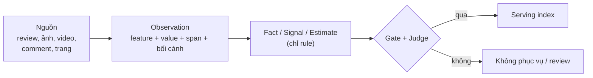

Agent xây từ đầu đến cuối; gate tất định kiểm mọi lần ghi; người chỉ duyệt khi muốn (Judge thay hàng đợi bắt buộc). Không span → không observation → không giá trị. Corpus không lưu dữ liệu người dùng.

## Phạm vi

**Trong:** Đà Lạt. Google Maps quyết định **tập địa điểm** (tham quan, ăn uống, hoạt động, mua sắm, dịch vụ du khách) và **chỗ ở** (nhóm `stay`, chỉ Planning đọc để gợi ý chỗ ở; Explore / Decision không bao giờ gợi ý). Review + ảnh Maps, video TikTok, trang official là bằng chứng cho nơi đã có trong tập.

**Ngoài:** dữ liệu người dùng, độ hợp gợi ý (online), live context (thời tiết, giao thông, giá phòng theo ngày), toàn quốc.

## Nguyên tắc

1. Không bao giờ bịa entity: chỉ tồn tại sau khi resolve về thứ có thật (Place ID).
2. Không span, không observation.
3. Chưa biết giữ `unknown`, không bao giờ `false`.
4. Giữ xung đột: bất đồng → `uncertain`, giữ cả hai phía.
5. Model trích xuất, code quyết định: fact / signal / estimate chỉ do rule ghi.
6. Cùng được nhắc ≠ ở gần nhau.
7. Vai trò nguồn tách biệt: Maps quyết định tập nơi; nguồn khác chỉ thêm bằng chứng.
8. Build không chờ người: việc chưa giải quyết → `UNRESOLVED` / không phục vụ, kèm lý do.

## Nguồn

| Nguồn | Dùng cho | Không dùng cho |
|---|---|---|
| Google Maps | Tập nơi; định danh, vị trí, giờ, trạng thái, website; review, ảnh, giờ cao điểm là bằng chứng trải nghiệm | Rating làm bằng chứng (chỉ để xếp ứng viên) |
| Video TikTok | Trải nghiệm, môi trường, vận động của nơi đã có | Tạo nơi mới; fact vận hành một mình |
| Comment TikTok | Tín hiệu lặp lại (đông, yên, đường đi) | Fact; một comment đơn lẻ như sự thật |
| Trang official | Giờ, giá vé, đặt chỗ, quy định | — |

Video được giữ tới khi kiểm xong (`scripts/free_tiktok_clips.py` xóa sau), trừ clip `tiktok clips` chọn cho từng nơi (phát từ `/media/tiktok/<id>/video.mp4`; nơi chưa có clip dùng embed TikTok).

## Vai trò model

Spec ràng buộc **vai trò**, không ràng buộc model; chọn model theo chất lượng trên nhãn rồi chi phí trên mỗi nơi phục vụ (`docs/LLM_PROVIDER.md`).

| Vai trò | Làm gì | Yêu cầu |
|---|---|---|
| Code | Chuẩn hóa, dedup, lọc spam, chấm match, tổng hợp, gate | Tất định, có test |
| ASR | Âm thanh → transcript có timestamp | Tiếng Việt |
| Extractor | Observation có span, lọc, kiểm span, đọc ảnh / khung hình | Nhận ảnh, output có cấu trúc, rẻ |
| Judge | Thay người duyệt: nhãn nhận định, đóng cửa, gộp nơi; Judge mạnh cho giá trị cho phép | Suy luận mạnh nhất có được |

Prompt, schema, thiết lập mọi task: `src/corpus/llm/` (`roles.py` `Role`, `tasks.py` `Task`); kết quả lưu `prompt_hash`, đổi prompt thì chạy lại.

## Pipeline

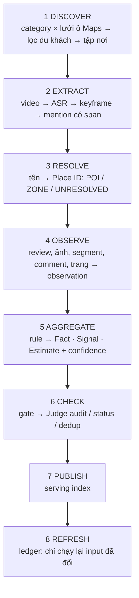

**POI** = một điểm xác định; **ZONE** = khu, con đường, cảnh quan (khu săn mây Cầu Đất), nối với POI qua quan hệ. Mọi bước đi qua ledger (input hash × processor version).

## CLI

```
python -m corpus login <tiktok|gmaps> [--profile <tên>]
python -m corpus <gmaps|tiktok|official> <phase|all> [--city dalat] [--headed] [--limit N]
python -m corpus judge <dedup|status|audit|all> [--city dalat]
python -m corpus build [--city dalat] [--every N] [--skip <bước>…]
python -m corpus aggregate | serving [--city dalat]
python -m corpus review [--port 8765]
```

| Nguồn | Phase theo thứ tự |
|---|---|
| `gmaps` | `search` (+ `stay_search`) → `filter` → `counts` → `list` → `crawl` → `relevant` → `extremes` → `keywords` → `visit` → `qc` → `observe`; ảnh: `photos` → `photo_observe` |
| `official` | `pages` → `observe` |
| `tiktok` | `place_search` → `place_filter` → `place_crawl` → `asr` → `asr_check` → `asr_alt` → `asr_check` → `place_verify` → `place_poi` → `poi_crawl` → `asr` → `asr_check` → `place_verify` → `clips` → `observe` |

`build` (`src/corpus/build.py`) chạy một lần build tăng dần, mỗi bước bỏ phần input không đổi; bước lỗi được báo, build đi tiếp:

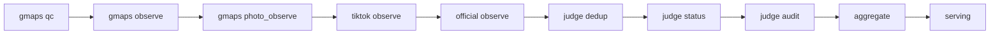

`--headed` mở trình duyệt để người giải captcha. `--profile`, `--shard i/n` cho tài khoản TikTok thứ hai. Phase cần Extractor / Judge cần mạng tới endpoint model.

## Ba loại output

| Loại | Ví dụ | Rule | Hiển thị |
|---|---|---|---|
| Fact | giờ, giá, đặt chỗ | Official > provider; bất đồng → `uncertain` | Một giá trị, hoặc "chưa xác nhận" + cả hai |
| Signal | độ đông theo bối cảnh, yên tĩnh, view, dốc | Phân phối, 1 tác giả 1 phiếu, có xu hướng | "62% trong 123 comment, 30 creator" |
| Estimate | thời gian tham quan | Rule trên observation | Luôn là khoảng |

Bối cảnh quan trọng: "đông sáng cuối tuần" lưu `crowd × weekend × morning`. Nơi không có bằng chứng trải nghiệm chỉ làm chỗ ăn, anchor, dự phòng.

## Bản ghi địa điểm

```text
Place
├── Identity      tên, alias, POI | ZONE, category, vị trí, area
├── Operation     giờ, giá, đặt chỗ, thời gian tham quan (khoảng), độ đông theo giờ
├── Experience    feature (thiên nhiên, view, cà phê, chụp ảnh, …)
├── Environment   trong / ngoài trời, độ đông theo bối cảnh, ồn, nhạy thời tiết
├── Effort        đi bộ, dốc, khó tiếp cận
├── Suitability   cặp đôi, gia đình, trẻ em, người lớn tuổi, xe lăn
└── Provenance    bằng chứng, confidence 4 thành phần, độ mới, xung đột, coverage, trạng thái
```

Feature lấy từ **ontology có version** (`config/ontology.yaml`: `id`, `group`, giá trị cho phép, `contexts`, `verify` always|sampled, `caution_values`, `check: span`, nhãn + đồng nghĩa). Corpus và User Profile dùng chung **id**, không chung bản ghi.

## Trạng thái

Một bộ chung cho corpus, Admin, User Web; giữ theo từng khía cạnh.

| Trạng thái | Ý nghĩa | Hiện cho người dùng |
|---|---|---|
| `VERIFIED` | Qua gate (+ Judge nếu rủi ro cao) | Có |
| `UNCERTAIN` | Xung đột hoặc bằng chứng yếu | Có, "chưa chắc" |
| `OUTDATED` | Quá hạn độ mới | Có, kèm cảnh báo |
| `NEEDS_REVIEW` | Judge đánh dấu / chờ kiểm bắt buộc | Không |
| `DISABLED` | Đóng cửa, trùng, không hợp lệ | Không |

## Data model

Lưu file (chưa có DB), mỗi nguồn một thư mục (`RULE.md` §2). Gốc `DATA_DIR` (mặc định `data/`).

| Đường dẫn | Ghi bởi | Nội dung |
|---|---|---|
| `data/gmaps/{search,filter,counts,list,places,qc}/` | `corpus.crawl.gmaps` | thô đúng như nguồn; `places/<fid_dir>/{place,reviews*,photos,visit}.json` |
| `data/tiktok/{place_search,place_filter,place_poi,poi_crawl,clips,videos}/` | `corpus.crawl.tiktok` | `videos/<id>/{info,video}.json`, `frames/`, `video.mp4` |
| `data/official/pages/` | `corpus.crawl.official` | chữ hiển thị của trang official |
| `data/<nguồn>/observations/`, `data/gmaps/photo_observations/` | `corpus.observe` | observation, một file mỗi nơi |
| `data/intel/places/` + `summary.json` | `corpus.aggregate` | Fact / Signal / Estimate |
| `data/serving/places.json` | `corpus.serving` | bản ghi online đọc |
| `data/review/` | `corpus.review`, `corpus.judge` | nhãn, quyết định (`decisions.jsonl`, `judge_labels.jsonl`) |

**Observation** (`src/corpus/observe/__init__.py`, chung mọi nguồn):

```text
id · place_fid · feature · value · context{time_of_day, day_type, weather}
source_type · source_id · author · observed_at · span{quote, field, start_s, end_s}
extractor · ontology_version
```

`author` là đơn vị phiếu (`author_hash` = sha256(id)[:16], không lưu tên). `span` trỏ vào dữ liệu thô, không chép nội dung sang bản ghi.

Quy ước file: `.jsonl` chỉ append; file khác ghi `*.tmp` rồi `os.replace`. File đánh dấu xong → bỏ qua; lỗi một mục → `errors.jsonl`, đi tiếp. Rời trang theo **tín hiệu kết thúc** (API `has_more=0`, dòng "đã xem hết"), timeout chỉ là lưới an toàn và ghi `…_complete = false`.

## 1. Discover

### Google Maps — tập địa điểm

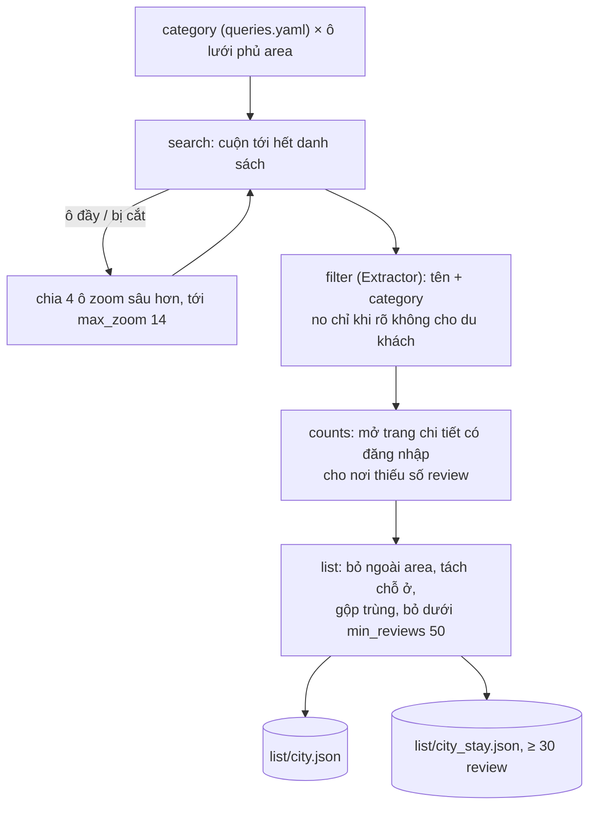

- `score` Bayes `(v·R + m·C) / (v + m)` (R rating, v số review, C rating TB của category, m trung vị số review) chỉ để xếp thứ tự; ngưỡng chất lượng duy nhất là `min_reviews`.
- Gộp trùng: cùng tên chuẩn hóa (bỏ dấu, hoa thường, dấu câu, tên thành phố) và cách ≤ 1000 m → giữ bản nhiều review nhất. Gần nhau mà khác tên thì không gộp.
- Chỗ ở: FID từng mang category chỗ ở ở bất kỳ lần thấy nào là chỗ ở; `stay_search` ghép "khách sạn / homestay / villa / resort / nhà nghỉ" × tên phường (danh sách khách sạn của Maps bỏ qua khung bản đồ). Nhóm `stay` chỉ giữ `stay_features`.
- Thành phố là config (`config/cities.yaml`: tên + `area` [lat_min, lng_min, lat_max, lng_max]).

### Google Maps — chi tiết từng nơi

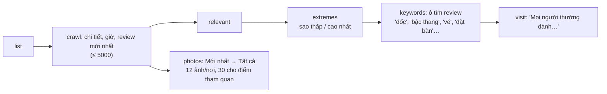

- Review không lấy phản hồi chủ quán. Text Maps giữ nguyên văn. Hai layout review (thường, lưu trú) đều đọc được.
- `keywords`: chỉ mở nơi Maps có nhiều review hơn số đã giữ; 20 review đầu mỗi từ; review của nó là mẫu `keywords`.
- Ảnh: đọc người đăng (cùng `author_hash` với review), tháng chụp; bỏ ảnh > 3 năm, ≤ 3 ảnh / người; ảnh chủ quán gắn cờ `owner`; tải 768 px qua tab.
- Bị chặn / đăng xuất: trang có link `ServiceLogin` → dừng `LoginRequired`; Headless phải mang UA Chrome thường (UA "HeadlessChrome" bị Maps "chế độ hạn chế").
- Captcha: `--headed` chờ người giải (≤ 5 phút), headless dừng; **không tự giải**. Số tab tự dò 1..`tabs`, giảm nửa khi bị chặn (`throttle.json`).

### TikTok — bằng chứng theo từng nơi

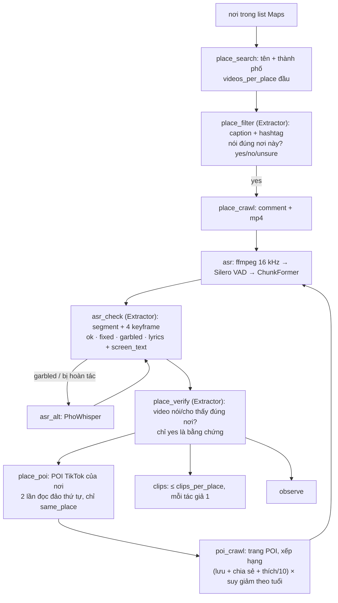

- `asr_check` guard: hoàn tác chỗ thay từ không giống âm ASR (độ giống < 0,5), từ chèn không có trong ASR2, xóa từ phủ định; bản `fixed` giữ < 50% từ → `garbled`.
- `place_verify`: `no` / `unsure` vào trang review; người thắng.
- POI chung nhiều nơi chỉ thuộc nơi có nhiều video gắn nó nhất; hòa thì không ai.
- Bị chặn: body API rỗng → nghỉ `cooldown_s` rồi thử lại. Video crawl ≤ 3 tab / tài khoản.
- TikTok theo query (`search` → `list` → `filter` → `crawl` → `comments_crawl`) vẫn chạy được nhưng ngoài phạm vi hiện tại.

### Official

Website trong bản ghi Maps (không phải mạng xã hội, đại lý, link rút gọn) → trang chủ + ≤ 4 trang cùng site nói giá vé, giờ, liên hệ; tải lại sau 90 ngày → `data/official/pages/<fid_dir>.json`.

## 2. Extract

Video → segment (cảnh + khoảng lặng) → ASR → keyframe → Extractor trả chữ trên màn hình + mô tả hình. Rồi mention địa điểm có span, loại đề xuất (`POI` | `ZONE`) và quan hệ không gian **được nói rõ** ("ngay cạnh", "cách 2 km").

## 3. Resolve

Tập đích là inventory Maps. Mention từ nguồn khác chỉ match vào tập này hoặc tra thêm một nơi Maps theo tên.

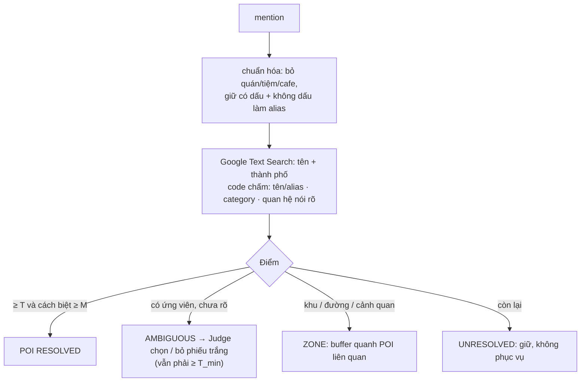

`entity_id` vĩnh viễn; Place ID là định danh ngoài, làm mới 12 tháng. Online: tên người dùng gõ chạy cùng matcher; không chắc → người dùng chọn. Lời người dùng không bao giờ là bằng chứng.

## 4. Observe

Mọi nguồn → `Observation`; không gì ghi thẳng vào entity. Bối cảnh (`time_of_day`, `day_type`, `weather`) theo lời nguồn, mỗi cái là enum hoặc `unknown`.

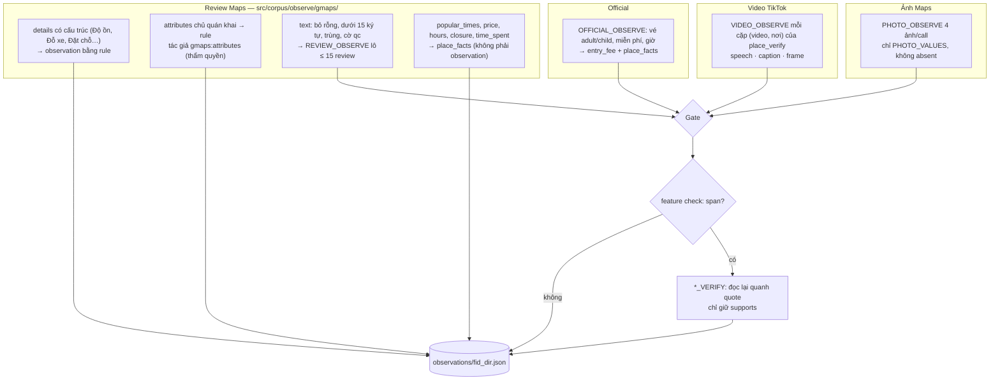

**Gate** của một câu trả lời: feature + value có trong ontology · context đúng enum · quote là chuỗi con của nguồn (sau chuẩn hóa NFC, khoảng trắng, hoa thường); `speech` → quote trong đúng segment; `frame` → chỉ giá trị ảnh chứng minh được. JSON hỏng → chia đôi lô thử lại; lỗi mạng → nơi đó thất bại, chạy lại lần sau.

**Kiểm span** bắt phủ định ("hông chặt chém"), mỉa mai, nhận xét vị trí, ngoại lệ ("miễn phí bé dưới 80cm"), câu kể của người viết. Effort có giá trị phủ định (`absent`, `sheltered`) để sàng lọc có bằng chứng `pass`, không chỉ `fail`.

**Mẫu có chủ đích:** review chỉ đến từ `extremes` / `keywords` mang `sample`, đếm ở `voices_targeted`, chỉ được tính cho effort, `visit_duration` và fact (`corpus.observe.targeted_ok`).

**Chạy lại** khi input, prompt, ontology hoặc version rule đổi; có thêm review mà prompt không đổi → chỉ review mới qua model (`read`), nhãn Judge cũ dùng lại được.

Official: giá chỉ cho nhóm bán vé vào cửa (`TICKET_GROUPS`); site dùng chung nhiều nơi chỉ giữ quote có tên riêng của nơi trong 500 ký tự. Feature ngoài ontology → `proposed_feature`; ontology chỉ người sửa.

## 5. Aggregate

Chỉ code (`src/corpus/aggregate/`). Đọc mọi `data/*/observations/*.json`, không biết nguồn; ghi đúng một lần build vào `data/intel/`.

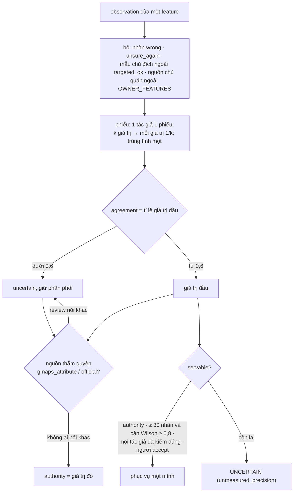

| Thành phần | Công thức |
|---|---|
| `n` = `independent_sources` | số tác giả |
| `mention_rate` | tác giả nói feature / tổng `voices` |
| `trend` | cắt tại ngày trung vị; mỗi nửa ≥ 5 tác giả, chênh ≥ 0,2 → `rising` / `falling` / `stable` |
| `rating_trend` | sao TB hai nửa, chênh ≥ 0,5 |
| `freshness` | giờ 90 ngày, giá 180, độ đông 365, khác 730 |
| `checked` | tác giả của giá trị đầu đã có nhãn `correct` |
| Coverage mỗi khía cạnh | `NONE` (0 feature) · `COMPLETE` (≥ 3 feature có n ≥ 3) · `PARTIAL` |

- `verify: always` (giá trị **cho phép**: "hợp người lớn tuổi") → `needs_review` tới khi mọi tác giả đã kiểm đúng; giá trị **cảnh báo** cần ≥ 2 tác giả hoặc đã kiểm hết. Sai cảnh báo chỉ mất một gợi ý; sai cho phép có thể gây hại.
- Official thắng Maps: `hours` của ngày trang nêu (`hours_source = official`), khác nhau → `hours_conflict`; `entry_fee` lấy vé trang (typical = trung vị vé người lớn).
- `crowd_by_time` = TB % độ đông theo `weekday|weekend` × buổi (4–5 sáng sớm, 6–10 sáng, 11–13 trưa, 14–16 chiều, 17–20 tối, còn lại đêm); tương đối với chính nơi đó.
- Hai mục Judge phán cùng một nơi (`place_merge`) gộp dưới mục nhiều review hơn.
- **Estimates** (`estimates.py`, `config/category_defaults.yaml`; luôn là Estimate): `category_group`; `visit_minutes` ưu tiên Maps `time_spent` → review `visit_duration` (≥ 3 tác giả) → mặc định nhóm; `entry_fee` từ quote vé (số lớn nhất mỗi tác giả, 730 ngày, ≥ 2 tác giả) → vé Maps; `effort_hint`.

**Serving record** (`src/corpus/serving/`, ngưỡng `config/serving.yaml`):

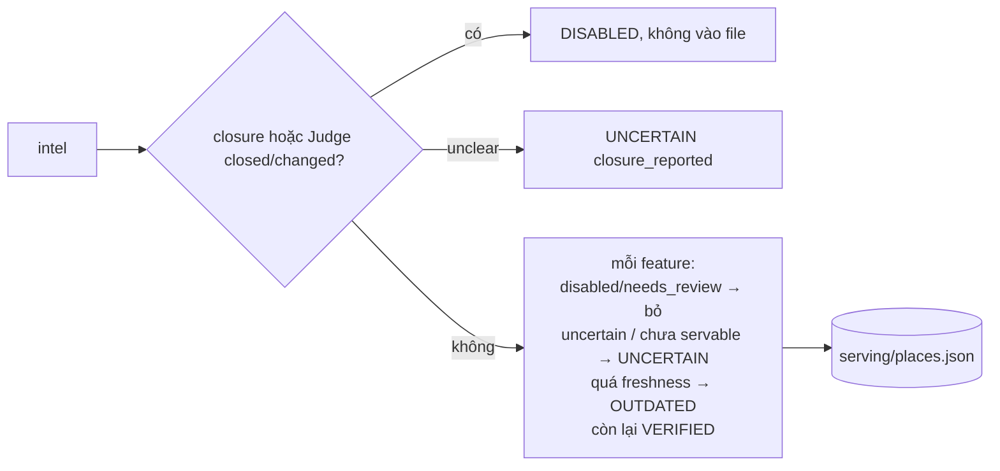

- `check(record, feature, forbidden)` — kiểm fail-closed: `fail` khi giá trị cấm chắc chắn; `pass` khi giá trị khác chắc chắn và không ai nói giá trị cấm; còn lại `unknown`.
- `area`: leader clustering trong `area_km`. `near_duplicate_group`: cùng nhóm + `usable_as` + Jaccard ≥ 0,6 trên cặp (feature, value) "loại nơi" so với leader. `mmr()`: λ·điểm − (1−λ)·độ giống lớn nhất.
- `usable_as` (`experience | meal | anchor | backup`) = mặc định nhóm, bỏ `experience` khi coverage experience `NONE`.

Đủ cho Place Decision chưa: `python -m decision evaluate` (`docs/P3_PLACE_DECISION.md` §17).

## 6. Kiểm tra và Judge

**Gate** (code, model không vượt được): đúng schema · span tồn tại nguyên văn · timestamp trong media · feature có trong ontology · match qua ngưỡng · ZONE bao POI liên quan · fact/signal/estimate chỉ do rule.

**Judge** (`src/corpus/judge/`, prompt `OBS_AUDIT`, `PLACE_STATUS`, `SAME_PLACE`) chỉ ghi nhãn và quyết định vào `data/review/`, không sửa giá trị; nhãn người cùng nội dung luôn thắng.

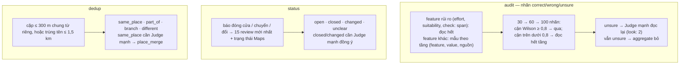

- `wrong` khi: phủ định, mỉa mai, giả định, ngoại lệ, nói nơi khác, hành động của người viết, quá yếu so với định nghĩa, ảnh không cho thấy.
- **Engine Gemma** (`JUDGE_ENGINE=gemma`, khi hết quota Judge chính): audit chạy trên Extractor, 8 nhận định / call, một vòng; `wrong` bỏ ngay, `unsure` → `look: 2`. Đo 2026-10-06: lọt 11–16% nhận định sai, bỏ nhầm ~30% nhận định đúng. Nhãn Gemma không bao giờ thay nhãn người / Judge chính. `JUDGE_READ_ALL=1` đọc mọi nhận định chưa có nhãn; `JUDGE_ALSO_LAN=1` mượn thêm slot host LAN.

## 7. Publish và review

Serving record (`usable_as`, trường lọc, feature + bằng chứng, confidence, coverage, trạng thái) là thứ online đọc. `NEEDS_REVIEW` và `DISABLED` không bao giờ được phục vụ. Trang review (`python -m corpus review`, `127.0.0.1:8765`, `src/corpus/review/`) cho người gán nhãn và quyết định; quyết định là nhãn, không sửa giá trị đã crawl, và là bộ regression để đo Judge.

## 8. Refresh

Ledger: `source_id, stage, input_hash, processor, processor_version, prompt_hash, ontology_version, status, usage`. Một bước chỉ chạy lại khi input hoặc processor đổi; đổi ontology chạy lại từ observation, không chạy lại ASR. Job định kỳ: làm mới provider store, Google ID (12 tháng), nguồn quá hạn, quét chỗ mới mở.

## Vòng lặp tự động

Code giữ vòng lặp, số bước, ngân sách, điều kiện dừng; model chỉ đề xuất hành động trong tập đóng, output được validate.

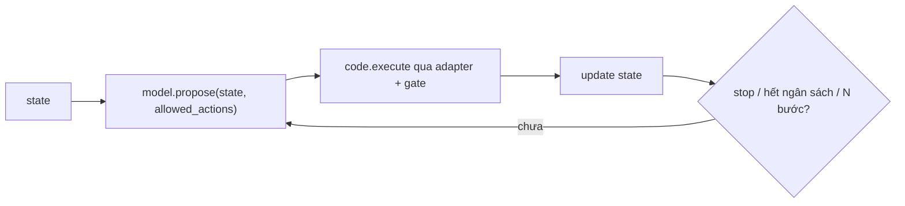

| Vòng | Hành động | Dừng |
|---|---|---|
| Mở rộng query TikTok | đề xuất query mới | ứng viên mới mỗi lô dưới ngưỡng |
| Tìm trang official | search, chọn link, đi link nội bộ whitelist | đủ loại trang hoặc 5 trang |
| Lấp khoảng trống coverage | thêm review, trang official, video "tên + khía cạnh" | coverage tăng hoặc 3 bước |
| Hiệu chỉnh (ngoài build) | biến thể prompt / ngưỡng → regression | không tốt hơn hoặc N lượt |

## Place Decision dùng corpus thế nào

| Decision cần | Field |
|---|---|
| Sàng cứng: trẻ em, nhóm, xe lăn, dốc, bậc, đi bộ xa | `features.<id>` + `check()` |
| Ngân sách | `operation.price_range`, `features.entry_fee / value_for_money` |
| Độ đông theo ngày / buổi | `operation.crowd_by_time`, `features.crowd.by_context` |
| `preference_fit` | `features.<id>.distribution / n / confidence / mention_rate` |
| Thẻ: vì sao, đánh đổi, độ tin | `observation_ids` → quote, `trend`, `coverage` |

Online chỉ đọc serving record, không duyệt đồ thị bằng chứng.

## Chi phí và hiệu năng

Rule trước model · chỉ Extractor + Judge trong build · mọi call khóa theo input hash + prompt hash (không trả tiền hai lần) · gom lô mục nhỏ · I/O gọn (id, enum, offset) · ngân sách mỗi build, hết thì dừng gọn và làm tiếp lần sau.

## Đo chất lượng

Nhãn đến từ Judge và người. `review.label_stats()` tính precision + cận dưới Wilson theo (feature, value), tách theo nguồn. Precision lấy mẫu của một bước rơi dưới ngưỡng → bước đó ngừng tự publish.

**Test bất biến:** không observation thiếu span · không fact/signal/estimate thiếu observation hoặc do model ghi · xung đột không bị làm phẳng · `unknown` không thành `false` · cùng được nhắc không tạo quan hệ · `NEEDS_REVIEW` / `DISABLED` không được phục vụ.

## Sai lệch cho bản demo

| Demo | Khi thương mại |
|---|---|
| Cào Maps có đăng nhập, dùng review làm bằng chứng | Places API theo điều khoản |
| Scraper TikTok có đăng nhập | Truy cập có license |
| Lưu file | PostgreSQL + PostGIS |
| ZONE = buffer quanh POI | Dữ liệu bản đồ |

Cần có: key model trong `.env`, tài khoản TikTok + Google phụ (`python -m corpus login`), trần ngân sách Judge.
