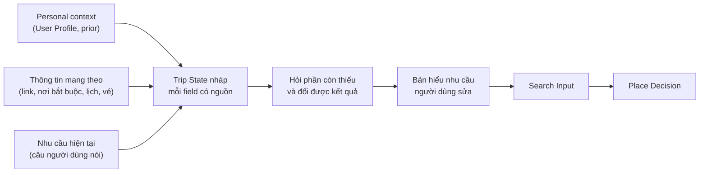
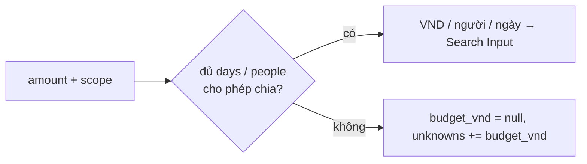
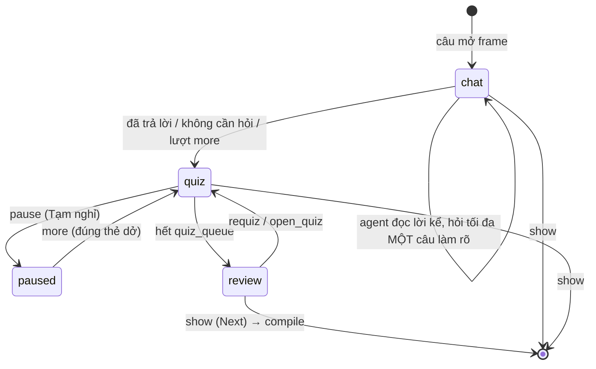
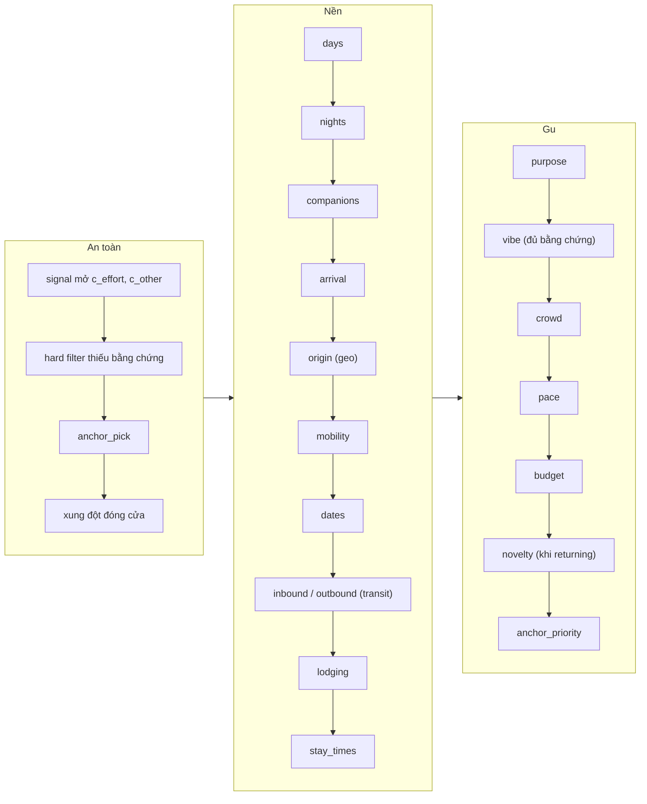
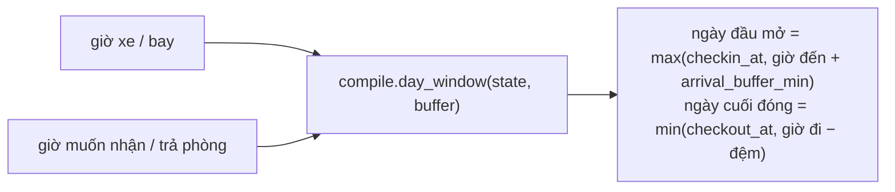
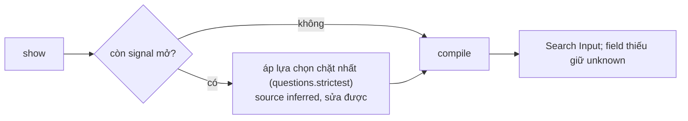
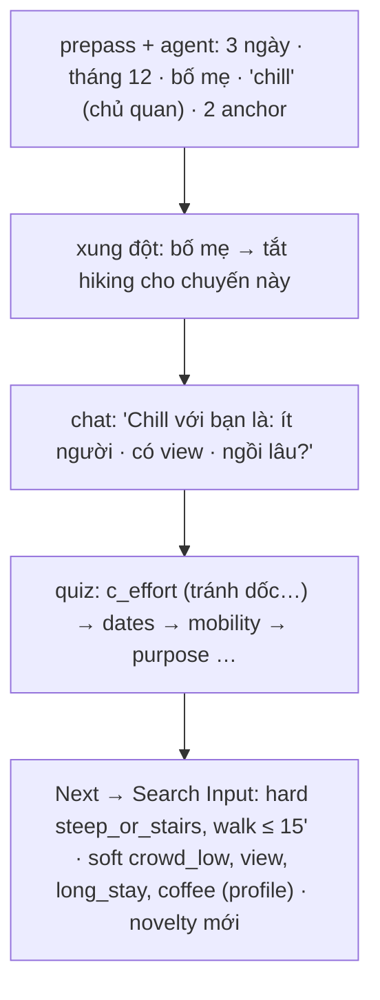
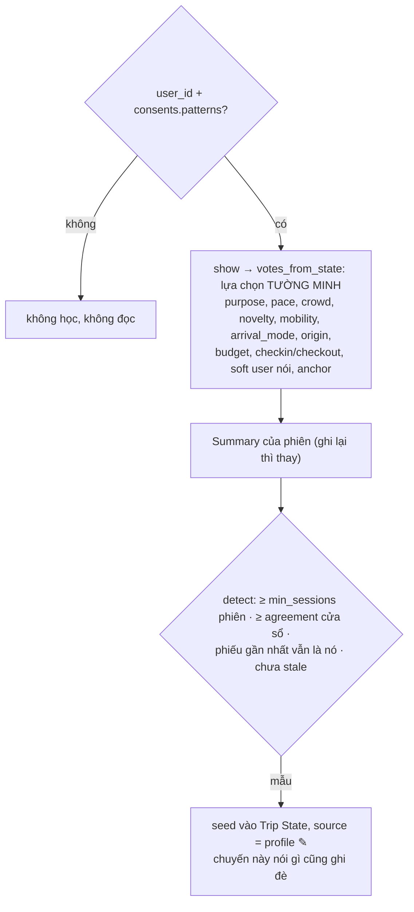

# P2 — Trip Understanding

Bước online đầu: hiểu người dùng cần gì cho **chuyến này** trước khi tìm nơi. Code: `src/trip/`. Vì sao hỏi như vậy: `docs/PROJECT_CONTEXT.md` §6–12.

## 1. Là gì



Hiểu đủ để tìm đúng, hỏi ít nhất. Output là `SearchInput` có cấu trúc, không phải đoạn văn. Field chưa biết giữ `unknown`. Chưa đề xuất nơi nào ở bước này (chỉ truy vấn ngầm để chọn câu hỏi).

## 2. Ba nguồn đầu vào

| Nguồn | Vai trò | Độ tin |
|---|---|---|
| Personal context (chỉ khi đồng ý) | Mặc định (prior) | Thấp nhất |
| Thông tin mang theo | Anchor + gu ngầm | Trung bình – cao |
| Nhu cầu hiện tại | Sự thật của chuyến này | Cao nhất |

Mâu thuẫn: `Physical → User hard → Override chuyến này → Recent Interests → Demonstrated Preferences`. Trạng thái bắt đầu và mức dẫn dắt là hai trục độc lập (`PROJECT_CONTEXT.md` §3.1).

## 3. Trip State

```text
Trip State
├── Cơ bản      start_date | month (+ month_part), days, nights, companions, people, base,
│               mobility, budget_vnd + budget_scope
├── Vào / ra    entry_point, exit_point (bến xe, sân bay, tự lái)
├── Hậu cần     origin, arrival_mode, inbound, outbound, lodging_booked, lodging
├── Khung giờ   checkin_at, checkout_at, day_end
├── Anchor      nơi bắt buộc, booking, sự kiện giờ cố định; must | want
├── Constraint  hard: physical + user hard; signal sức khỏe
├── Sở thích    soft (feature=value:love|avoid), liked_groups (nature | sights | chill | meal)
├── Nhịp độ     pace, max_leg_min, crowd_tolerance
├── Novelty     quen | mới | trộn + visited
└── meta        phase, guidance, effort_budget, control, asked, declined, told, other_qid
```

Mỗi field lưu `value · source (user|anchor|profile|inferred|default) · confidence · status (unknown|asked|confirmed|skipped) · evidence`.

| Trạng thái field | Hành động |
|---|---|
| `user` + `confirmed` | Dùng, không hỏi lại |
| `profile` / `anchor` | Dùng làm mặc định ✎, lời chuyến này ghi đè |
| `inferred`, đủ tin | Dùng, đánh dấu ✎ |
| `inferred`, tin thấp | "Còn chưa chắc" hoặc hỏi nếu đổi kết quả |
| `unknown` không đổi kết quả | Giữ `unknown` |
| `skipped` | Không hỏi lại trong phiên |

### Ngân sách

`budget_vnd` = số người dùng nói, `budget_scope` ∈ `trip_total | per_day | per_person | per_person_day` (prepass đọc trong cùng mệnh đề; agent ghi được). Không ai nói phạm vi → `domain/budget.py` đoán theo độ lớn (≥ 2 triệu → cả chuyến), đánh dấu ✎.



Số người: `people`, hoặc 1 khi `solo`, 2 khi chỉ `partner`.

**Số đêm.** `nights` là fact riêng ("3 ngày 2 đêm", "3N2Đ"; 0–7, không lớn hơn `days`). Mọi nơi downstream đọc qua **một** hàm `trip.nights(ctx)` (`domain/nights.py`): `nights` nếu có, không thì `max(days − 1, 0)`.

### Tầng dữ liệu đầu vào

| Tầng | Gồm | Khi |
|---|---|---|
| 0 | — | trước khi gõ gì |
| 1 | days, ngày / tháng, companions + people, mobility | chặn kiểm tra khả thi |
| 2 | link, booking, giờ xe / bay | miễn phí nếu người dùng mang theo |
| 3 | budget, pace, crowd, novelty, sở thích | chỉ hỏi khi đổi kết quả |
| 4 | physical constraint | hỏi ngay khi có tín hiệu |

Tối thiểu trước đề xuất đầu: `days`, `companions`, `mobility`. Tài khoản / profile xin sau giá trị đầu.

## 4. Luồng xử lý



Chỉ lượt đọc lời kể đầu được hỏi bằng lời, và chỉ để làm rõ **chính điều vừa viết** (từ mơ hồ, tên trùng); ngày, số ngày, người đi, phương tiện, ngân sách để thẻ quiz hỏi (`ask_text` kind `date` bị từ chối). Người dùng quyết định lúc sang bước sau (§6).

### Một lượt gõ

```mermaid
flowchart TB
  T[Tin nhắn] --> PP["prepass (rule): từ khóa, link, danh sách nơi<br/>→ ghi giá trị ✎ + keyword_hints"]
  PP --> ST[phát state ngay]
  PP --> PAR{{song song}}
  PAR --> CLEF["Clef: lạc đề / phá hoại / hỏi số liệu?"]
  PAR --> AG["Agent loop (LangGraph StateGraph): ≤ tool_steps call<br/>record_fact · search_* · ask_*"]
  CLEF -->|"chặn (≥ clef_reject_min 0,88 / clef_data_min)"| FIX["hủy Agent, bỏ mọi thứ nó ghi<br/>REJECT_SAY / NODATA_SAY"]
  CLEF -->|cho qua hoặc lỗi (fail-open)| SHOW[hiện lời Agent đã giữ]
  AG --> GUARD["guard: quote nguyên văn · values.parse<br/>bad_say: số / tên nơi người dùng chưa nói"]
  GUARD --> SHOW
  SHOW --> CARD["thẻ: ask_* → custom; câu hỏi chữ cuối lời → thẻ;<br/>không có → ô gõ tự do"]
```

| Việc | Ai làm |
|---|---|
| Tách field từ câu tự do, phát hiện từ chủ quan và tín hiệu nhạy cảm, viết câu hỏi | Agent (LLM, role `AGENT`) |
| Phân loại lượt gõ trước / song song Agent; kiểm có / không rẻ | Clef (`infrastructure/clef.py`, Cloudflare Workers AI, ~0,3–0,5 s, fail-open) |
| Kiểm quote, chuẩn hóa, `ready` / `missing`, ghi Trip State, compile | Code (`domain/guard.py`, `readiness.py`, `agent/tools/`) |

**Tool của Agent** (`agent/tools/specs.py`, function calling LangChain `bind_tools`):

| Tool | Việc | Code kiểm |
|---|---|---|
| `record_fact(field, op, value, quote, how)` | ghi một fact | quote nguyên văn trong tin nhắn; sai thì trả lỗi kèm định dạng đúng để sửa cùng lượt; mong muốn không feature nào diễn đạt → `unmapped` |
| `resolve_relative_date`, `search_places` | tra cứu chỉ đọc | argument là span của câu người dùng |
| `search_features(query)` | ontology khớp mong muốn (≤ 5; Clef xếp hạng khi từ khóa không ra, ≥ `clef_feature_min`) | chỉ đọc ontology |
| `ask_choice` / `ask_text` | thẻ 2–6 lựa chọn / câu mở (chỉ ở phase chat) | dừng lượt; câu đã `declined` bị trả lỗi |
| `open_quiz` | mở lần đầu, tiếp tục quiz đang dở, hoặc mở lại để đổi đáp án | chỉ ở lượt chat tương tác |

Vòng là `StateGraph` (`agent/loop.py`): `budget_step → model_step → tool_step`, mỗi nhánh rẽ về `budget_step` hoặc kết thúc. Dừng khi tool dừng thành công, có `unmapped` (lời thay bằng `UNMAPPED_SAY`), model trả chữ không tool, hoặc hết `tool_steps` (nút `step_cap`). Tool chạy tuần tự trong một reply: tool dừng ngăn các call sau cùng reply. Khối suy nghĩ Gemma bị lột (`agent/client.py strip_thought`). Clef kiểm theo từng lời Agent (`TurnTools.prefetch`): fact `inferred` có được quote nói không (`clef_verify_min` 0,75), câu sắp hỏi đã trả lời chưa (`clef_repeat_min`), chữ Agent có hứa kết quả không (`clef_reply_min` → `UNSURE_SAY`).

Agent lỗi (mạng, hết `total_s`): fact đã ghi giữ nguyên, trả `FALLBACK_SAY`; prepass vẫn đã ghi.

**Prompt:** system + ontology bất biến (`agent/prompts.py`) → transcript → `CURRENT CONTEXT` (Trip State kèm nguồn, thẻ mở, `keyword_hints`, `compared_places`, `still_needed`, `phase`, `resolving_other`, ngày hôm nay; là nguồn sự thật khi transcript mâu thuẫn) → câu mới.

### Trả lời một thẻ

| Hành động | Xử lý | Model |
|---|---|---|
| Chip quiz | ghi `drafts` có sẵn (`apply_chip`), sang thẻ kế | Không |
| `Bỏ qua` / `Chưa chắc` | field giữ `unknown`, qid vào `asked`/`declined` | Không |
| Chọn ngày trên lịch | ghi `start_date` (ngày đã qua bị từ chối) | Không |
| Thẻ chủ đề | ghi soft + `liked_groups` cố định của chủ đề (`THEME_SAY`) | Không |
| Gõ ở cổng `Khác` (quiz) | rõ (từ khóa / Clef `OTHER_CLARITY` + parse được) → ghi, sang thẻ; mơ hồ → chat làm rõ rồi quay lại đúng thẻ | Khi mơ hồ |
| Bấm lựa chọn thẻ agent | nhãn đi lại agent như chữ (không qua Clef) | Có |

Thẻ đang mở **đóng** khi người dùng bấm lựa chọn hoặc agent ghi được giá trị **mới**; không thì giữ.

**So sánh với một nơi** ("không thích quán giống X"): `domain/traits.py` tính ≤ 4 nét nổi bật của X (feature đã phục vụ khác giá trị phổ biến của cùng category) → `compared_places`; agent ghi soft `:avoid` / `:love` đúng các nét đó, guard bỏ nét khác.

**Lượt `refine`** (harness gọi khi người dùng gõ mong muốn ở Chọn nơi): chạy như một lượt chữ, giữ thẻ màn Hiểu chuyến đi, compile lại, phát `done {search_input}`.

## 5. Ngân hàng câu hỏi quiz

`domain/questions.py:quiz_queue` — thứ tự cố định, **an toàn trước**, field đã biết / đã hỏi thì bỏ:



Mỗi thẻ có chip `Khác, tự gõ` và `Bỏ qua` / `Chưa chắc`. Thẻ `geo` / `lodging` / `transit` nhận giá trị chọn từ ô tìm qua `TurnInput.value` (JSON, `engine._pick_logistics`). Không hỏi `max_leg_min` (để chat chỉnh). Hai điều code giữ cứng: signal sức khỏe mở không bị bỏ qua; giá trị chỉ vào Trip State qua `record_fact` có bằng chứng hoặc `drafts` của chip.

### Hậu cần

`domain/logistics.py` (hàm thuần): `entry_road` (đèo theo hướng `origin`), `nearest_airport` (`config/airports.yaml`), `route`, `pick_transit` (một `Transit` → `inbound`/`outbound` + `entry_point`/`exit_point`), `clock_after`.



Giờ xe / bay là ràng buộc vật lý nên luôn thắng giờ muốn. `Transit` chỉ đến từ crawl, không bao giờ do model viết: `{mode, carrier, depart_at, arrive_at, from_point, to_point, price_vnd|null, stops, source, fetched_at}`.

**Phương tiện** `motorbike | car | walk` (không Grab / taxi). Đến bằng `bus` / `plane` → thẻ `input = rental` (điểm thuê xe máy, `docs/P4_PLANNING.md` §Thuê xe máy) với chip Thuê xe máy · Thuê ô tô · Chỉ đi bộ (`walk`). `trip.rents_bike(ctx)` dùng chung cho Planning; `understanding.rental` giữ gợi ý thuê.

**Dữ liệu cũ:** `domain/legacy.py upgrade` (`mobility = ride` → chưa biết; `arrive_at`/`leave_at` → `checkin_at`/`checkout_at`); `scripts/migrate_saved.py [--apply]` sửa file phiên và journey trong Postgres.

## 6. Next do người dùng bấm

Agent không quyết khi nào xong. `{kind: "show"}` mở **bất cứ lúc nào**. `ready` (code) false khi thiếu nền hoặc còn signal mở; `missing: [{target, label}]` (`config/trip.yaml required`) chỉ để UI nói còn thiếu gì, không chặn.



"Xem gợi ý" không biến `unknown` của hard constraint thành pass.

## 7. Tín hiệu an toàn

`knee, elderly, kids, wheelchair, pregnant, motion_sick, height, vegetarian` vào Trip State dưới dạng `signal`. Signal chưa xử lý là "mở": `ready = false`, `show` áp lựa chọn chặt nhất, `compile_search_input` ném `UnhandledSignal`. Prepass ghi signal + hard filter tương ứng không phụ thuộc agent. Không đường code nào nới ràng buộc thể chất.

## 8. Bản hiểu nhu cầu

```text
Chuyến     3 ngày 12–14/12 · ở trung tâm · ô tô riêng · đi với bố mẹ
Anchor     [TikTok 1] [TikTok 2]
Bắt buộc   tránh dốc/bậc · đi bộ ≤ 15 phút
Sở thích   yên tĩnh, có view · cà phê (từ hồ sơ ✎) · ưu tiên nơi chưa đi
Chưa rõ    ngân sách · ăn uống
```

✎ = từ profile hoặc suy luận, sửa tại chỗ (override của chuyến, không ghi profile). Ngân sách hiện số người dùng nói + quy đổi ("5 triệu cả chuyến · ≈ 830 nghìn/người/ngày"). "Hợp gu bạn" (`understanding.matching`) = số nơi qua giới hạn cứng **và** có bằng chứng hợp ít nhất một điều thích; chip có `drafts` mang `effect` (`chip_effects`).

## 9. Search Input

Output (`trip.SearchInput`), đầu vào của `docs/P3_PLACE_DECISION.md` §2.1.

```text
Search Input
├── context        ngày | tháng, days, nights, base, entry/exit_point, mobility, companions, people,
│                  checkin_at, checkout_at, day_end, budget_vnd (VND/người/ngày), origin, arrival_mode,
│                  inbound, outbound, lodging_booked, lodging
├── hard_filters   physical + user hard, mỗi cái có unknown_policy exclude | flag → loại, fail-closed
├── anchors        nơi bắt buộc + độ ưu tiên
├── soft_weights   theo feature id → xếp hạng
├── pace           + travel / crowd tolerance
├── novelty        + visited
├── unknowns       không lọc, trung tính, gắn cờ khi giải thích
├── unmapped       tên chưa resolve → Decision hỏi lại
└── liked_groups   nhóm muốn đi, nói trước đứng trước
```

| Người dùng nói | Sau làm rõ | Vào Search Input |
|---|---|---|
| "chill" | ít người + view + ngồi lâu | `crowd_low↑ view↑ long_stay↑` |
| "bố mẹ, mẹ đau gối" | tránh dốc | `hard_filters: steep_or_stairs, walk ≤ 15'` |
| "lần này muốn khác" | thử mới | `novelty = high` |
| "Không chắc" ngân sách | — | `unknowns: budget_vnd` |

## 10. Điều chỉnh theo người dùng

Cùng một agent cho mọi người; đổi `guidance`, `effort_budget`, `control` (`PROJECT_CONTEXT.md` §3.3, §12.3). Không suy đoán tuổi, giới tính.

## 11. Trải nghiệm

| Vấn đề | Cách xử lý |
|---|---|
| Hỏi nhiều → mệt | Một câu mỗi lượt, chỉ điều đổi kết quả, không câu bắt buộc |
| Hỏi lại cái đã biết | Dùng mặc định ✎ từ profile / anchor |
| Không biết trả lời | Hỏi cách dùng; luôn có chip + gõ tự do |
| Không hiểu vì sao bị hỏi | Nói tác động ("còn 38 → 14 nơi") |
| Câu nhạy cảm | Giọng trung tính, nói vì sao, luôn có `Bỏ qua` |

## 12. Nguyên tắc đặt câu hỏi

Phase chat: agent viết (`agent/prompts.py`). Phase quiz: thẻ cứng (`domain/questions.py`). Chung: hỏi cách dùng, chỉ hỏi điều đổi kết quả, một câu mỗi lượt, bỏ qua được, không hỏi lại, từ chủ quan thì hỏi nghĩa. Căn cứ: `PROJECT_CONTEXT.md` §12.1.

## 13. Giọng điệu

Gần gũi nhưng không suồng sã — như người hướng dẫn am hiểu. Căn cứ: thân mật làm bớt "trả lời cho xong" [27], [28] nhưng giảm tin khi chưa quen thương hiệu [29]; register đúng vai trò quan trọng hơn [30], [31]; câu hỏi sức khỏe nên trang trọng [32]; xưng hô tiếng Việt định vị quan hệ [33] (`PROJECT_CONTEXT.md` §Tài liệu tham khảo).

| Tình huống | Giọng |
|---|---|
| Mặc định | Câu ngắn, xưng "mình" – gọi "bạn", không tiếng lóng |
| Người dùng thân mật | Nới một mức, không bắt chước tiếng lóng |
| Câu nhạy cảm | Trung tính, nói vì sao, nhấn mạnh bỏ qua được |
| Cảnh báo, thiếu dữ liệu | Rõ, không đùa, không giảm nhẹ |

Giọng chỉ đổi cách nói, không đổi nội dung, lựa chọn hay field được ghi.

## 14. CLI và API

User Web đi qua harness (`docs/AGENT_HARNESS.md`). Public API: `Tools`, `create_engine`, `SearchInput`, `nights`, `rents_bike`. `skills.yaml` khai báo quyền. API độc lập (cần `AGENT_*`, `docs/LLM_PROVIDER.md`):

```
python -m trip serve [--port 8766]          # bind 127.0.0.1
POST   /api/trip/sessions                   {experience?, start_with?, user_id?, remember?}
GET    /api/trip/sessions/<id>              → {id, transcript, understanding, card, phase}
POST   /api/trip/sessions/<id>/turn         SSE: say(delta|replace) · preview · state · card · done · error
DELETE /api/trip/profile/<user_id>          → {forgotten}
GET    /api/trip/places?q=<tên>
```

`turn`: `{kind: text|answer|edit|show|theme|more|requiz|pause, …}`; qua harness thêm operation `refine {text}`.

```text
src/trip/
  domain/          state (TripState, SearchInput) · card · guard · values · questions · prepass · resolve ·
                   traits · dates · logistics · rental · nights · budget · coverage · patterns · readiness ·
                   understanding · compile · legacy · text
  agent/           loop.py (LangGraph StateGraph: tool ↔ model) · client.py (strip_thought) · prompts.py ·
                    tools/{specs,core,executor}.py
  api/             engine.py (một lượt, giao dịch phiên) · server.py (HTTP + SSE :8766) · tools.py (adapter harness)
  infrastructure/  catalog.py · clef.py · sessions.py · profile.py (§17) · settings.py (config/trip.yaml)
```

Test: `python -m pytest -q tests/trip` (model thay bằng `ScriptedChat`, không mạng).

## 15. Ví dụ

Profile `cà phê = high`, `hiking = high`; đã đi Langbiang. Người dùng: "Tháng 12 đi Đà Lạt 3 ngày với bố mẹ, muốn chill" + 2 link TikTok.



## 16. Đánh giá

Mô phỏng offline: user giả lập có Trip State ẩn (`src/bench/hidden.py` `HiddenTrip`), chạy qua harness thật Trip → Decision → Planning trên serving thật.

```
python -m bench generate --seed 1            # → config/bench_trips.yaml (40 chuyến, quota signal / companions / mobility)
python -m bench run [--styles tapper,baseline,brief] [--only ids] [--live]   # → data/bench/<ts>/{runs,fields,summary}.csv
```

| Kiểu user | Hành vi |
|---|---|
| `tapper` | chỉ bấm chip; field không có chip → `skip` |
| `baseline` | form cố định 14 ô dựng thẳng `SearchInput` (14 lượt) |
| `brief` | gửi brief làm lượt gõ rồi như tapper |
| `chatter` (live) | user LLM trả lời mọi thẻ bằng lời |

Verdict mỗi field: `correct · wrong · missing · invented · ok_unknown · inferred · unreachable · n/a`; accuracy = correct / (correct + wrong + missing). Gate (`config/bench.yaml`, `tests/bench/`): `invented` = 0, `safety_missed` = 0, `hard_violations` = 0. Chỉ số khác: số lượt trước đề xuất đầu, tỉ lệ `Không chắc` / `Bỏ qua`, số lần sửa bản hiểu nhu cầu.

## 17. Học mẫu dài hạn

Gu lặp lại qua nhiều chuyến thành **prior**, dùng thẳng làm mặc định, không hỏi lại (`patterns.enabled: true`, `min_sessions: 2`).



Không bao giờ thành phiếu: field im lặng / `unknown` / `Bỏ qua` · `visited` · soft suy luận · giá trị chỉ xác nhận từ mẫu (`chip:prior`) · signal sức khỏe, hard filter, ngày đi, người đi cùng. Mẫu thúc vận động bị bỏ khi chuyến có giới hạn vận động. Mẫu về nơi chỉ thành chip "Thêm X" khi nơi còn trong serving.

Đồng ý: ô riêng khi đồng ý điều khoản hoặc công tắc "Nhớ lựa chọn của tôi" (`POST /api/harness/me/consent {patterns}`); tắt thì xóa phần đã nhớ. Khách dùng thử không học. Xóa: `DELETE /api/harness/profile/<user_id>`.

**Còn mở:** chưa có giao diện xem từng mẫu; mẫu `avoid` cho nơi (Decision `drop`) chưa nối; ngưỡng chờ số liệu khảo sát.
