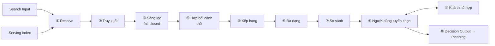
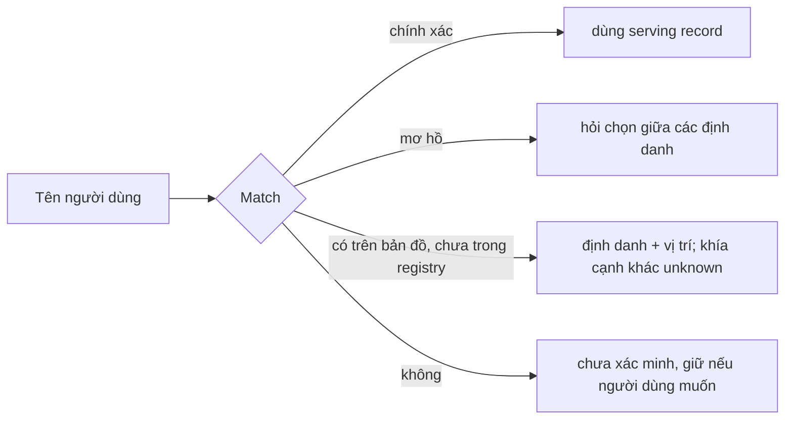
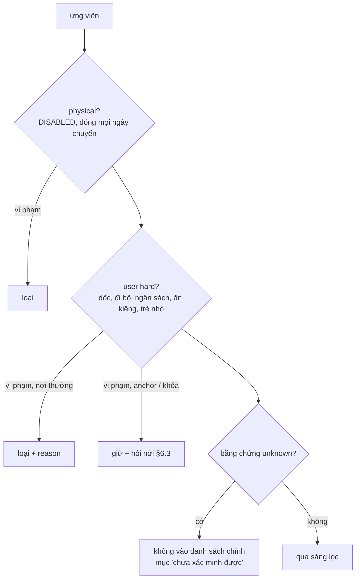
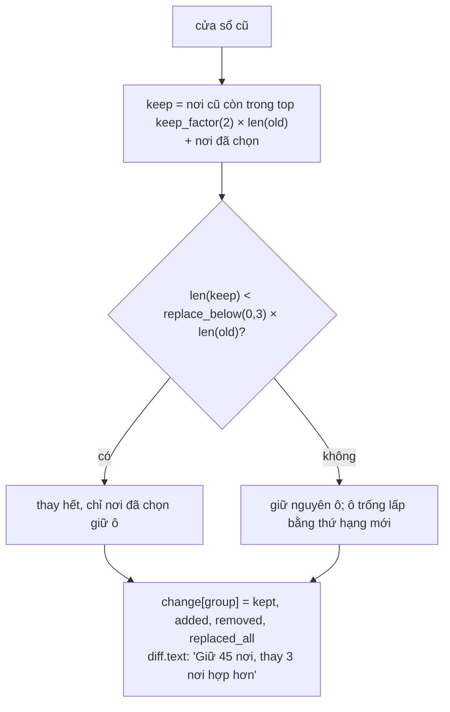
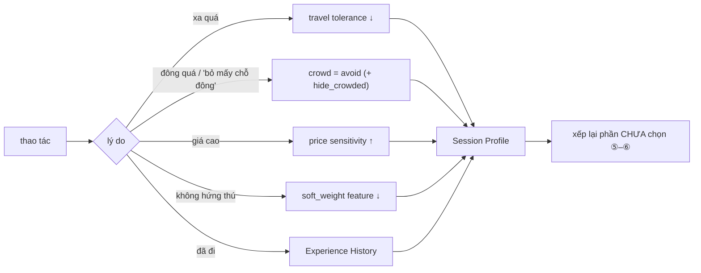
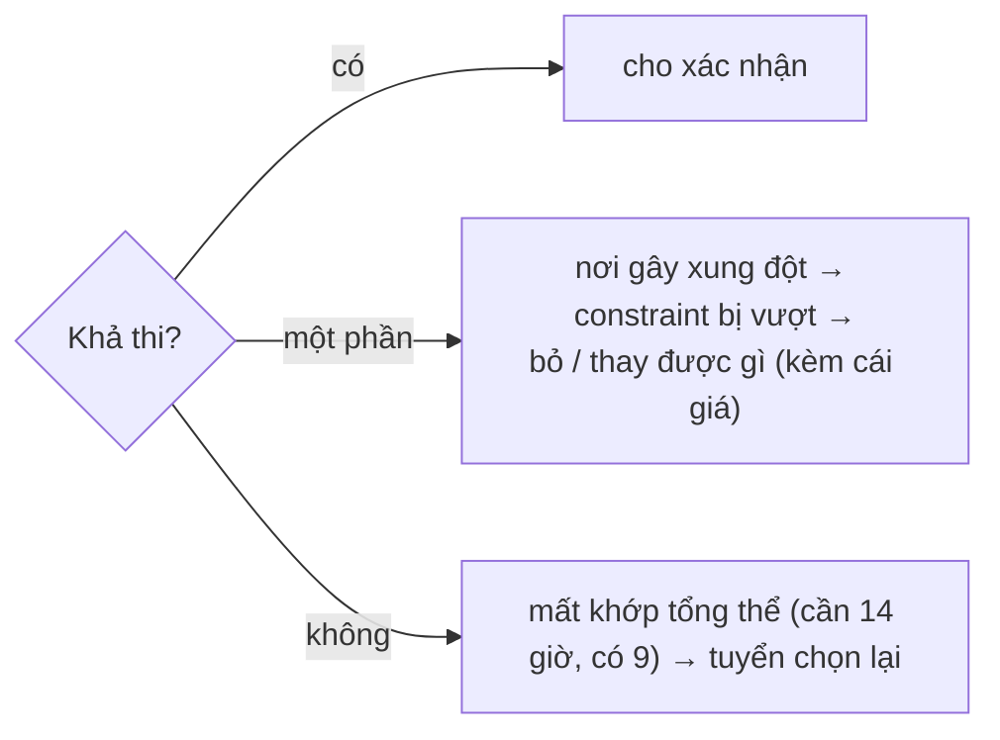
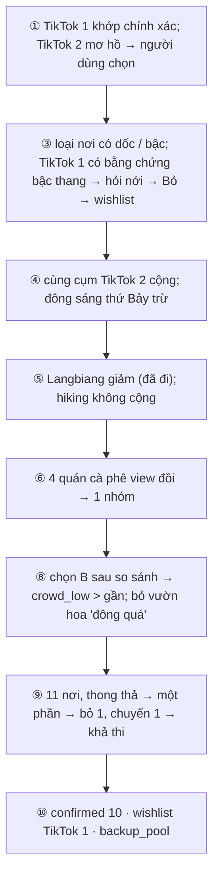
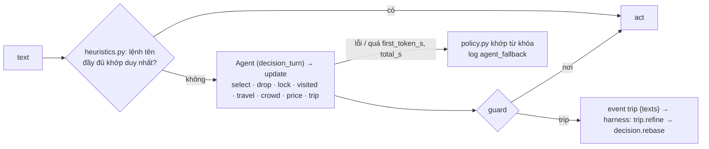

# P3 — Place Decision

Từ **Search Input** (`docs/P2_TRIP_UNDERSTANDING.md` §9) và serving index (`docs/P1_CORPUS.md`), giúp người dùng chọn **tập địa điểm đã xác nhận** trước khi xếp lịch. Code: `src/decision/`.

## 1. Là gì



Một tập quyết định **nhỏ, hữu ích**; hệ thống hỗ trợ chọn, không chọn thay. Constraint trước sở thích. Chỉ đọc serving; chỉ ghi Session Profile và danh sách đã chọn. Khoảng cách **thô**; thời gian thật thuộc Planning.

## 2. Đầu vào

### 2.1 Search Input

| Field | Dùng ở | Cách dùng |
|---|---|---|
| `context` | ③ ④ ⑨ | ngày → giờ mở; base + mobility → bán kính; companions → suitability |
| `hard_filters` | ③ | loại, fail-closed |
| `anchors` | ① ④ ⑨ | luôn giữ; làm tâm không gian |
| `soft_weights`, `liked_groups` | ⑤ | trọng số theo feature id / nhóm |
| `pace` + tolerance | ④ ⑥ ⑨ | bán kính, cỡ shortlist, số nơi / ngày |
| `novelty` + visited | ⑤ | giảm / loại nơi đã đi |
| `unknowns` | mọi bước | không lọc, trọng số 0, gắn cờ |

Search Input đổi giữa chừng → chạy lại từ bước sớm nhất bị ảnh hưởng (§14); lựa chọn đã khóa giữ nguyên.

### 2.2 Serving record

Chỉ đọc serving record (`docs/P1_CORPUS.md` §Bản ghi địa điểm): Identity, Operation, Experience, Environment, Effort, Suitability, Provenance. Chỉ `VERIFIED`, `UNCERTAIN`, `OUTDATED` được dùng. Nhóm `stay` (chỗ ở) bị loại kể cả khi người dùng nêu tên.

## 3. Phân vai

| Việc | Ai |
|---|---|
| Resolve, truy xuất, sàng, chấm điểm, đa dạng, khả thi, chọn cặp so sánh | Rule tất định |
| Diễn đạt "vì sao", "đánh đổi" | LLM, chỉ dùng field có sẵn |
| Hiểu câu tự do ("xa quá", "ít người hơn") | Agent → update có kiểu → guard → act |

⑧ ↔ ⑨ là vòng chính. Planning không xếp được → quay về ⑧ (`docs/ARCHITECTURE.md` §7).

## 4. Resolve

Anchor, nơi đã lưu, nơi nhập tay đi qua matcher của corpus (`docs/P1_CORPUS.md` §3).



Anchor không bị loại âm thầm; vi phạm thì cảnh báo và hỏi (§6.3).

## 5. Truy xuất ứng viên

Nguồn: serving index (theo `soft_weights`, category, cụm quanh base / anchor) · nơi đã lưu · nơi bắt buộc · lịch có sẵn · tìm trong phiên. Truy xuất rộng hơn shortlist nhiều lần. Nơi `experience = NONE` chỉ làm chỗ ăn, anchor, dự phòng.

## 6. Sàng lọc constraint

### 6.1 Thứ tự



### 6.2 Ba giá trị của một kiểm tra

`corpus.serving.check` trả `pass | fail | unknown`.

| Kết quả | Ứng viên thường | Anchor / nơi khóa |
|---|---|---|
| `pass` | tiếp | tiếp |
| `fail` | loại, ghi lý do | giữ, cảnh báo, hỏi nới |
| `unknown` | "chưa xác minh được" (policy `exclude`); giữ + cờ khi `unknown_policy: flag` | giữ + cờ |
| `UNCERTAIN` | như `unknown` với an toàn / tiếp cận; như `pass` + cảnh báo với loại khác | giữ + cảnh báo |

Fail-closed: thiếu bằng chứng cho hard constraint thì không nói nơi đó an toàn.

### 6.3 Xung đột với nơi người dùng chọn

Physical → không vào danh sách xác nhận, giữ wishlist, nói lý do. User hard → hỏi nới **kèm cái giá** ("~120 bậc thang; giữ nghĩa là bỏ điều kiện tránh bậc cho riêng nơi này?"); nới chỉ áp cho nơi đó. Unknown → giữ, cảnh báo tự kiểm.

### 6.4 Lưu lý do loại

Mỗi nơi bị loại giữ `reason` → trả lời "vì sao không có X", dựng `backup_pool` cho Planning, đo chất lượng.

## 7. Độ hợp bối cảnh

Thô, rẻ, không gọi route service (`fit.py`).

| Tín hiệu | Tính từ |
|---|---|
| Khoảng cách | vị trí × base / anchor (chim bay / cụm); bán kính theo pace, mobility (`radius_km.walk` khi đi bộ) |
| Cụm | cùng cụm anchor → cộng |
| Đường vào, đỗ xe | `rough_road_access = present` → cờ `rough_road`; `parking = hard` + ô tô → `parking_hard`; `unknown` không cờ |
| Độ đông | `crowd_by_time` × ngày / buổi của chuyến; `fit.crowd_evidence` = tỉ lệ người nói đông × độ mạnh(n) |
| Mùa | ngoài trời × tháng mưa → cờ `rain` (một lần ở `view.notes`) |
| Anchor giờ cố định | xa anchor cùng ngày → trừ |

Output `context_fit` + cờ + `crowd` / `crowd_warn`. Dưới ngưỡng → không vào shortlist, vẫn ở pool.

## 8. Xếp hạng

```text
score = w_ctx·context_fit + w_pref·preference_fit + w_rec·recent_interest + w_nov·novelty
      + w_exp·experience_fit + w_pop·popularity + w_like·liked_group
      − w_unc·uncertainty − w_crowd·crowd (chỉ khi chuyến tránh đông)

preference_fit = Σ soft_weight(f) · có_feature(f) · confidence(f)
confidence(f)  = agreement × độ_mạnh(n) × trọng_số_trạng_thái × độ_nổi_bật
```

| Thành phần | Giá trị |
|---|---|
| độ_mạnh(n) | thang log, bão hòa `STRONG_N = 30` (1 → 0,2; 3 → 0,4; 10 → 0,7) |
| trạng thái | VERIFIED 1 · OUTDATED 0,7 · UNCERTAIN 0,5 (chỉ `unmeasured_precision` → nâng dần theo độ_mạnh × agreement) |
| độ_nổi_bật (experience) | `min(1, mention_rate / 0,03)` |
| uncertainty | đủ trọng số khi không bằng chứng; UNCERTAIN đếm `1 − agreement × độ_mạnh(n)` |

Không bằng chứng → đóng góp 0, không âm. Feature `off` cho chuyến → không cộng. `novelty = high` giảm mạnh nơi đã đi (trừ anchor). Trọng số trong `config/decision.yaml`; mỗi điểm lưu kèm từng thành phần.

**Sao "Hợp với bạn"** (`rank.stars`): `stars = clamp(score / trần × 5, 0, 5)` giữ số lẻ; `trần = w_ctx + w_pref (khi có sở thích) + w_like (khi có nhóm yêu thích)` — chỉ phần người dùng điều khiển, không phụ thuộc danh sách đang xem. Chưa nêu gu → `fit = null`. `Engine.fits(sid, ids)` trả `fit` cho nơi bất kỳ trong pool.

## 9. Đa dạng và cỡ shortlist

### 9.1 Gom nơi gần trùng

`near_duplicate_group` của serving → nhóm (đại diện điểm cao nhất + thay thế). Chọn kiểu MMR (`corpus.serving.mmr`): điểm cao nhưng khác nhất nơi đã chọn.

### 9.2 Cỡ shortlist

```text
số chỗ cần ≈ số ngày × số nơi/ngày(pace) − số anchor
cỡ shortlist ≈ số chỗ cần × hệ số dư
```

MMR chỉ chọn trong nơi khớp mong muốn (`preference_fit ≥ top_min_pref`) và không `crowd_warn` khi chuyến tránh đông; nơi chọn mang `top: true` ("Hợp nhất"). Thứ hạng đầy đủ mỗi nhóm = đã chọn → `top` → mọi nơi còn lại theo `score`.

### 9.3 Nhóm hiển thị

Theo `display_groups` (`nature`, `sights`, `chill`, `meal`). Anchor đứng đầu, tách riêng. `view.focus` = nhóm đầu trong `liked_groups` có thẻ, không có thì nhóm nhiều `top` nhất.

### 9.4 Cửa sổ hiện và lọc lại

`State.shown[group]` (trạng thái màn, không vào undo). Lần đầu `page_size` = 24 nơi; `Engine.page` nối thêm khi cuộn.



## 10. So sánh

Chỉ khi có lựa chọn thật (nhóm gần trùng, hai nơi tranh một chỗ). Chỉ trên khía cạnh có bằng chứng: A hơn ở · B hơn ở · chưa biết (không coi là thua) · hy sinh gì (khoảng cách thô, độ đông theo buổi, effort). Chọn sau so sánh là tín hiệu mạnh cho Session Profile.

## 11. Thẻ ứng viên

| Mục | Nguồn |
|---|---|
| Vì sao phù hợp (1–3 feature, đóng góp ≥ `WHY_MIN` 0,1, kèm cỡ mẫu) | Experience, Environment |
| Đánh đổi (cờ riêng của nơi, điểm người dùng tránh, giá trị xấu ≥ 2 người) | §7, so sánh |
| Thời gian (`day_visit`, khoảng) | Estimate |
| Giá (khoảng / người; vé ước tính; "miễn phí"); `budget_vnd` cạnh giá | Operation |
| Độ tin cậy, phụ thuộc unknown | Provenance, `unknowns` |

Tối đa hai dòng cảnh báo mỗi thẻ; cảnh báo cả chuyến ở `view.notes`.

## 12. Người dùng tuyển chọn

### 12.1 Thao tác

Thêm · Bỏ (lý do tùy chọn) · Khóa · So sánh · Thay · Xem thêm giống.

### 12.2 Tín hiệu trong phiên



Không bấm ≠ không thích. Bỏ không lý do → chỉ giảm nơi đó. Mọi cập nhật chỉ ở Session Profile.

## 13. Khả thi của tổ hợp

Chạy lại sau mỗi thao tác (`feasibility.py`).

### 13.1 Kiểm tra

| Kiểm tra | Cách tính thô |
|---|---|
| Tổng thời gian | Σ `day_visit.typical` + di chuyển theo cụm + đệm ≤ thời gian có (ngày × khung − anchor − nhận/trả phòng) |
| Anchor | giờ cố định không chồng |
| Giờ mở cửa | mỗi nơi mở ít nhất một khung trong chuyến (UNCERTAIN / OUTDATED chỉ cảnh báo) |
| Tải di chuyển | số cụm xa ≤ số ngày |
| Ngân sách | Σ giá ≤ ngân sách (chỉ khi biết) |

`day_visit(rec, cfg)` (public) = thời gian một lần ghé trong ngày (khu cắm trại 60/90/150 phút thay khoảng một đêm; nhóm khác chặn ở `typical_max`/`long_max`). `room` gợi ý còn trống bao nhiêu: `usable` = khung từng ngày − bữa ăn; `filled` khi đã dùng ≥ `fill_share` 0,8.

### 13.2 Kết quả



### 13.3 Nơi khóa gây xung đột

User constraint → hỏi nới kèm cái giá; physical → không tạo tổ hợp giả vờ khả thi; giờ chưa chắc → giữ + cảnh báo.

## 14. Chạy lại khi đầu vào đổi

| Thay đổi | Chạy lại từ |
|---|---|
| `hard_filters`, ngày, mobility | ③ |
| anchor, base | ① rồi ④ |
| `soft_weights`, novelty, Session Profile | ⑤ |
| pace | ⑥ + ⑨ |
| thêm / bỏ / khóa | ⑨; ⑤–⑥ cho phần chưa chọn |
| Planning báo không xếp được | ⑧ kèm nơi gây lỗi |

`scope.replan_scope(act)`, `scope.input_scope(old, new)`. Nơi đã chọn không bị loại âm thầm.

## 15. Output

```text
Decision Output
├── confirmed     id, role (anchor | locked | selected), visit (day_visit), flags, relaxed
├── backup_pool   ứng viên cùng nhóm / bị loại vì ngữ cảnh, kèm for + reason
├── wishlist      muốn nhưng vi phạm physical, kèm lý do
├── trip_context  bản chụp Search Input
├── feasibility   kết quả §13
└── decision_log  vì sao chọn / bỏ, đánh đổi đã chấp nhận
```

## 16. Ví dụ

Search Input của `P2_TRIP_UNDERSTANDING.md` §15 (bố mẹ, tránh dốc, chill, 3 ngày):



## 17. Đánh giá — `python -m decision evaluate`

Chạy pipeline thật trên 30 chuyến ẩn (`config/eval_trips.yaml`) → `data/decision/eval.json`.

| Chỉ số | Mục tiêu |
|---|---|
| Hard constraint violation trong shortlist | 0 |
| Unsupported claim trong thẻ / so sánh | 0 |
| Tỉ lệ chọn từ shortlist, nơi tự thêm từ ngoài | hữu ích / bỏ sót |
| Tỉ lệ gần trùng trong shortlist | đa dạng |
| Tổ hợp "khả thi" bị Planning trả về | sai số ước lượng thô |

## 18. CLI và API

```
python -m decision evaluate
python -m decision serve [--port 8767]                  # bind 127.0.0.1
POST /api/decision/sessions                            {search_input, trip_session?}
GET  /api/decision/sessions/<id>
POST /api/decision/sessions/<id>/act                   tất định; 400 khi act sai
POST /api/decision/sessions/<id>/turn                  {text} → SSE say · trip · view · done · error
GET  /api/decision/sessions/<id>/compare?a=&b=  ·  /why-not/<place_id>
POST /api/decision/sessions/<id>/confirm               → Decision Output; 409 khi chưa chốt được
```

**Act:** `select`, `drop` (`reason`: `far|crowded|pricey|dislike|visited`), `lock`, `unlock`, `swap`, `relax`, `wishlist`, `prefer`, `feedback`, `answer`, `undo`, `confirm`.

**Lượt chữ:**



Gu không bao giờ thành act `prefer` từ lượt chữ.

```text
src/decision/
  model.py settings.py contracts.py   kiểu dữ liệu, config/decision.yaml, validate output ở biên
  geo.py trip_days.py                 khoảng cách thô theo cụm; các ngày của chuyến
  screen.py fit.py rank.py            ③ ④ ⑤
  diversify.py window.py              ⑥, cửa sổ hiện (§9.4)
  compare.py cards.py                 ⑦, thẻ (§10–11)
  curation.py feasibility.py          ⑧ act thuần sinh State mới; ⑨
  pipeline.py output.py scope.py      ①→⑥ một đường; ⑩; chạy lại từ đâu
  agent.py guard.py policy.py heuristics.py   lượt chữ
  engine.py session.py server.py tools.py skills.yaml   phiên có phiên bản; HTTP :8767; adapter harness
  evaluate.py                         §17
```

Public API: `Tools`, `create_engine`, `DecisionOutput`, `day_visit`, `hard_check`, `preference_fit`, `run_pipeline`. `Engine.draft` trả Decision Output nháp không lưu cho lịch ngầm. Test: `python -m pytest -q tests/decision`; model thật: `-m live tests/decision/test_decision_live.py`.
