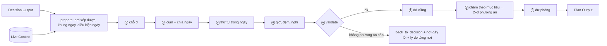
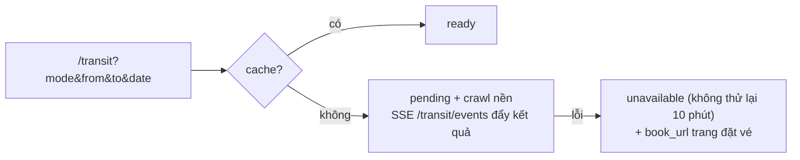
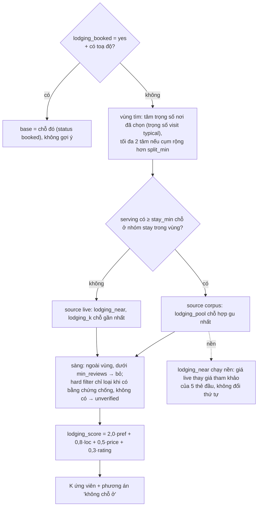
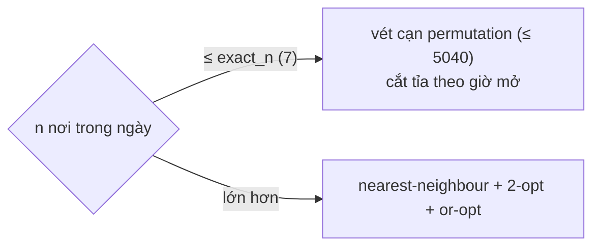
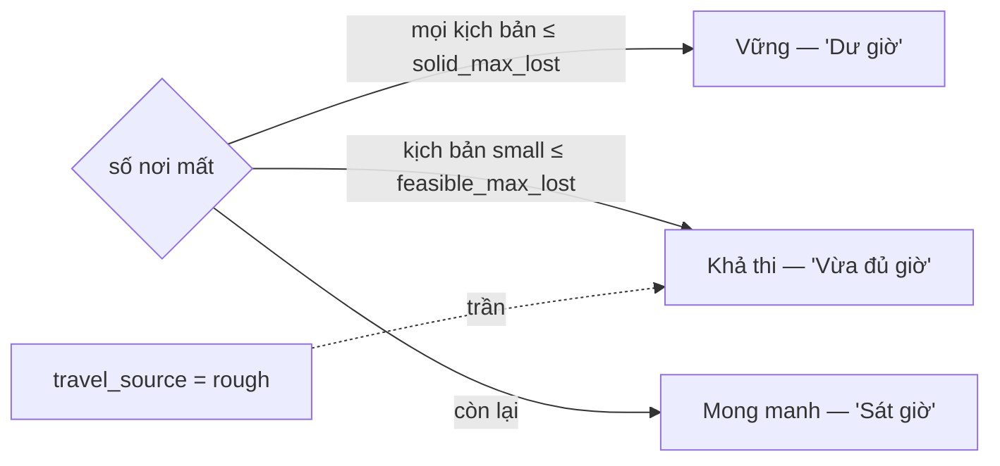
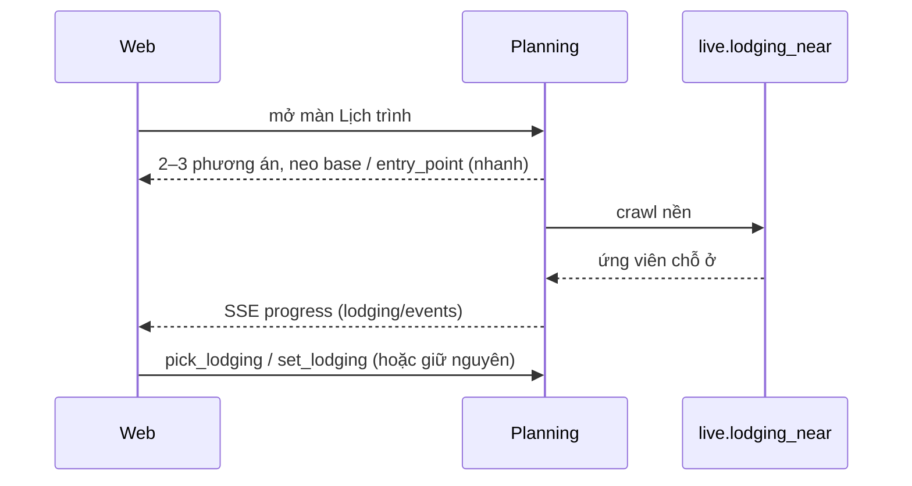
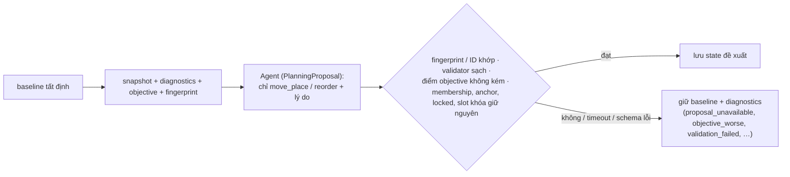

# P4 — Planning & Validation + Live Context

Từ **Decision Output** (`docs/P3_PLACE_DECISION.md` §15) dựng 2–3 **phương án lịch trình** đã kiểm, mỗi phương án tối ưu một mục tiêu, kèm **chỗ ở** sao cho cả chuyến ít di chuyển nhất; người dùng sửa và chốt. Code: `src/live/` (Live Context) + `src/planning/`.



## Phạm vi

**Trong:** chia ngày, cụm, thứ tự, giờ mở cửa, thời lượng theo nhịp độ, đệm / nghỉ, chỗ ở (corpus `stay` hoặc tra live), điểm vào / ra, kiểm tra cuối, độ vững, dự phòng, phương án theo mục tiêu, vòng sửa / chốt, Live Context.

**Ngoài:** booking, chỉ đường từng bước, traffic thời gian thực, giá OTA qua API, nhiều thành phố, đưa chỗ ở vào Place Intelligence.

## Nguyên tắc

1. Chỗ ở không vào Place Intelligence; số live chỉ sống trong phiên, mang `source` + `fetched_at`.
2. Chỗ ở là **biến tối ưu**: mỗi ứng viên làm neo đầu / cuối ngày rồi xếp lại cả lịch.
3. Solver và kiểm chứng tất định; agent nội bộ chỉ đề xuất, rule kiểm trước khi áp.
4. Physical constraint không bao giờ nới.
5. Không bịa: thiếu quán ăn → khoảng "ăn (tự chọn)" kèm quán thật trong corpus; không tự thêm nơi vào lịch.
6. Số live luôn là ước lượng / tham khảo, không phải Fact.
7. Không xáo lịch âm thầm: mọi thay đổi qua diff; nơi khóa không bị dời.

## Ranh giới module

```text
src/live/            gọi mạng, đọc-ghi cache; KHÔNG có đường ghi data/intel
  __init__.py        travel_matrix, route_shape, weather, lodging_near, lodging_seen, geocode, geosearch,
                     flights, flights_url, buses, buses_url, sun_times, holidays, events, advisories, Unavailable
  http.py cache.py settings.py      một GET, một timeout; cache theo key + TTL → data/live/<nguồn>/
  osrm/ weather/ lodging/ geocode/ flights/ buses/      mỗi nguồn một module
  sun.py holidays.py events.py advisories.py           tính local / file nhập tay

src/planning/        rule tất định
  model.py settings.py places.py frame.py conditions.py travel.py traits.py
  lodging.py logistics.py              ⓐ; tra cứu hậu cần (geo, chỗ ở theo tên, chuyến, điểm thuê xe)
  cluster.py days.py route.py schedule.py personalization.py     ⓑ ⓒ ⓓ
  validate.py robustness.py backup.py objectives.py variants.py  ⓔ ⓕ ⓗ ⓖ
  build.py preview.py repair.py scope.py output.py               ghép một đường; lịch ngầm; sửa ngày; Plan Output
  session.py engine.py server.py tools.py skills.yaml            phiên có phiên bản; HTTP :8768; adapter harness
  agent.py guard.py policy.py proposal.py                        lượt chữ (API độc lập); đề xuất nội bộ
  evaluate.py                                                    đo offline
```

Phụ thuộc: `planning → live, decision, trip, corpus.serving, corpus.ontology, corpus.crawl (listed_stays)`. `live → corpus.crawl` (`open_sessions`, `maps_search`, `LoginRequired`). `live` không biết `planning`.

| Thư mục | Ghi bởi |
|---|---|
| `data/live/<nguồn>/` | `src/live` (cache có TTL) |
| `data/planning/sessions/`, `data/planning/eval.json` | `src/planning` (API độc lập, `evaluate`) |
| `data/intel/`, `data/serving/`, `data/gmaps/` | chỉ offline; Planning chỉ đọc |

## Đầu vào

Decision Output nguyên dạng: `confirmed`, `backup_pool`, `wishlist`, `trip_context` (Search Input: `days`, `nights`, `entry_point`, `exit_point`, `checkin_at`, `checkout_at`, `lodging_booked`, `lodging`, `inbound`, `outbound`, …), `decision_log`, `feasibility`. Thiếu điểm vào / ra → ngày đầu / cuối chỉ cắt theo giờ, gắn cờ "kém chắc".

## Live Context

Mọi hàm trả `None` / `Unavailable` khi không có dữ liệu; không bịa. Test khẳng định không có đường ghi tới `data/intel`, `data/serving`, `data/gmaps`.

| Nguồn | API | Cách lấy | TTL | Khi lỗi |
|---|---|---|---|---|
| `osrm/` | `travel_matrix`, `route_shape` | OSRM local (OSM Việt Nam), `/table`, `/route` | 7 ngày | ước lượng thô (`rough_minutes`), `travel_source = rough`, trần "Khả thi" |
| `weather/` | `weather(lat, lng, dates)` | Open-Meteo ≤ 16 ngày; ngoài tầm → `config/climate.yaml` | 3 giờ | `None` → "chưa biết thời tiết" |
| `lodging/` | `lodging_near(...)` | mặt "Khách sạn" của Maps qua `corpus.crawl` | 24 giờ | Maps không trả lời → thẻ khách sạn các lần tìm trước trong bán kính (giữ `fetched_at` cũ); không có → rỗng → neo `base` / `entry_point` |
| `geocode/` | `geocode`, `geosearch` | Nominatim; Photon (gõ tới đâu gợi ý tới đó), số nhà → dòng `approx` | 30 ngày | `None` / "không thấy" |
| `flights/` | `flights(src, dst, day)` | Google Flights `aria-label` từng dòng | 26 giờ | `Unavailable`; không bao giờ trả chuyến giả |
| `buses/` | `buses(origin, day, way)` | Vexere, `__NEXT_DATA__` qua một GET | 26 giờ | `Unavailable` |
| `sun.py` | `sun_times` | công thức NOAA | — | — |
| `holidays` `events` `advisories` | theo ngày | YAML nhập tay | — | ngày không liệt kê = chưa biết, **không** phải an toàn |

### OSRM

Một lần mỗi máy: `scripts/osrm_setup.sh` (`osrm-extract` profile `car` → partition → customize → `osrm-routed`). Xe máy = ma trận × `mode_factor` 0,95. Một ma trận mỗi lượt cho `confirmed` + K chỗ ở + điểm vào / ra (~20 điểm = 400 cặp, một request); mọi phương án dùng chung.

### Chỗ ở (crawl live)

Mặt "Khách sạn" của Maps (bỏ qua khung bản đồ, đủ cho top quanh một khu). Thẻ: `name, fid, lat/lng, rating, reviews, price_per_night, amenities`. Thẻ không giá vẫn giữ (`price = unknown`). Giá là giá tham khảo lúc crawl; ngày và trần giá hiện mới lọc phía Planning, chưa gửi lên bộ lọc Maps. `LoginRequired` / captcha → rỗng kèm lý do.

### Phương tiện

`motorbike | car | walk` (không Grab / taxi). OSRM chỉ một profile đường; phương tiện đổi **chi phí dừng** và **cách đi** (`travel.build_travel`):

| | motorbike | car | walk |
|---|---|---|---|
| Thời gian chặng | ma trận × 0,95 | ma trận × 1,0 | chim bay × `road_factor` ÷ `walk_kmh` |
| Đến mỗi nơi | + `park_min.motorbike` | + `park_min.car` (+ `park_hard_extra_min` khi `parking = hard`) | — |
| Đi bộ khi chặng dưới | `walk_km` 0,4 | `car_walk_km` 0,8 | mọi chặng |
| Bán kính chỗ ở | 3 km | 5 km | 1 km |

`walk` chỉ khi đến bằng xe khách / máy bay và không thuê xe → cảnh báo `walk_only`.

### Thuê xe máy

Đến bằng `bus | plane` + `motorbike` (`trip.rents_bike`) → ngày đầu mở sau `checkin_at` + `rental.pickup_min`, ngày cuối đóng trước `checkout_at` − `rental.return_min`. Điểm thuê lấy từ serving `category_group = rental` (không vào lịch): `GET /api/harness/rentals` → `{status: ready|none, hub, points[]}`, gần nhất trước; `hub` là bến xe / sân bay (`rental.hubs`) hoặc điểm vào đã chọn.

### Chuyến xe khách, chuyến bay

`Transit` đúng kiểu của Trip State (`stops`: 0 = bay thẳng; `None` với xe khách). `scripts/prewarm_transit.py` (cron 03:15, `config/live.yaml transit_prewarm`) tra trước mọi sân bay ↔ DLI và mọi tỉnh Vexere ↔ Đà Lạt; 8 lần chặn liền thì dừng nguồn đó.



### Điều kiện từng ngày

`conditions.fetch_live` (một lần mỗi lần dựng) → `DayCond` cho ngày có tín hiệu; ngày không có tín hiệu giữ nguyên lịch.

| Điều kiện | Cách đọc | Tác động |
|---|---|---|
| Thời tiết | `heavy`: dông / mưa ≥ `heavy_rain_mm` / gió ≥ `heavy_gust_kmh`; `severe`: ngưỡng `severe_*` | `heavy` tính như ngày mưa; `severe`: nơi `weather_exposed` **không được xếp** |
| Thông báo | `advisories.yaml` theo `city` hoặc vòng tròn | `severe`: nơi trong vùng không xếp; thấp hơn: cờ + nhạy cảm |
| Đông khách | cuối tuần `busy`; lễ / sự kiện `peak`; nơi đông khi `crowd = high` hoặc `crowd_by_time ≥ crowd_busy_pct` | tăng thời gian, đệm; phạt khi chia ngày; `crowd_tips` giờ vắng nhất |
| Đóng cửa dịp Tết | sự kiện `closure_risk` | cờ, đệm, dự phòng phải có giờ xác minh; không tự kết luận quán đóng |

Validate là chỗ duy nhất quyết định (vi phạm `hazard`). Không có thông báo không bao giờ viết thành "an toàn".

## Thuật toán

### ⓐ Chỗ ở — `lodging.py`



- `pref_fit` = Σ (soft `love` +1 / `avoid` −1, người đi cùng → suitability) khớp feature `VERIFIED` ÷ số mong muốn; không bằng chứng → 0, không âm. `loc_fit = 1 − phút TB tới nơi đã chọn ÷ loc_ref_min`.
- `price_max = lodging_share × budget_vnd × số người × số ngày ÷ số đêm` khi biết cả ngân sách lẫn số người.

### ⓑ Cụm và chia ngày — `cluster.py`, `days.py`

- Khung ngày: ngày đầu từ `checkin_at`; ngày cuối tới `checkout_at` (chuyến còn đêm sau ngày cuối và không có `checkout_at` → chạy tới `day_end`); ngày giữa `day_start..day_end`.
- Cụm: `area` của serving, rồi chia / gộp theo đường kính thực (ma trận) với `cluster_max_min`.
- Gán cụm → ngày: ngày ≤ `max_days` (7), cụm ≤ `max_clusters` (8) → **DP trên tập con**, tất định. Phí = di chuyển + vi phạm giờ mở + lệch số nơi theo pace + cụm ngoài trời vào ngày mưa. Bằng nhau → ngày sớm hơn. Vượt giới hạn → tham lam + cờ.
- Ghim: anchor giờ cố định; nơi chỉ mở vài ngày; `locked` cùng ngày người dùng chỉ định.

### ⓒ Thứ tự trong ngày — `route.py`



- Ngày mở / kết ở chỗ ở; ngày đầu mở ở `entry_point`, ngày cuối kết ở `exit_point`.
- **Ghim buổi** (`pins`: `sunset_view`, `cloud_hunting`, `live_music` + `sun_times`): hoàng hôn / đêm cuối ngày, bình minh / sương đầu ngày. Nơi nhiều tính năng theo giờ chỉ cần một (ưu tiên cái người dùng muốn, `build.timed_pins`). Mỗi sáng tối đa một điểm bình minh; thừa → nơi ít bằng chứng nhất sang giờ khác (`dawn_full`). Ngày vẫn hỏng → bỏ ghim nơi muộn nhất (`pin_dropped`). Người dùng ghi đè bằng `set_slot`.
- **Bữa ăn** (`meals_per_day`): quán trong `confirmed` chèn vào khung trưa / tối nó mở; không có → khoảng "ăn (tự chọn)" kèm `options`: ≤ `meal_options` quán đang mở suốt khung, trong `meal_radius_km`, qua hard filter.

### ⓓ Giờ, thời lượng, đệm, nghỉ — `schedule.py`

- Thời lượng từ `visit` (`decision.day_visit`); `personalization.duration` chọn baseline theo hoạt động, kéo về `long` khi sở thích khớp bằng chứng `VERIFIED`.
- `personalization.suitability` chọn giờ trong khung khả thi theo bằng chứng `by_context`; chờ có phí `wait_cost_per_min`.
- Không vừa → `build.relocate_days` thử ngày khác với thời lượng đầy đủ → rút phần flexible về `short` → nhả ghim buổi mềm (cảnh báo). `requested_start` / `requested_duration` của người dùng không bao giờ bị nhả.
- Đến sớm → `wait`; quá giờ đóng → vi phạm. Đệm = `buffer_min[pace]` + phụ phí mưa / chặng dài / giờ `UNCERTAIN`. Nghỉ chặn đi liên tục quá `max_consecutive_min`. Cửa hàng chưa có giờ không xếp trước `unknown_hours_from`.

### ⓔ Kiểm tra cuối — `validate.py`

Nơi **duy nhất** kết luận đạt / không, từ chính dòng thời gian cuối. Kiểm: ngày đi · giờ mở · chồng lấn · di chuyển · anchor · ngân sách (gồm tiền phòng) · hard constraint · trùng nơi · `hazard`. Gần trùng chỉ cảnh báo `near_duplicate`. Nơi đã bỏ ghim (`DayResult.unpinned`) được tôn trọng ở mọi lần kiểm lại. Mỗi vi phạm có `physical: bool` và cái giá của từng cách sửa.

### ⓕ Độ vững — `robustness.py`

Nhiễu cố định (không random): xuất phát +15 / +30 phút · visit +20% · travel +25% · mưa theo xác suất (nơi phơi mưa ngày `rain_prob ≥ rain_high` tính là mất). Mỗi kịch bản phát lại thứ tự đã chọn và đếm nơi bị mất.



### ⓖ Mục tiêu và phương án — `objectives.py`, `variants.py`

Nhịp độ (cường độ) ≠ mục tiêu (tối ưu theo gì). Năm mục tiêu: `least_travel`, `low_cost`, `weather_robust`, `diverse`, `preference_fit`; chọn ≤ 3 bằng rule từ chuyến.

```text
for lodging in K+1 ứng viên (+ "không chỗ ở"):
    for obj in mục tiêu đã chọn (≤ 3):
        p = schedule(days(clusters, lodging, obj), obj)
        if validate(p).ok: score[(obj, lodging)] = obj.score(p), robustness(p)
best mỗi obj → 2–3 phương án; bỏ trùng (cùng chỗ ở + cùng thứ tự mọi ngày)
```

Dùng chung một ma trận và cache thứ tự trong ngày theo `(ngày, điểm mở, điểm đóng, tập nơi)`; đổi chỗ ở chỉ đổi điểm mở / đóng. Ngân sách < 2 s khi cache nóng.

### ⓗ Dự phòng — `backup.py`

Nơi nhạy cảm = ngoài trời + ngày mưa · giờ `UNCERTAIN` / `OUTDATED` · sát giờ đóng · cụm xa. Thay thế từ `backup_pool` (cùng cụm, cùng nhóm, qua constraint); không có → nói rõ. `on_delay`: bỏ điểm nào khi bị trễ.

## Số đêm và khung đêm

Số đêm = `trip.nights(ctx)` — dùng chung cho tiền phòng, trần giá, ngày trả phòng (ngày đi + số đêm) và khung đêm. Chỉ ngày thứ `i < nights` có `night` (`build.night_slots`): khung `day_end → night_end`, **chỉ gợi ý** ≤ `night_options` nơi thuộc `night_groups` có giờ mở đã biết phủ ≥ `night_min` phút, trong `night_radius_km`; không có → `empty: true` nói rõ đêm trống.

## Chỗ ở không làm người dùng chờ



## Vòng người dùng sửa và góp ý

User Web chỉ gửi `act` (tất định, không gọi model mỗi nút). Xác nhận Decision → `recommend` nội bộ một lần → mở Lịch trình. "+ Thêm nơi" → `back` về Decision cùng hành trình.

| Act | Chạy lại từ |
|---|---|
| `pick_variant` | — |
| `pick_lodging`, `clear_lodging`, `set_lodging(text, lat?, lng?)` (chữ → `Logistics.resolve` → `geocode`) | ⓑ |
| `set_lodging_budget` | ⓐ |
| `move_place`, `reorder` | ⓒ ngày liên quan |
| `drop_place` | ⓔ + `repair_day` |
| `add_from_backup`, `swap` | ⓒ–ⓔ ngày đó |
| `lock_slot`, `unlock` | — |
| `set_visit(place, start?, duration_min?)`, `clear_visit` | ⓒ–ⓔ ngày đó |
| `set_slot(place, dawn|sunset|evening|any)` | ⓒ–ⓔ ngày đó |
| `set_pace`, `set_objective`, `set_day_window` | ⓑ |
| `relax(constraint, scope)` — chỉ user constraint, kèm cái giá | ⓔ |
| `undo`, `redo` | — |
| `confirm` (chặn khi `validate` chưa ok) | ⓔ + `place_live_status` |

Act gây xung đột giờ yêu cầu / slot khóa bị từ chối trước commit, giữ phiên cũ; `ActionError` ra khỏi `Tools` là câu tiếng Việt (`session.user_text`). Sửa sau khi chốt không mất bản đã chốt: `outputs.planning` phục vụ Đang đi tới lần chốt sau.

## Agent đề xuất nội bộ



Agent nội bộ không chọn chỗ ở, đổi pace, nới constraint, mở khóa, đổi tập nơi hay confirm. Replay phiên không gọi lại LLM.

## Guardrail

| Bất biến | Cách ép |
|---|---|
| Không xáo lịch âm thầm | `repair_day` phạt mỗi thay đổi; mọi thay đổi qua diff |
| `locked` / anchor không bị dời | `repair_day` từ chối |
| Physical không nới | `validate` duy nhất kết luận; không có `relax` cho physical |
| Không bịa | id, phút, giá trong lời phải có trong kết quả tool; số live mang nguồn + thời điểm |
| Lịch thô không "Vững" | `robustness` đọc `travel_source` |
| Live không thành tri thức | `src/live` không có đường ghi `data/intel` |

## Plan Output

```text
Plan Output
├── variants, chosen      2–3 phương án: mục tiêu, lịch, điểm, độ vững, bảng đánh đổi
├── itinerary             theo ngày: nơi, giờ đến / đi, chặng (phút, mode), chờ, đệm, nghỉ, bữa, night
├── route                 hình lộ trình (OSRM /route)
├── lodging               đã chọn (+ giá hoặc unknown)
├── cost, travel_load     chi phí ước tính; phút di chuyển mỗi ngày
├── reasons, tradeoffs    vì sao chọn (gộp decision_log); đã hy sinh gì
├── warnings, day_conditions, crowd_tips, uncertainty
├── robustness, backups   mức + kịch bản; phương án thay mỗi nơi nhạy cảm
└── provenance            mỗi số live kèm source + fetched_at
```

## CLI và API

| Lệnh | Việc |
|---|---|
| `python -m planning build <decision_output.json> [--out]` | một lịch đã kiểm |
| `python -m planning variants <decision_output.json> [--weather f.json]` | 2–3 phương án + độ vững + dự phòng |
| `python -m planning lodging <decision_output.json>` | thêm chỗ ở cạnh tranh (cần Chrome đăng nhập gmaps) |
| `python -m planning serve [--port 8768]` | HTTP + SSE độc lập |
| `python -m planning evaluate` | 30 chuyến ẩn → `data/planning/eval.json` |

API độc lập (harness không có `turn` cho Planning): `POST /api/planning/sessions` · `GET …/<id>` · `POST …/act` · `POST …/turn` (SSE `say · view · progress · done · error`) · `GET …/variants` · `GET …/lodging` · `GET …/lodging/events` · `POST …/confirm`. Public API: `Tools`, `create_engine`, `build_plan`, `build_variants`, `PlanningProposal`, `run_proposal`.

## Cấu hình — `config/planning.yaml`

| Nhóm | Khoá |
|---|---|
| Di chuyển, phương tiện | `road_factor`, `rough_speed_kmh`, `walk_km`, `walk_kmh`, `car_walk_km`, `park_min`, `park_hard_extra_min`, `rental` |
| Khung ngày, nhịp độ | `day_start`, `day_end`, `leave_at`, `visit_key`, `per_day`, `buffer_min` (+ phụ phí), `rest_min`, `max_consecutive_min` |
| Cá nhân hóa | `personalization` (`activities`, `time_bands`, `daily_rhythm`, `wait_cost_per_min`, …) |
| Bữa, buổi, đêm | `meals_per_day`, `meal_*`, `pins`, `night_*` |
| Cụm, ngày, thứ tự | `cluster_max_min`, `max_days`, `max_clusters`, `exact_n`, `weights` |
| Mục tiêu | `max_variants`, `objective_order`, `objective_weights` |
| Điều kiện ngày, độ vững | `crowd_busy_pct`, `conditions`, `rain_high`, `robustness` |
| Dự phòng | `near_close_min`, `far_leg_min`, `backup_radius_min`, `backups_per_place` |
| Chỗ ở | `radius_km`, `lodging_k`, `lodging_share`, `min_reviews`, `split_min`, `stay_min`, `lodging_pool`, `lodging_weights`, `loc_ref_min` |

TTL và endpoint live ở `config/live.yaml` (`src/live` không đọc config của planning).

## Test

| Mức | Nội dung |
|---|---|
| Unit | cluster, DP, route, schedule, validate, robustness, lodging, objectives — fixture thuần |
| Fixture live | ma trận, thời tiết, lodging lưu từ lần chạy thật; không gọi mạng |
| Golden | lịch của chuyến mẫu (`tests/planning/golden/`); đổi thuật toán phải cập nhật có chủ ý |
| Bất biến | live không ghi intel; physical không nới; `locked` không dời; `confirm` chặn khi chưa ok |
| Live (`-m live`) | OSRM, Open-Meteo, crawl lodging — chạy tay |

## Đo — `python -m planning evaluate`

`config/eval_trips.yaml` → Trip → Decision → Planning. Chỉ số: hard violation (0) · unsupported claim (0) · tỉ lệ tổ hợp Decision "khả thi" xếp được · Vững / Khả thi / Mong manh · phút di chuyển so baseline nearest-neighbour (có thể âm vì Planning tối ưu cả giờ mở) · phút chỗ ở tiết kiệm mỗi ngày · độ trễ (< 2 s). Chưa mô phỏng hội thoại nhiều lượt.

## Giới hạn đã biết

- Không traffic thời gian thực; xe máy = profile ô tô × hệ số.
- Điểm thuê xe chỉ từ Maps, không giá / điện thoại; chọn điểm thuê chưa ghi vào chuyến.
- Giá phòng là giá OTA lúc crawl; homestay ngoài OTA không giá; ngày / trần giá chưa gửi qua bộ lọc Maps.
- Vét cạn trong giới hạn `max_days` / `max_clusters` / `exact_n`; vượt thì heuristic + cờ.
- `advisories.yaml`, `events.yaml` nhập tay; `place_live_status` chưa gọi mạng.
- Sau khi chỗ ở crawl xong, phương án không tự chấm lại theo K ứng viên; `lodging.candidates` của Plan Output luôn rỗng.
- `Trip` / `Schedule` sống trong RAM; restart dựng lại từ `decision` + các version (cache live giữ theo TTL).
- `drop_place` qua chip không bị `rethink_drops` chặn (chỉ kênh `turn`).
