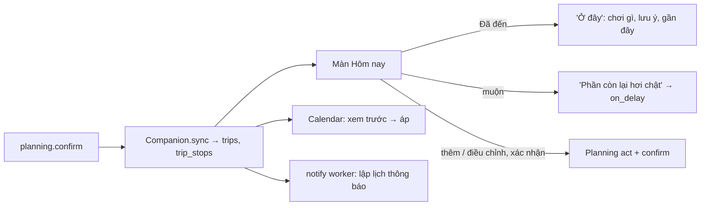
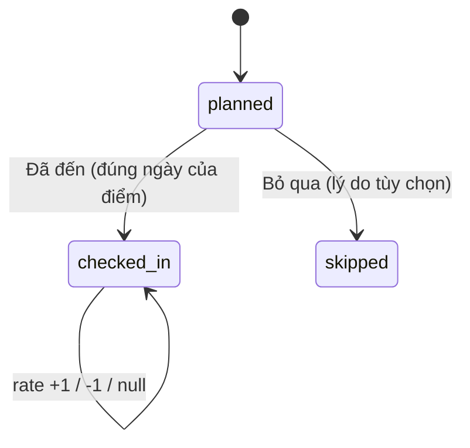
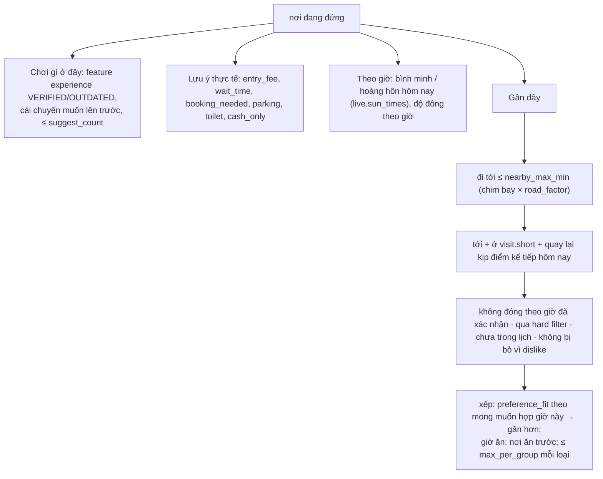
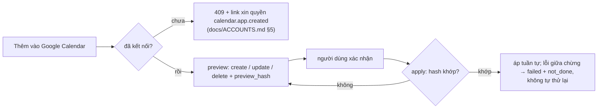
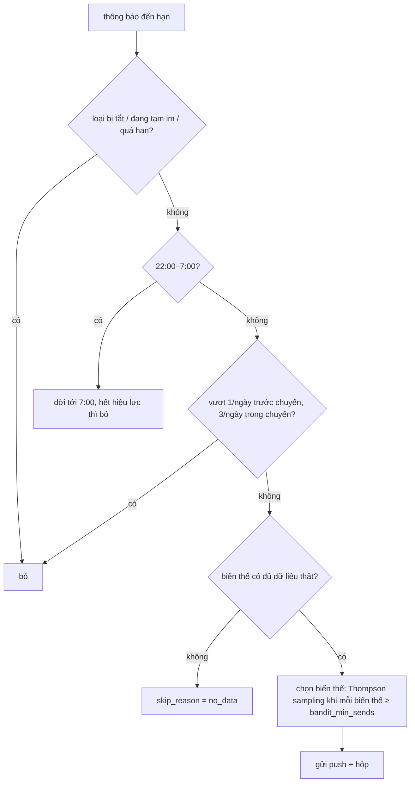

# P5 — Đang đi: Hôm nay, Google Calendar, thông báo

Phase sau khi lịch đã chốt: đi cùng người dùng trong chuyến. Code: `src/companion/` (chuyến, check-in, gợi ý, Calendar), `src/notify/` (thông báo), HTTP ở `src/harness/`. Web: `screens/Today.tsx`, `today.ts`, `notify.ts`, `screens/Inbox.tsx`, `public/sw.js`. Cấu hình: `config/companion.yaml`, `config/notifications.yaml`.

## 1. Quy tắc

- Không ép: check-in tự nguyện; không có trạng thái "lỡ" — điểm chưa check-in là `planned` (chưa biết). Đánh giá chỉ là Hợp / Không hợp.
- Gợi ý chỉ từ serving index; thiếu bằng chứng giữ `unknown`; hard constraint của chuyến vẫn áp, fail-closed.
- Check-in và thông báo **không** phải bằng chứng về địa điểm, không ghi Place Intelligence. Thấy khác thông tin → nút Báo sai.
- Không gì tự đổi kế hoạch: thêm nơi, điều chỉnh, ghi Calendar đều cần người dùng xác nhận.

## 2. Chuyến và điểm dừng

`planning.confirm` commit → harness gọi `Companion.sync`: bảng `trips` (một dòng mỗi hành trình, `plan_hash`) và `trip_stops` (mỗi `visit`, giờ theo `Asia/Ho_Chi_Minh`). Chốt lại: điểm chưa đến dời theo lịch mới, điểm không còn bị xóa, điểm đã check-in / bỏ qua giữ nguyên.

## 3. Màn Hôm nay

Route `/app/today?journey=<id>[&stop=<id>]`; cần `outputs.planning` (thiếu → 409).

| API | Việc |
|---|---|
| `GET /api/harness/sessions/<id>/today?day=` | ngày đang xem, điểm dừng + trạng thái, `extra` (check-in ngoài lịch), `tight`, cảnh báo, điều kiện ngày, Calendar, `trip.starts_in` |
| `POST …/companion {operation: checkin, stop_id \| place_id}` | chỉ đúng ngày; `place_id` = "Tôi đang ở nơi khác" (nơi trong serving, trong khoảng ngày chuyến) |
| `POST …/companion {operation: skip, stop_id, reason?}` | `far, crowded, pricey, dislike, tired, weather, other` |
| `POST …/companion {operation: rate, stop_id, value}` | `1 \| -1 \| null` |
| `POST …/companion {operation: add, place_id, day, confirmed: true}` | Planning `add_from_backup` rồi confirm; chỉ nơi trong backup pool |
| `POST …/companion {operation: adjust, option_id, confirmed: true}` | phương án §5; confirm lỗi thì act được undo |
| `GET …/companion/suggest?place=&similar=1` | §4 |

Trước ngày đi: bản xem trước "Còn N ngày nữa". Nút Đã đến / Bỏ qua chỉ ở ngày hôm nay của chuyến.

## 4. Gợi ý "Ở đây"

`companion/suggest.py` — hàm thuần trên serving record:

"Nơi tương tự ở gần" (khi bấm "Đông quá hoặc không như kỳ vọng"): như Gần đây, cùng `category_group`.

## 5. "Phần còn lại hơi chật"

Check-in muộn ≥ `tight_threshold_min` và ngày đó còn điểm → một dòng trung tính "Phần còn lại hơi chật · Xem cách điều chỉnh". Phương án từ `backups.on_delay` (`option_id = drop:<place_id>`); chỉ đổi khi người dùng chọn và xác nhận.

## 6. Google Calendar

Một calendar riêng do app tạo cho mỗi chuyến; mỗi điểm có giờ là một event (giờ, địa chỉ, cảnh báo, link `/app/today?stop=`, không nhắc mặc định).

Kế hoạch đổi sau khi đồng bộ → `state = drifted`: chỉ một dòng "Lịch Google khác kế hoạch hiện tại · N thay đổi", không tự đồng bộ. Ngắt kết nối thu hồi token, chỉ xóa calendar khi người dùng chọn. Bảng `calendar_sync`, `calendar_events`.

## 7. Thông báo

Ít, đúng lúc, giọng "TripGuardian / bạn". Không bao giờ "bạn đã lỡ", đếm ngược giả, so sánh với người khác. Kênh: web push + Hộp thông báo `/app/inbox`.

| `kind` | Khi nào |
|---|---|
| `plan_unfinished` | 24 giờ sau shortlist chưa chốt, một lần |
| `book_ahead` | 10:00, 3 ngày trước, nếu có nơi `booking_needed = yes` |
| `eve_of_trip` | 20:00 tối hôm trước |
| `day_brief` | 7:30 mỗi ngày đi |
| `checkin_hint` | giờ đến dự kiến của 2 điểm đầu chuyến |
| `golden_hour` | 45 phút trước hoàng hôn / bình minh ở nơi có `sunset_view` / `cloud_hunting` |
| `weather_change` | kiểm mỗi 3 giờ; mưa ≥ `rain_alert`, còn điểm ngoài trời, có dự phòng; một lần / ngày |
| `post_trip` | 10:00 ngày sau khi về |
| `paused` | sau 3 thông báo liên tiếp không mở; im tới khi người dùng tự mở app |

Mẫu câu ở `config/notifications.yaml`, người duyệt mới sửa; model không viết câu lúc gửi. Worker `python -m notify run [--once]` mỗi phút: lập lại thông báo khi `plan_hash` mới, kiểm dự báo, gửi cái đến hạn; push 404 / 410 → xóa subscription.

Web chỉ xin quyền sau khi chốt, bằng thẻ có "Không, cảm ơn" (không hỏi lại). Điện thoại hiện nhận trang tải app nên push chỉ đăng ký từ trình duyệt máy tính.

| API | Việc |
|---|---|
| `GET /api/harness/push/key` | khóa VAPID public |
| `POST /api/harness/push/subscribe`, `/push/unsubscribe` | subscription (endpoint https) |
| `GET /api/harness/notifications`, `POST …/<id>/open` | hộp; đánh dấu mở, đặt lại chuỗi bỏ qua |
| `GET / PATCH /api/harness/me/notification-prefs` | `{enabled_kinds, paused}` |
