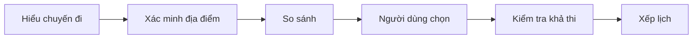
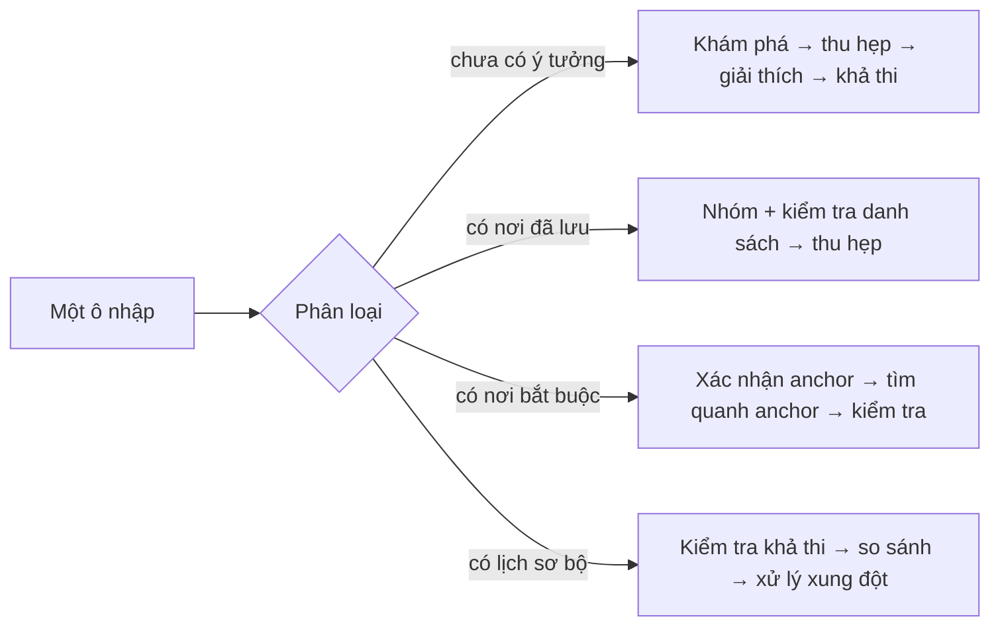
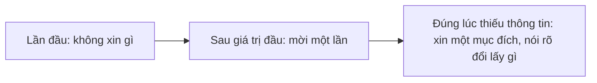
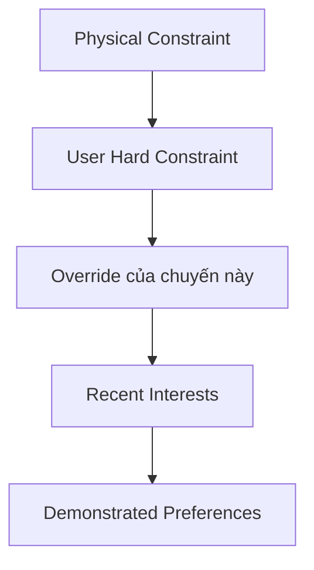
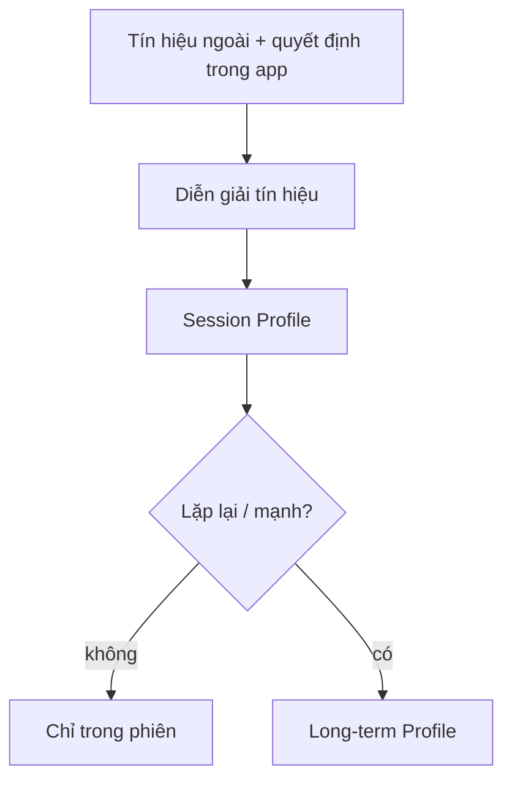
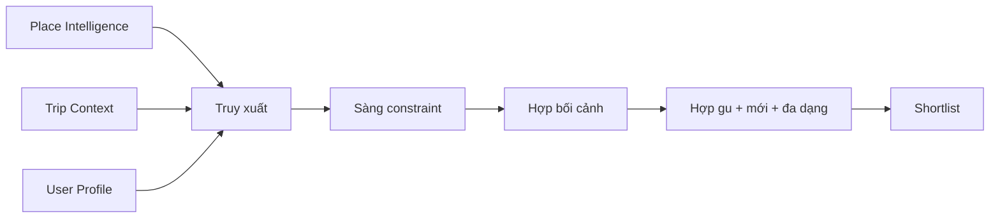
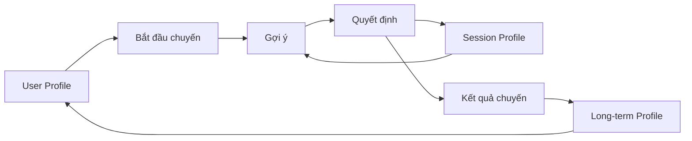
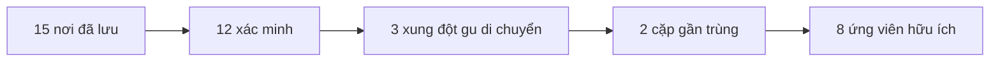

# TripGuardian — Project Context

Vì sao làm, cho ai, nguyên tắc sản phẩm. Hệ thống chạy thế nào: `docs/ARCHITECTURE.md`. Màn hình: `docs/WEB.md`.

## 1. Tóm tắt

TripGuardian giúp người dùng **chọn đúng địa điểm trước khi tạo lịch trình**, rồi kiểm tra các nơi đã chọn có đi được cùng nhau không. Phạm vi kiểm chứng: Đà Lạt.

> Nơi nào hợp chuyến này? · Vì sao chọn nơi này thay vì nơi kia? · Các nơi đã chọn có thực sự đi được cùng nhau không?



Không định vị là "AI tạo lịch trình": giá trị nằm ở quyết định, không ở itinerary.

## 2. Vấn đề

Người đi du lịch không thiếu gợi ý (TikTok, Maps, blog, hội nhóm) mà thiếu cách biến gợi ý rời rạc thành chuyến đi thật: còn mở không, giờ, giá, đường đi, có hợp người đi cùng, nơi nào trùng trải nghiệm, có vừa thời gian và ngân sách không. Đây là bài toán **ra quyết định dưới nhiều ràng buộc**; nhiều lựa chọn còn gây quá tải [1].

## 3. Người dùng mục tiêu

Người **tự lên kế hoạch** chuyến tự túc 2–4 ngày, cá nhân / cặp đôi / nhóm nhỏ, tự di chuyển (xe máy, ô tô).

### 3.1. Hai trục độc lập

| Trục | Lấy từ | Quyết định |
|---|---|---|
| Trạng thái bắt đầu | Có sẵn trong input, không cần hỏi | Luồng bắt đầu từ đâu |
| Mức dẫn dắt | Suy từ hành vi trong phiên | Cách hỏi và giải thích |

Không trục nào trực tiếp quyết định địa điểm. Không suy đoán tuổi, giới tính, đặc điểm cá nhân.

### 3.2. Trạng thái bắt đầu



Người dùng đổi luồng bất cứ lúc nào.

### 3.3. Mức dẫn dắt

| Tham số | Tín hiệu | Điều chỉnh |
|---|---|---|
| `guidance` | Độ dài trả lời, tự nêu tiêu chí, bấm chip hay gõ | Lượng chip gợi ý, độ dài giải thích |
| `effort_budget` | Tỉ lệ `Không chắc` / `Bỏ qua`, trả lời cụt | Số lượt hỏi còn lại, lúc chuyển sang đề xuất |
| `control` | Sửa bản hiểu nhu cầu, critique đề xuất | Độ chi tiết tùy chỉnh |

Mặc định nghiêng về dẫn dắt nhiều (thiếu giải thích làm hỏng chuyến), bù bằng progressive disclosure.

### 3.4. Thuộc tính đổi tập ứng viên

Số ngày + ngày cụ thể · đi với ai, số người · phương tiện · nơi lưu trú · ràng buộc thể chất. Phải biết hoặc đánh dấu `unknown` trước khi tìm.

## 4. Vì sao Đà Lạt

Người Việt dùng mạng xã hội để khám phá (53%) và Maps để lên kế hoạch (32%) [2]: mỗi nguồn tốt một việc, người dùng tự nối. Đà Lạt có nhiều kiểu trải nghiệm ở nhiều khu xa nhau, mùa đông khách làm thay đổi khả thi [3], [4] → khoảng cách và thời gian phải vào ngay **bước chọn nơi**.

## 5. Nhu cầu cốt lõi

Giảm công sức nghiên cứu · giảm rủi ro chọn sai · thu hẹp lựa chọn · hiểu đánh đổi · kiểm tra khả thi · **giữ quyền quyết định** · có phương án thay thế. Trọng số đổi theo trạng thái bắt đầu (khám phá cao khi chưa có ý tưởng; kiểm tra danh sách cao khi đã lưu / có lịch).

## 6. User Profile

User Profile là **prior** cho cá nhân hóa, không phải fact, không thay constraint của chuyến.

### 6.1. Nguồn và thời điểm xin

| Nguồn | Giá trị | Ma sát |
|---|---|---|
| Link tự dán cho chuyến này | Anchor + gu ngầm | Không |
| Chuyến TripGuardian trước, quyết định trong app | Lựa chọn, trải nghiệm | Không |
| Google Saved Places, Timeline, TikTok saved | `visited`, gu, nhịp đi | Cao (ngoài MVP) |



Luật tối thiểu hóa: một lần import = một mục đích · cắt lát trước khi nạp · chỉ lưu feature dẫn xuất · cho xem và xóa từng mục. Không chặn người dùng để chờ dữ liệu.

### 6.2. Cấu trúc

```text
USER PROFILE
├── Demonstrated Preferences   kiểu trải nghiệm hay chọn (xếp hạng, không lọc)
├── Recent Interests           đang quan tâm, giảm dần theo thời gian
├── Experience History         đã trải nghiệm gì (chưa trải nghiệm ≠ không thích)
└── Behavioral Defaults        pace, dwell, travel/crowd tolerance, guidance/effort/control
```

### 6.3. Exploration Gap

Recent Interest cao + Experience thấp → trải nghiệm mới tiềm năng. Tránh filter bubble.

## 7. Bối cảnh chuyến hiện tại thắng profile



Ví dụ: profile `hiking = high`, chuyến này đi với bố mẹ đau gối → tắt hiking **cho chuyến này**, không sửa profile dài hạn.

### 7.1. Trip-specific Override

Không hỏi lại toàn bộ gu mỗi chuyến; chỉ hỏi điều **khác bình thường hoặc chưa biết mà đổi được kết quả**. Override chỉ sống trong chuyến.

## 8. Cập nhật profile



### 8.1. Session Profile

Phản ánh gu đang thể hiện trong chuyến, thích nghi ngay; không đổi gu dài hạn.

### 8.2. Độ mạnh tín hiệu

| Mạnh | Trung bình | Yếu | Rất yếu |
|---|---|---|---|
| lock, dislike rõ, bỏ lặp lại, chọn sau so sánh | add, save, compare, replace | mở chi tiết, xem | impression |

Không bấm ≠ không thích.

### 8.3. Lý do của quyết định

| Lý do bỏ | Cập nhật |
|---|---|
| Xa quá | travel tolerance |
| Đông quá | crowd tolerance |
| Giá cao | price sensitivity |
| Không hứng thú | experience preference |
| Đã từng đi | experience history |

Chỉ hỏi lý do khi nó giúp gợi ý tiếp.

### 8.4. Học từ So sánh

Học từ phần **khác nhau** giữa hai nơi (A yên, xa; B đông, gần; chọn A → `yên tĩnh > ít di chuyển`), không từ phần giống.

### 8.5. Sau chuyến

Đã ghé chỉ chứng minh `experienced = true`, không chứng minh `liked`. Phản hồi hoặc quyết định lặp lại mới tăng độ tin.

### 8.6. Long-term Profile

Chỉ đổi khi nhiều tín hiệu độc lập, lặp lại, có chủ đích mạnh, hoặc phản hồi rõ. Một hành động không ghi đè dài hạn. Cài đặt: `docs/P2_TRIP_UNDERSTANDING.md` §17.

### 8.7. Confidence, Trend, Freshness

Mỗi thuộc tính giữ mức chắc chắn, xu hướng (ổn định / tăng / giảm) và độ mới.

## 9. Profile trong gợi ý



Constraint → nơi nào **đi được**; Trip Context → nơi nào **hợp chuyến này**; Profile → trong các nơi hợp lệ, nơi nào **hợp người này hơn**.

## 10. Vòng cá nhân hóa



Dữ liệu ngoài giải quyết cold start; về sau quyết định trong app quan trọng hơn vì có bối cảnh.

## 11. Nguyên tắc User Profile

Không hỏi lại điều đã biết đủ chắc · hành vi là bằng chứng, không phải sự thật · `unknown` ≠ không thích · đã đến ≠ đã thích · quan tâm gần đây có thể khác gu dài hạn · chuyến hiện tại thắng lịch sử · một sự kiện không ghi đè dài hạn · cá nhân hóa hỗ trợ khám phá · người dùng luôn sửa được suy luận.

## 12. Khám phá nhu cầu

Hội thoại ngắn, chỉ hỏi khi câu trả lời đổi kết quả. Luôn có: chọn gợi ý · nhập tự do · `Không chắc` · bỏ qua · xem đề xuất trước. Trước khi tìm, hiện **bản hiểu nhu cầu** (chuyến, anchor, hard constraint, sở thích kèm nguồn, phần chưa chắc) để sửa.

### 12.1. Nguyên tắc đặt câu hỏi (có căn cứ)

| # | Nguyên tắc | Căn cứ |
|---|---|---|
| 1 | Chỉ hỏi câu có giá trị thông tin cao nhất | [11], [12] |
| 2 | Hỏi làm rõ trước khi lập kế hoạch | [13] |
| 3 | Constraint rõ (hoặc `unknown`) trước khi tìm | [14] |
| 4 | Hỏi cách dùng ("chuyến này để làm gì"), không hỏi thuộc tính | [8] |
| 5 | Có gợi ý + cho nhập tự do | [9] |
| 6 | `Không chắc` hợp lệ; học tiếp qua đề xuất + critique | [16], [17], [24] |
| 7 | Làm rõ từ chủ quan ("chill", "đẹp") | [10] |
| 8 | Hỏi "vì sao" tối đa 1–2 bậc để tới nhu cầu gốc | [18] |
| 9 | Để LLM sinh câu hỏi mở khi mô tả mơ hồ, chuẩn hóa về field | [15] |
| 10 | Cho trả lời bằng hình khi khó diễn đạt | [21] |

### 12.2. Cài đặt

Ngân hàng câu hỏi, thứ tự, giọng điệu: `docs/P2_TRIP_UNDERSTANDING.md` §5, §12, §13.

### 12.3. Điều chỉnh theo người dùng

Không chia persona. Cùng ngân hàng câu hỏi; đổi **mức hướng dẫn, dạng câu, độ sâu** theo tín hiệu trong phiên [20], [25], [26]: trả lời cụt → ít câu, sớm đề xuất; tự nêu tiêu chí → hỏi thẳng tiêu chí, cho chỉnh chi tiết.

## 13. Nguồn thông tin

| Nguồn | Dùng cho |
|---|---|
| TikTok, mạng xã hội | Khám phá, trải nghiệm lặp lại |
| Google Maps | Định danh, vị trí, giờ, review trải nghiệm |
| Trang chính thức | Giá, giờ, quy định |
| Thời tiết / tuyến đường | Điều kiện theo thời điểm |
| Người dùng | Nhu cầu, constraint, anchor — **không** phải bằng chứng về địa điểm |

Mỗi nhận định: `Claim + Source + Collected time + Confidence`. Thiếu hoặc mâu thuẫn → hiện chưa chắc. Cách xây: `docs/P1_CORPUS.md`.

## 14. Nguyên tắc sản phẩm

1. **Chọn trước, lập lịch sau.**
2. **Ràng buộc trước sở thích.**
3. **Phù hợp hơn nổi tiếng.** Độ phổ biến chỉ là một tín hiệu.
4. **Người dùng giữ quyền chọn.**
5. **Giải thích cả chọn và bỏ.**
6. **Không che giấu bất định.**
7. **AI không tự xác nhận khả thi.** Giờ, thời gian, tuyến, ngân sách, constraint kiểm bằng logic tất định.
8. **Cá nhân hóa không vượt qua chuyến đi.**
9. **Xin dữ liệu theo mục đích.**

## 15. Ví dụ

"Lần đầu đi Đà Lạt, 3 ngày với người yêu, xe máy, lưu 15 chỗ trên TikTok, thích thiên nhiên và cà phê, không muốn chạy xe nhiều."



"Hai quán A và B đều view rừng, ở hai khu khác nhau; bạn chỉ cần một." Chọn A → "Giữ A giúp ngày 2 bớt ~35 phút di chuyển." Chọn xong mới xếp lịch.

## 16. Vai trò của AI

| LLM làm | LLM không quyết |
|---|---|
| Hiểu ngôn ngữ, trích sở thích, câu hỏi thích ứng, trích bằng chứng có span, giải thích | Giờ mở cửa hợp lệ, xung đột thời gian, vượt ngân sách, tuyến khả thi, vi phạm hard constraint |

Model không ghi fact về địa điểm: model trích observation → rule tổng hợp → model mạnh kiểm nơi rủi ro → người duyệt phần còn bị đánh dấu.

## 17. Phạm vi MVP

**Trong:** Đà Lạt · chuyến tự túc 2–4 ngày · trip context · khám phá sở thích · nhập nơi đã lưu · anchor · tìm và kiểm tra địa điểm · shortlist · so sánh · tuyển chọn · khả thi · lịch nhiều ngày · tối ưu tuyến · cảnh báo và dự phòng.

**Ngoài:** chỉ đường từng bước · booking · mạng xã hội · cộng tác nhóm lớn · toàn quốc · import Timeline / TikTok · suy đoán nhân khẩu học · cam kết real-time · LLM tự điền dữ kiện.

## 18. Thước đo thành công

| Mục tiêu | Chỉ số |
|---|---|
| Đúng constraint | Hard constraint violation rate |
| Có căn cứ / không bịa | Evidence coverage · unsupported claim rate |
| Khả thi / ổn định | Feasible itinerary rate · tỉ lệ robust / fragile |
| Giảm công sức | Time to accepted plan · số lần tìm ngoài |
| Giúp chọn / dễ hiểu | Tỉ lệ chọn từ shortlist · hiểu lý do chọn / bỏ |
| Cá nhân hóa / minh bạch | Kết quả đổi hợp lý theo gu · bất định được cảnh báo đúng |

Ngưỡng chỉ đặt sau baseline và pilot.

## 19. Baseline

So trên cùng tình huống: (1) người dùng tự tìm (TikTok / Google / Maps) · (2) AI travel planner thông thường · (3) TripGuardian `Understand → Verify → Compare → Select → Validate → Schedule`. Đo thời gian lập kế hoạch, vi phạm constraint, số lần sửa, mức tự tin, khả thi.

## Tài liệu tham khảo

[1] J.-Y. Park, S. Jang, "Confused by too many choices? Choice overload in tourism," *Tourism Management*, 35, 2013.
[2] Traveloka, YouGov, "Travel Redefined: Understanding and Catering to the Diverse Needs of APAC Travellers," 2024.
[3] Công an tỉnh Lâm Đồng, "Nâng cao ý thức chấp hành luật giao thông đường bộ trong các dịp lễ, Tết."
[4] Cổng TTĐT tỉnh Lâm Đồng, "Đà Lạt: Nỗ lực chống ùn tắc giao thông."
[8] I. Kostric, K. Balog, F. Radlinski, "Soliciting User Preferences in Conversational Recommender Systems via Usage-related Questions," RecSys 2021.
[9] L. Ziegfeld, D. Di Scala, A. H. M. Cremers, "The effect of preference elicitation methods on the user experience in conversational recommender systems," *Computer Speech & Language*, 2025.
[10] F. Radlinski et al., "Subjective Attributes in Conversational Recommendation Systems," AAAI 2022.
[11] K. Christakopoulou, F. Radlinski, K. Hofmann, "Towards Conversational Recommender Systems," KDD 2016.
[12] M. Aliannejadi et al., "Asking Clarifying Questions in Open-Domain Information-Seeking Conversations," SIGIR 2019.
[13] X. Zhang et al., "Ask-before-Plan: Proactive Language Agents for Real-World Planning," Findings of EMNLP 2024.
[14] J. Xie et al., "TravelPlanner: A Benchmark for Real-World Planning with Language Agents," ICML 2024.
[15] B. Z. Li et al., "Eliciting Human Preferences with Language Models," ICLR 2025.
[16] J. A. Krosnick et al., "The Impact of 'No Opinion' Response Options on Data Quality," *Public Opinion Quarterly*, 66(3), 2002.
[17] L. Chen, P. Pu, "Critiquing-based recommenders: survey and emerging trends," *UMUAI*, 22, 2012.
[18] T. J. Reynolds, J. Gutman, "Laddering Theory, Method, Analysis, and Interpretation," *J. Advertising Research*, 28(1), 1988.
[20] P. L. Pearce, U.-I. Lee, "Developing the Travel Career Approach to Tourist Motivation," *J. Travel Research*, 43(3), 2005.
[21] J. Neidhardt et al., "Eliciting the users' unknown preferences," RecSys 2014.
[24] D. Jannach et al., "A Survey on Conversational Recommender Systems," *ACM Computing Surveys*, 54(5), 2021.
[25] B. P. Knijnenburg et al., "Each to his own: How different users call for different interaction methods in recommender systems," RecSys 2011.
[26] R. Mahmud et al., "Understanding User Preferences for Interaction Styles in Conversational Recommender Systems," OzCHI 2025.
[27] S. Kim, J. Lee, G. Gweon, "Comparing Data from Chatbot and Web Surveys," CHI 2019.
[28] Z. Xiao et al., "Tell Me About Yourself: Using an AI-Powered Chatbot to Conduct Conversational Surveys," *ACM TOCHI*, 27(3), 2020.
[29] A. Gretry et al., "'Don't pretend to be my friend!' When an informal brand communication style backfires on social media," *J. Business Research*, 74, 2017.
[30] A. P. Chaves et al., "Chatbots Language Design: The Influence of Language Variation on User Experience with Tourist Assistant Chatbots," *ACM TOCHI*, 2022.
[31] A. P. Chaves, M. A. Gerosa, "How Should My Chatbot Interact? A Survey on Social Characteristics in Human–Chatbot Interaction Design," *IJHCI*, 37(8), 2021.
[32] "Does Chatbot Language Formality Affect Users' Self-Disclosure?," CUI 2022.
[33] H. V. Luong, *Discursive Practices and Linguistic Meanings: The Vietnamese System of Person Reference*, John Benjamins, 1990.
