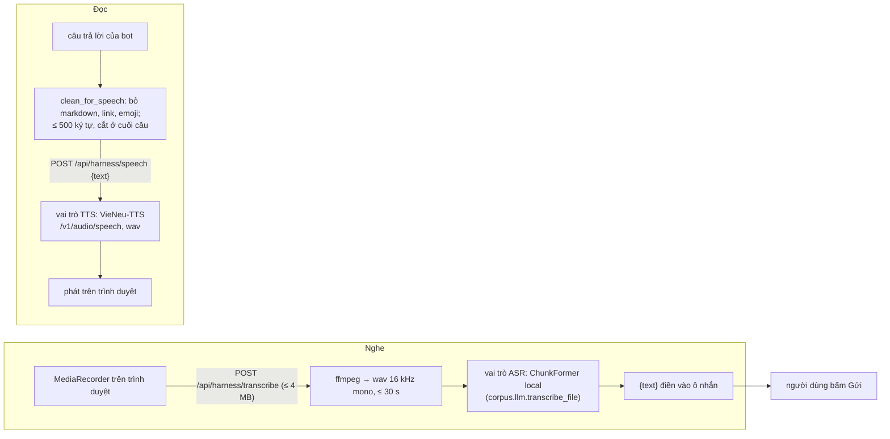

# Giọng nói của trợ lý

Nghe (STT) và đọc (TTS) cho trợ lý ở User Web. Code: `src/speech/` (`listen.py`, `synth.py`), HTTP ở `src/harness/server.py`, Web `web/src/user/ui/voice.ts`. Model nào đảm nhận: `docs/LLM_PROVIDER.md`.

## Quy tắc

- Không tự gửi: lời nghe được chỉ điền vào ô nhắn, người dùng bấm Gửi.
- Giọng đọc mặc định **tắt**, nhớ theo trình duyệt (`localStorage` `tg.asst.sound`); nút nhỏ cạnh mỗi câu bot đọc riêng câu đó.
- Lỗi bất kỳ (chưa cấu hình, host sập, bận, âm thanh rỗng) → `SpeechUnavailable` → 503 `{error: "speech_unavailable"}`; Web im lặng, giữ chữ, 5 phút sau mới thử lại. Không bao giờ gửi nội dung sang endpoint mặc định của SDK.
- Mỗi chiều tối đa 2 call đồng thời trong tiến trình (GPU / host dùng chung); quá thì "bận". TTS timeout 20 s.

## API

| Đường | Vào | Ra |
|---|---|---|
| `POST /api/harness/transcribe` | thân là bản ghi âm (webm / ogg / mp4), ≤ 4 MB | `{text}` · 400 âm thanh không đọc được / im lặng · 413 quá cỡ · 503 |
| `POST /api/harness/speech` | `{text}` | `audio/wav` · 400 text không phải chuỗi · 503 |

Cả hai cần đăng nhập và cùng origin (`docs/AGENT_HARNESS.md` §4). Harness nạp sẵn model ASR lúc khởi động (`speech.warm`).

## Vận hành

VieNeu-TTS chạy như worker `tts` của `./run.sh start|prod` (`scripts/vieneu_server.sh`, `~/vieneu-tts`, cổng 8780, `TTS_GPU` chọn GPU; bỏ qua nếu chưa cài). `.env`: `TTS_BASE_URL`, `TTS_MODEL`, `TTS_VOICE`, `TTS_API_KEY` (`docs/LLM_PROVIDER.md` §TTS). ASR cần `ffmpeg` trên `PATH` và gói `.[asr]`.

Test: `python -m pytest -q tests/speech`.
