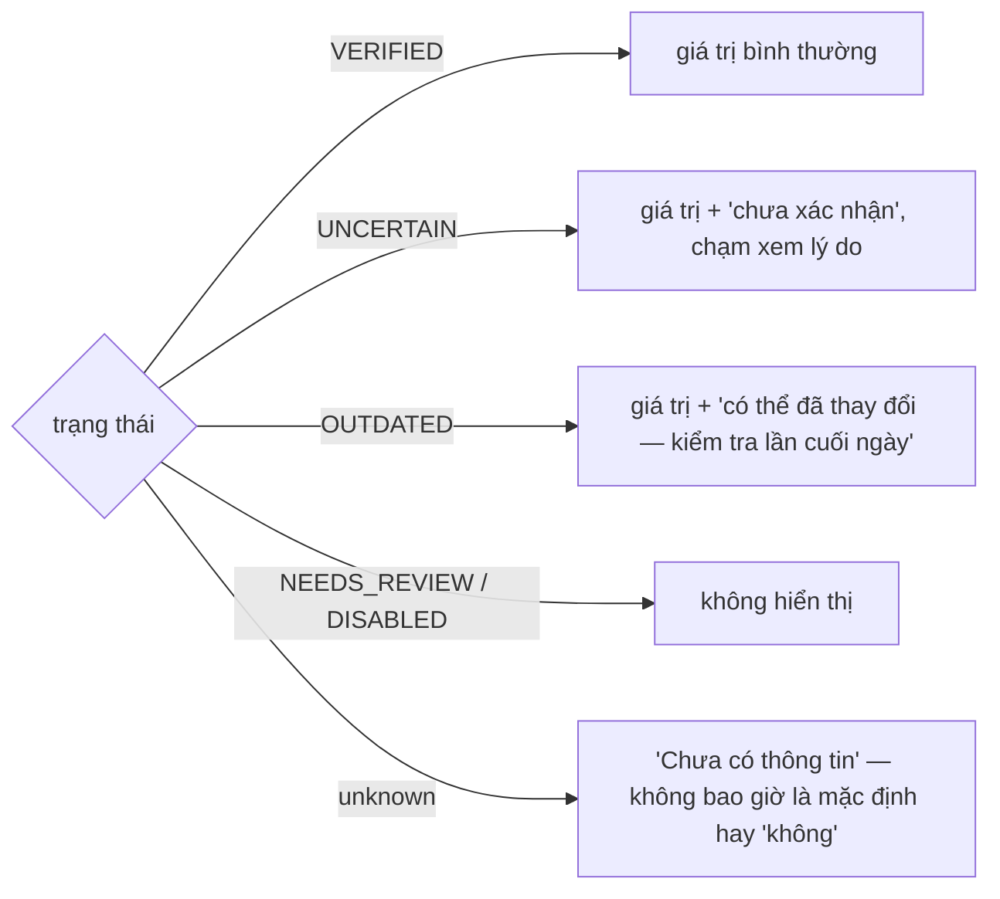
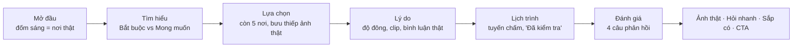

# Thiết kế UI/UX

Nguyên tắc, cách hiển thị dữ liệu, hệ thị giác, chuyển cảnh, landing. Chức năng từng màn và file: `docs/WEB.md`.

## 1. Sản phẩm trong một phút

Trợ lý **ra quyết định**, không phải máy tạo lịch; người dùng luôn chốt cuối. MVP: Đà Lạt, 2–4 ngày, cặp đôi / nhóm bạn / gia đình nhỏ, xe máy hoặc ô tô. Giao diện không hỏi người dùng thuộc nhóm nào; đọc trạng thái bắt đầu (từ input) và mức dẫn dắt (từ hành vi) — `docs/PROJECT_CONTEXT.md` §3. Chỉ thiết kế **máy tính** (khung 1440); điện thoại thấy trang Mở trên máy tính (§7).

## 2. Nguyên tắc (bắt buộc)

1. **Giúp quyết định, đừng bắt lướt.** Tập nhỏ; gom nơi giống nhau, nói nên giữ nơi nào.
2. **Bất định phải hiện ra** ngay tại chỗ ra quyết định.
3. **Mọi nhận định cách bằng chứng một chạm.**
4. **Giải thích hai phía:** vì sao phù hợp *và* đánh đổi, luôn đi cùng nhau. Xung đột nêu tên nơi + quy tắc + cách sửa.
5. **Người dùng giữ quyền:** không lặng lẽ bỏ nơi đã chọn; giới hạn chỉ nới khi họ xác nhận.
6. **Bất khả thi vật lý là cứng:** không nút nào biến lịch không kịp thành "khả thi".
7. **Chỉ hỏi điều đổi kết quả;** câu nào cũng bỏ qua được và có "Chưa chắc".
8. **Suy đoán từ hồ sơ có nhãn** "từ hồ sơ của bạn", sửa được một chạm.

Không được: phần trăm trần làm tín hiệu chính · sao như điểm chất lượng (sao = mức hợp chuyến, `Card.fit`, luôn kèm lý do) · ước lượng như sự thật · gợi ý chỗ ở ngoài màn "Bạn ở đâu?" · bản đồ khác Google · hiện transcript video.

## 3. Hiển thị chất lượng dữ liệu (mọi màn)



| Loại | Cách trình bày |
|---|---|
| Fact (giờ, giá) | Giá trị chính xác + nguồn + ngày |
| Signal (đông, yên) | Xu hướng + bối cảnh + cỡ mẫu: "sáng cuối tuần: đông · 123 comment, 30 creator" |
| Estimate (thời gian) | Luôn là khoảng: "60–90 phút", "≈35 phút" |
| Độ tin cậy | Cao / Trung bình / Thấp + lý do một dòng |

Thông tin thực tế (chính thức / Google) và bằng chứng trải nghiệm (TikTok, review) **tách rõ về hình ảnh**. Giới hạn cứng = con dấu viền đậm có khóa; sở thích mềm = chip viền đứt có × và nguồn.

## 4. Hệ thị giác — giấy hồng, Mận / Hồng

Landing và app dùng chung bộ màu (biến CSS `web/src/user/css/tokens.css`; component không hard-code màu, lớp trong suốt dùng `color-mix()`). `--tg-pine` (chính) và `--tg-sun` (nhấn) giữ tên cũ, giá trị là mận và hồng.

| Vai trò | Giá trị | Tương phản |
|---|---|---|
| Nền / bề mặt / hairline | `#FFF9F8` / `#FFFFFF` / `#F3E1E4` | — |
| Mực / phụ / chú thích | `#3A2B32` / `#5E4A54` / `#7D6873` | 12,8 · 7,8 · 4,9 |
| Mận (nút chính, tab, tuyến, focus) | `#6B3550`, đậm `#4F2539`, nhạt `#FCEEF1` | chữ trắng 9,3 |
| Hồng (ghim, tim, tiến độ) | `#C97890`; chữ `#8A3D58`; chữ trên hồng `#2A1820` | 3,2 · 7,3 · 5,3 |
| Tốt / Hổ phách / Nguy hiểm | `#2F6B4F` trên `#E6F2EA` · `#8A5A00` trên `#FFF4DC` · `#B42318` | 5,5 · 5,4 · 6,6 |

- Chữ: tiêu đề **Lora**, nội dung **Inter** (landing: Be Vietnam Pro), số / giờ / giá **JetBrains Mono**; tự lưu ở `web/public/fonts`. Nội dung ≥ 16 px.
- Bo 16–20 px, bóng nhẹ, icon SVG nét mảnh (`user/ui/icons.tsx`), không emoji. Cảnh báo luôn có icon + chữ.
- Ảnh nơi là **ảnh thật của chính nơi đó** (Maps / frame clip, chọn bằng `web/scripts/pick_covers.py`: YOLO bỏ ảnh người chiếm khung, pHash bỏ gần trùng, Gemma xếp đẹp), ghi nguồn. Ảnh sinh (`web/scripts/gen_ui_images.py`) chỉ cho không khí.
- Admin: "phòng điều khiển", Mona Sans, sáng / tối theo hệ thống.

## 5. Khung và chuyển cảnh

```text
BARE  Vào ứng dụng: ảnh trái + thẻ phải, không thanh trên
FLOW  thanh trên 68px: logo · thanh bước · [vé] · avatar   + thanh dính đáy 76px khi màn có
NAV   rail trái 76px: logo · Khám phá · Chuyến của tôi · Đã lưu · Hồ sơ · avatar
```

Không bao giờ hiện cùng lúc thanh bước và rail. Nội dung tối đa 1280, lề 48.

| Kiểu | Nghĩa | Chuyển động |
|---|---|---|
| T1 Sang bước | tới / lùi một bước | mờ + dịch 24 px, 280 ms; thanh trên đứng yên |
| T2 Chờ máy | backend đang làm | khung xương đúng bố cục đích + chữ nói đúng việc; không % giả |
| T3 Đào sâu | xem kỹ một nơi | ảnh thẻ nở thành ảnh đầu trang (View Transitions / FLIP); quay lại giữ tab + vị trí cuộn |
| T4 Lớp phủ | việc nhỏ không rời màn | panel trượt từ cạnh, 240 ms; chỉ làm mờ nền khi là hộp chặn |
| T5 Cập nhật tại chỗ | dữ liệu đổi | nháy nền nhạt 600 ms; danh sách chuyển vị trí, không nhảy |

`prefers-reduced-motion`: đổi tức thì hoặc mờ chéo ≤ 120 ms. Rỗng: một câu vì sao + **một** nút dẫn tới màn sửa được. Lỗi thao tác: dòng lỗi ngay dưới nút, không toast góc.

## 6. Giọng nội dung

Câu ngắn, như người bạn hiểu Đà Lạt; xưng "mình" – gọi "bạn" trong app, "TripGuardian" – "bạn" trên landing. Không "hệ thống đã xử lý", không "vui lòng". Chi tiết giọng của agent: `docs/P2_TRIP_UNDERSTANDING.md` §13.

## 7. Landing

**Máy tính** (`user/screens/Landing.tsx`): landing không giải thích mà **diễn** sản phẩm trên thung lũng Đà Lạt 3D lúc bình minh (địa hình thật SRTM 30 m + OpenStreetMap; độ cao phóng ×~3, cây / nhà là biểu tượng).



- Ngân sách chữ mỗi chương: 1 nhãn (≤ 4 từ) + 1 tiêu đề (≤ 6 từ) + ≤ 1 dòng phụ (≤ 16 từ). Thứ gì camera nói được thì không viết.
- Số và vị trí thật: `user/landing/{stats,places,points}.json` (`web/scripts/pick_landing_places.py`); số làm tròn xuống hàng trăm ("hơn 1.700").
- Cuộn kéo timeline GSAP (`scrub` + Lenis); kéo để xoay 360°; nút `Khám phá Đà Lạt 3D` trao camera cho người dùng. Mọi nút `Trải nghiệm đi` chỉ sang `/app`.
- **Hiệu năng:** ảnh poster có ngay từ `index.html`; địa hình dựng sẵn ngoại tuyến (`npm run bake:landscape` → `web/public/world/dalat.bin`, ~240 KB brotli); bóng vẽ một lần; `compileAsync`; tự hạ chất lượng khi khung > 28 ms; máy không GPU → bản nhẹ 6 ảnh chụp từ mô hình (`?3d=off|on` để ép). Ngân sách: poster < 1 s, 3D < 3 s, 50–60 FPS.

**Điện thoại** (`user/screens/GetApp.tsx`, phát hiện ở `user/landing/device.ts`): mọi trang người dùng → "Mở trên máy tính": gửi link cho chính bạn (share sheet), chép link, mã QR vẽ tại chỗ (`user/ui/qr.ts`), nút cửa hàng khi có `VITE_APP_IOS_URL` / `VITE_APP_ANDROID_URL`.
