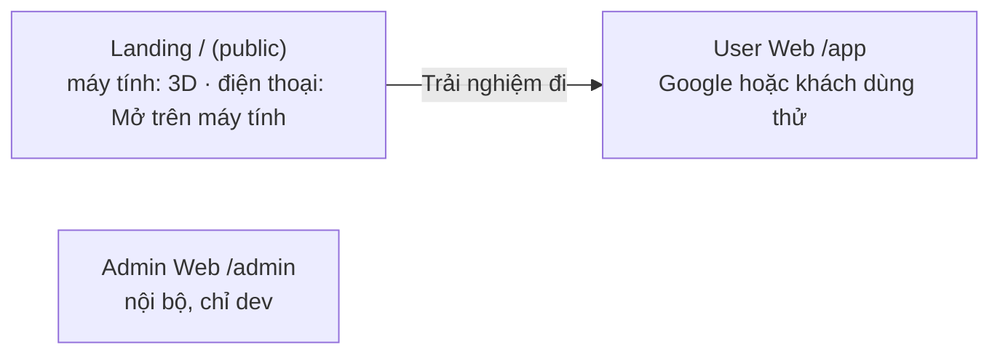
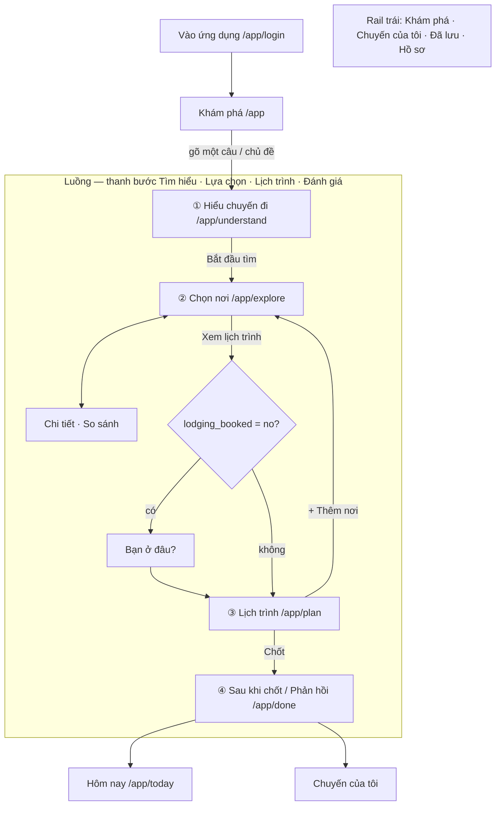
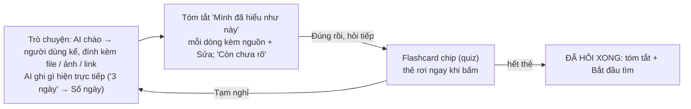

# Web — chức năng và màn hình

Mỗi vai trò được làm gì, mỗi màn cho làm gì, nối sang màn nào, nằm ở file nào. Cách hiển thị và hệ thị giác: `docs/UI_DESIGN.md`. Contract backend: `docs/AGENT_HARNESS.md`.

## 1. Bề mặt và vai trò



| Vai trò | Được | Không được |
|---|---|---|
| **User** | tạo / sửa chuyến của mình · sở thích, constraint, anchor · xem gợi ý + bằng chứng, so sánh, thêm / bỏ / khóa / thay · sửa lịch · phản hồi, báo sai · check-in, Calendar, thông báo · hồ sơ, xóa tài khoản | sửa dữ liệu địa điểm, bằng chứng, confidence; xem dữ liệu người khác; vào Admin |
| **Khách dùng thử** | 1 chuyến trong 1 ngày | lịch sử, lưu nơi, hồ sơ, thông báo, Calendar (`docs/ACCOUNTS.md` §4b) |
| **Admin** | xử lý hàng đợi review, gán nhãn, xem nơi + bằng chứng, xem toàn bộ dữ liệu người dùng, analytics | gõ giá trị fact mới; sửa lịch hay quyết định thay người dùng |

Điện thoại mở bất kỳ trang người dùng nào đều thấy trang **Mở trên máy tính** (`screens/GetApp.tsx`); web chỉ thiết kế cho máy tính.

## 2. User Web — các màn



### 2.1 Vào ứng dụng

"Tiếp tục với Google" hoặc "Dùng thử, không cần đăng nhập". Lần đầu: màn đồng ý điều khoản + chính sách dữ liệu (mở đọc được) + ô "nhớ lựa chọn của tôi". Google trả về đúng trang đang mở.

### 2.2 Khám phá (trang chủ app)

Hero + **một ô nhập tự do** (câu gõ thành lượt đầu của Hiểu chuyến đi) + chip · thẻ chủ đề (mỗi thẻ là một câu mở đầu) · người quay lại thấy thẻ **Chuyến đang lập** (Đi tiếp). Lần đầu có tour 4 bước không chặn trang (`ui/Tour.tsx`, khóa `home-tour`); thanh trái ghi tên ngắn dưới mỗi biểu tượng.

### 2.3 Hiểu chuyến đi

Hai pha (`docs/P2_TRIP_UNDERSTANDING.md` §4):



- Không bao giờ hiện số câu (`câu 2/3`), thanh tiến độ theo câu, hay danh sách câu sắp hỏi — agent quyết lúc chạy. Không hiện lịch sử các lượt đã qua.
- Cột phải "Đang hợp với bạn": số nơi qua giới hạn + biến động của lựa chọn vừa rồi; mỗi chip ghi trước nó làm số này đổi bao nhiêu.
- Vé chuyến (`Xem đầy đủ`, panel 55% bên phải, cuộn dọc): mỗi dòng có nguồn + Sửa; giới hạn cứng là con dấu kèm cái giá (`đang loại 6 nơi`) và Nới / Bỏ; sở thích mềm là chip viền đứt có ×. Ẩn khi còn câu hỏi mở.
- Thẻ hậu cần: xuất phát (`ui/PlaceInput.tsx`, gợi ý kiểu Google Maps) → cách tới (Tự đi / Xe khách / Máy bay) → chuyến đi / về (`ui/TransitPick.tsx`: lọc Sáng · Chiều · Đêm · Rẻ nhất; chỉ "Xong, dùng chuyến này" mới ghi; không tra được → trang đặt vé + nhập giờ) → khách sạn (ô tìm + "Chưa đặt chỗ ở") → giờ nhận / trả phòng → thuê xe (`ui/RentalPick.tsx`) khi đến bằng xe khách / máy bay.
- Nút `Xem gợi ý` và bước `Lựa chọn` luôn bấm được.

### 2.4 Nhập nơi đã lưu / lịch có sẵn

Mỗi mục: đã khớp ✓ · cần chọn (2–3 ứng viên) · không tìm thấy (giữ "chưa xác minh" hoặc xóa). Gộp trùng. Không bao giờ đoán match.

### 2.5 Chọn nơi

- **Đĩa xoay** (`ui/DiscPicker.tsx`) là cách chọn duy nhất: nửa đĩa mép trái, ≤ 7 cánh, lăn chuột / kéo / ↑↓ để xoay, ←→ xem ảnh; tab nhóm kèm `total`; tự tải trang tiếp khi gần cuối.
- Mỗi nơi: ảnh thật · "Hợp nhất" cho `top` · *Vì sao phù hợp* (≤ 3 ✓) + *Đánh đổi* ngay dưới · thời gian (khoảng) · giá · khoảng cách · độ tin cậy · sao "Hợp với bạn" (mức hợp chuyến, không phải chất lượng) · `Thêm · Khóa · So sánh · Bỏ` + tim lưu.
- Khối: nơi bắt buộc · giới hạn đã loại N nơi (`Nới giới hạn` → về vé) · "Chưa xác minh được điều kiện của bạn" (gập).
- **Trợ lý "Hỏi TripGuardian"** (`ui/Assistant.tsx`, phím `/`): cột 380 px trong lớp đĩa; lượt chat qua Decision; "Vì sao không gợi ý X?" trả từ dữ liệu; đính kèm danh sách nơi; mic + loa (`docs/SPEECH.md`).
- Lý do bỏ (không bắt buộc): Quá xa · Quá đông · Quá đắt · Không thích · Đã đi rồi.

### 2.6 Chi tiết địa điểm

`ui/PlaceSheet.tsx` (modal, `?place=<id>`, Esc đóng; `PlaceDetail.tsx` cho link chia sẻ). Tab Tổng quan · Hình ảnh · Video (clip người đã đến) · Gợi ý lịch trình · Đánh giá. **Thông tin thực tế** (giờ, giá, đặt chỗ + nguồn + ngày; xung đột hiện cả hai) tách rõ khỏi **trải nghiệm** (xu hướng kèm cỡ mẫu, clip đúng đoạn, comment gốc). Nút **Báo thông tin sai** (`POST /api/harness/reports`) không đổi dữ liệu.

### 2.7 So sánh

2 (tối đa 3) nơi, chỉ thuộc tính khác nhau; một câu hỏi chốt; hệ thống không chọn thay.

### 2.8 Thanh "Đã chọn" — thay trang Khả thi

Dính đáy Chọn nơi / Chi tiết / So sánh: số nơi · giờ tham quan · di chuyển · chi phí · **Xem lịch trình**. Mỗi thay đổi hiện dòng chênh lệch ("+1 nơi, +90 phút, +24 phút đi lại") + Hoàn tác.

### 2.9 Kết quả khả thi

| Trạng thái | Nguồn | Hiện |
|---|---|---|
| Đang xếp lịch | `preview` (debounce 350 ms) | khung xương mảnh |
| Lịch N ngày sẵn sàng | `preview = ready` | số liệu phương án ít di chuyển nhất |
| Cần chú ý | Decision `partial` / `preview = failed` | dải hổ phách: tên nơi + quy tắc + cách sửa kèm cái giá |
| Chưa đi được | Decision `infeasible` | "Cần ~X, chuyến có Y" + cách sửa |

Xung đột giới hạn người dùng có hàng *nới*; xung đột vật lý không có.

### 2.10 Lịch trình

Chỉ nhận act, không chat (`docs/P4_PLANNING.md` §Vòng người dùng sửa và góp ý).

- **Bạn ở đâu?** (`screens/Lodging.tsx`, một lần trước lịch khi chưa đặt chỗ ở): thẻ chỗ ở theo gu ("Hợp vì …", phút TB tới nơi đã chọn) · *Ở đây* · *Tôi ở chỗ khác* · *Cứ xếp giúp* · *Bỏ qua*.
- **Phương án** là thẻ ảnh (`ui/VariantCards.tsx`) + bảng đánh đổi.
- **Hành trình** (trang chính, `screens/Plan.tsx`): thanh Chỗ ở · dải Lưu ý (`ui/PlanAlerts.tsx`, không bao giờ nói "ổn cả") · sơ đồ thẻ ảnh theo thứ tự đi, mỗi thẻ có giờ đến–đi · **kéo thả** đổi thứ tự (`reorder`) / chuyển ngày (`move_place`), `Alt + ←/→` cho bàn phím · ngăn chỉnh giờ / thời lượng / khóa / buổi (`set_visit`, `set_slot`) · nút gợi ý nhấp nháy cho bữa ăn tự chọn và đêm (`ui/SlotPick.tsx`, chỉ gợi ý).
- **Chi tiết theo giờ** (`screens/PlanDetail.tsx`): tab ngày · timeline (chặng theo mode, Ăn · Nghỉ · Chờ · Đệm · Đêm n) · bản đồ Google · cột chỗ nghỉ, dự phòng, lưu ý cả chuyến.
- Nhãn độ vững mỗi ngày: Dư giờ / Vừa đủ giờ / Sát giờ. Dự phòng chỉ thay khi người dùng chọn.
- **Tối ưu**: Planning Agent đề xuất một lần; có cải thiện → biểu ngữ + ngăn trước → sau, *Giữ lịch cũ* / *Giữ cách xếp mới*.
- Thanh đáy: dòng báo + Hoàn tác · **Chốt kế hoạch này**. Luôn ghi "Giờ giấc và đường đi là ước tính."

### 2.11 Hồ sơ, Chuyến của tôi, Đã lưu

- **Chuyến của tôi**: Đang lập → Đi tiếp · Đã chốt → Xem lịch / Sửa lại · Đã đi → Phản hồi.
- **Đã lưu**: nơi thả tim, theo tài khoản; không tự vào lịch.
- **Hồ sơ**: avatar, tên, thành phố, phương tiện / người đi cùng hay dùng (prior ✎), công tắc "Nhớ lựa chọn của tôi", thông báo, Calendar, xóa tài khoản (hai bước).

### 2.12 Sau khi chốt / Phản hồi

Ngay sau chốt (`/app/done`): lịch theo ngày · thẻ **Thêm vào Google Calendar** (xem trước → xác nhận) · Chia sẻ lịch (chữ) · Mở Hôm nay. Sau ngày về: bốn câu chấm 1–5 + "có phải tự tìm thêm chỗ ngoài lịch?" + góp ý, không bắt buộc (`POST …/feedback`).

### 2.13 Hôm nay (Đang đi)

`docs/P5_COMPANION.md`: thẻ điểm dừng, Đã đến → "Ở đây", Bỏ qua, Hợp / Không hợp, "Phần còn lại hơi chật", thẻ Calendar, thẻ xin bật thông báo, Hộp thông báo.

## 3. Admin Web

```text
/admin            Dashboard (Places · Verified · Needs Review · hàng "Hôm nay" từ analytics)
/admin/review     hàng đợi review: Accept · Disable · Report error; mẫu ẩn trông y hệt mục thường
/admin/labels     gán nhãn đúng / sai / không rõ (lô 4), quote tô đậm; thống kê precision + Wilson
/admin/places     danh sách + chi tiết theo khía cạnh; Request refresh
/admin/evidence   Fresh / Outdated / Missing / Conflicting / Single source
/admin/sessions   phát lại hành trình: event, log module, transcript, phản hồi
/admin/analytics  tab Phễu · Trip · Quyết định · Lịch trình · Thực tế · Thông báo · Agent · Chất lượng; Insights
/admin/system     trạng thái thành phần, lỗi gần đây
```

Admin không gõ giá trị fact: giá trị sai được báo lỗi và hệ thống build lại từ bằng chứng (`docs/P1_CORPUS.md` §7). Chỉ số: `docs/ANALYTICS.md`.

## 4. Chuyển màn

| Từ | Thao tác | Tới | Kiểu (`UI_DESIGN.md` §5) |
|---|---|---|---|
| Landing | Trải nghiệm đi | Khám phá | T1 |
| Khám phá | Enter / chủ đề | Hiểu chuyến đi (chuyến mới) | T1 |
| Hiểu chuyến đi | Bắt đầu tìm | Chọn nơi (`trip → decision`) | T2 |
| Chọn nơi | ảnh / Chi tiết · So sánh | Chi tiết · So sánh | T3 |
| Chọn nơi | Bỏ · Báo sai | sheet lý do · hộp nhập | T4 |
| Chọn nơi | Thêm / Khóa / nhắn trợ lý | ở lại | T5 |
| Chọn nơi | Nới giới hạn / Sửa vé | Hiểu chuyến đi (`decision → trip`) | T1 ngược |
| Thanh "Đã chọn" | Xem lịch trình | Lịch trình (`decision → planning` + Tối ưu) | T2 |
| Lịch trình | đổi phương án / chỗ nghỉ / dự phòng | ở lại | T5 |
| Lịch trình | + Thêm nơi | Chọn nơi (`planning → decision`) | T1 ngược |
| Lịch trình | Chốt kế hoạch này | Sau khi chốt | T1 |

Bước đã xong trên thanh bước bấm được để lùi (`back`), không bao giờ tiến hộ. Lỗi giữa đường: ở lại màn cũ, dòng lỗi cạnh nút vừa bấm.

## 5. Ngoài phạm vi MVP

User: chỉ đường từng bước, đặt chỗ / thanh toán, mạng xã hội, cộng tác nhóm lớn, thành phố khác, bản web cho điện thoại. Admin: nhiều cấp, quy trình duyệt nhiều bước, CRM, billing.

## 6. Triển khai — màn nào ở đâu

Một app React (`web/`, Vite); `App.tsx` chọn bề mặt theo đường dẫn.

| Màn | File (`web/src/`) | Backend |
|---|---|---|
| Landing | `user/screens/Landing.tsx`, `user/landing/{scene,terrain,device}.ts`; điện thoại `user/screens/GetApp.tsx` (+ `user/ui/qr.ts`) | — |
| Đăng nhập | `user/screens/Auth.tsx`, `user/account.ts` (401 → đăng nhập) | `/api/auth/*`, `/me` |
| Khám phá | `user/screens/Discover.tsx`, `user/ui/Tour.tsx` | — |
| Hiểu chuyến đi | `user/screens/{Understand,TripChat}.tsx`, `user/ui/{Ticket,PlaceInput,TransitPick,RentalPick}.tsx`, `user/tu/` | stage `trip`; `/geo`, `/lodging/suggest`, `/transit` (+ SSE), `/rentals` |
| Chọn nơi, Chi tiết, So sánh, Đã chọn, trợ lý | `user/screens/{Explore,PlaceDetail,Compare}.tsx`, `user/ui/{DiscPicker,PlaceCard,PlaceSheet,SelectedBar,Assistant}.tsx`, `user/pd/` | stage `decision`, `preview`, `reports`, `speech`, `transcribe` |
| Lịch trình, Bạn ở đâu? | `user/screens/{Plan,PlanDetail,Lodging}.tsx`, `user/ui/{RouteStory,PlanAlerts,VariantCards,SlotPick}.tsx`, `user/planning/` (`view.ts` hàm thuần) | stage `planning` (`recommend`), `read/decision/fit` |
| Sau khi chốt, Phản hồi | `user/screens/Done.tsx` | `today`, `calendar`, `feedback` |
| Chuyến của tôi, Đã lưu, Hồ sơ | `user/screens/Account.tsx`, `user/store.ts` | `trips`, `/me*`, `/calendar/disconnect` |
| Hôm nay, Hộp thông báo | `user/screens/{Today,Inbox}.tsx`, `user/{today,notify,events}.ts`, `public/sw.js` | `today`, `companion`, `calendar`, `push`, `notifications`, `events` |
| Admin | `admin/AdminApp.tsx`, `admin/screens/`, `admin/api.ts`, `admin/analytics.ts` | review :8765, analytics :8770 |

**Client hành trình** `user/journey.ts`: tuần tự mutation, khôi phục yêu cầu chờ, cache dùng chung `${journeyId}:${stage}` (tươi 2 phút; mọi yêu cầu đổi hành trình xóa cache của nó; đổi tài khoản xóa hết). Test: `web/scripts/test_journey.mjs`, `test_plan_view.mjs`. `/app/plan?journey=<id>` mở đúng hành trình (của tài khoản khác → "Chưa mở được chuyến này").

Dữ liệu địa điểm chỉ-đọc: `web/public/data/snapshot.json` (`python web/scripts/export_snapshot.py`) + `covers.json` (`web/scripts/pick_covers.py`). Không tải được → "TripGuardian đang cập nhật, bạn thử lại sau ít phút" + Thử lại.

Chạy thử toàn luồng có chụp màn: `node web/scripts/shots_app.mjs [base]`.
